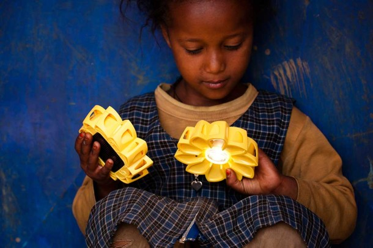
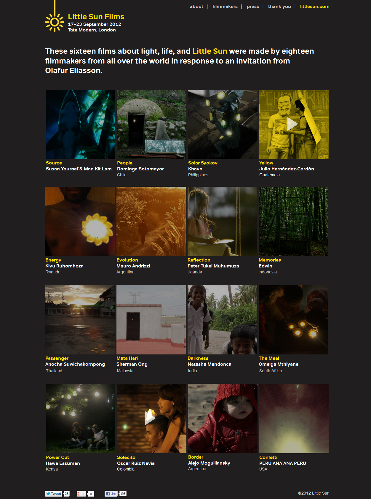

Last week, [Gerhard Richter’s](http://www.telegraph.co.uk/culture/art/art-news/9606098/Gerhard-Richter-painting-owned-by-Eric-Clapton-sells-for-21-million-the-highest-price-paid-for-a-living-artist.html) abstract painting at the **Sotheby’s sold for £21.3 million** – the highest ever for any living artist.  (I reckon that I’d be more successful free-falling from outer space a la [Felix Baumgarter](http://www.bbc.co.uk/news/science-environment-19943590) than buy a Gerhard Richter painting in this lifetime.) While this sale clearly shows how much money floats around in recession England, **I’d like to see some of this extra moolah channelled into other works of art**.

I’d like to see some of this private money used for more art funding for smaller and community-based art institutions. **How about supporting art that has a social purpose?**  There had been attempts in the past albeit small-scale to bring art and social change together but I haven’t seen anything as significant as [Olafur Eliasson’s Little Sun project](http://www.littlesun.com/). Little Sun is a solar-powered lamp he conceived with engineer **Frederik Ottesen**. As a piece of art, it was  used to create Sunlight graffitti and also to view Surrealist works in [Tate Blackout sessions](http://www.tate.org.uk/whats-on/tate-modern/exhibition/olafur-eliasson-little-sun) during the summer but the real purpose of the project is to bring sustainable light to poor and developing nations.

<iframe frameborder="0" height="480" src="http://player.vimeo.com/video/41830924" width="640"></iframe>

<figcaption>Olafur Eliasson’s Little Sun project. (Copyright Little Sun)</figcaption>

But now that the Tate exhibition is over, I’m worried that people are beginning to forget Olafur Eliasson’s Little Project. In fact, **the Tate exhibition was just a launching pad** – Olafur and his team have big plans for the Little Sun project and they want to distribute the Little Sun lamp in off-grid communities to provide sustainable energy to all.

Olafur has  also teamed up with 18 acclaimed young filmmakers from around the world to make sure that the Little Sun project continue to have that link with art. The filmmakers produced short films in response to Olafur’s Little Sun solar-powered lamp highlighting deeper issues that their own country/culture face. I particularly loved **Khavn de la Cruz’s humourous Solar Syokoy (Philippines)** about a Merman’s quest to find water in the urban city by using the Little Sun solar-lamp. **Darkness by visual artist/filmmaker Natasha Mendonca (India)** explores the nature of darkness as part of an everyday reality of the poor.

Olafur Eliasson said: ‘It has been a true gift to work on the sixteen Little Sun Films with these highly talented, very diverse filmmakers from all over the world, who have generously volunteered their voices and visions to this endeavour to bring light to some of the 1.6 billion people in the world without adequate access to the electrical grid. The responses have been unexpected, poetic, and eye-opening.’ 

*Other Participating filmmakers are Mauro Andrizzi, Edwin, Hawa Essuman, Julio Hernández-Cordón,  Alejo Moguillansky, Omelga Mthiyane, Peter Tukei Muhumuza, Sherman Ong, Peru Ana Ana Peru, Kivu Ruhorahoza, Oscar RuizNavia, Dominga Sotomayor, Anocha Suwichakornpong, Susan Youssef and Man Kit Lam.*

You can see all the short films at the [Little Sun website](http://www.littlesun.com/).

