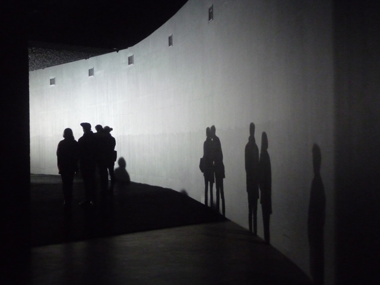
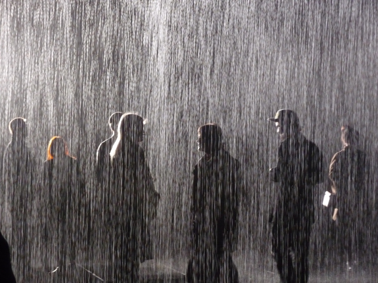

The queue itself is a stormfest: To get inside the [Rain Room at the Barbican](http://www.barbican.org.uk/artgallery/event-detail.asp?ID=13723), you’ve got to be ready to waste at least two hours of your precious time queuing up (and just imagine how the Barbican would be packed during the weekends with a drench-hungry crowd). Thank God I chose to come on a weekday – the queue was considerably long but manageable and I was entertained by listening to the **conversations of young wannabee artists who all came for the promise of a drizzle**.

I have asked myself why I was even interested to come here in the first place. I’ve grown up and lived in a place where tropical storms and torrential rain are as frequent as having your breakfast. Maybe I do miss it – the drama that a real rain brings (trapped indoors, without any electricity –  I think one can truly be your most creative during stormy weather. You can pen a hundred love songs from your hundred heartbreaks or write a cheesy soap opera with you as the damsel in distress.) **But yes, that kind of rain – the type that can wreak havoc in land and topple down dingy houses unfortunately – can (sometimes) inspire you and be a great companion for melancholic days**. (Of course if it’s devastating like Hurricane Sandy, it’s another matter, but forgive me for romanticising rain in this post).

<iframe frameborder="0" height="490" src="http://player.vimeo.com/video/51830893?title=0&byline=0&portrait=0&badge=0&color=ffffff" width="640"></iframe>

[Rain Room at the Barbican, 2012](http://vimeo.com/51830893) from [rAndom International](http://vimeo.com/randomvids) on [Vimeo](http://vimeo.com).

**Rain Room**

Here at the Barbican, I know I’d be seeing simulated rain and I wonder what kind of emotions I can feel coming face to face up-close and personal with an inspiration-ally. Entering the long corridor of the Curve room is in itself an experience as you already hear the sound of heavy rain smashing against the pavement. **It’s almost too cinematic – at the end of the corridor before you turn unto the curve, shadows of the onlookers are projected at a white wall while your own footsteps get diluted in the smell of the looming downpour**.

Young experimental practice called [Random international](http://random-international.com/) really know how to up the game of interaction – although they have been distancing themselves from defining their practice as such and have aligned themselves more in creating architectural settings. Whatever it is, **this 3d installation where you could control torrential rain without getting wet is genius** – and I feel like somehow we’ve tricked nature for once this time. With only eight people allowed to interact with the rain, there’s a guaranteed intimacy with this man-made natural concoction of a downpour.

<iframe frameborder="0" height="480" src="http://player.vimeo.com/video/50987695?title=0&byline=0&portrait=0&badge=0&color=ffffff" width="640"></iframe>

[Rain Room at the Barbican](http://vimeo.com/50987695) from [rAndom International](http://vimeo.com/randomvids) on [Vimeo](http://vimeo.com).

**The experience**

Staged in a rectangular platform, this hundred square metre field of falling water is made more dramatic by being backlit by a glaring spotlight.  People who had been able to jump right in the rain walk about with a glassy and inspired look about them. They don’t get wet as you already know – through the use of sensors, the rain responds to their movement and presence.  What happens next is a sight to behold – the rain envelops them forming a quasi-silhouette while trickling down in other parts of the platform. The dry rain feels real that one man opened his umbrella and posed for a snapshot for his girlfriend.

The rain room is a a marriage of art, science and technology. When it was my turn to go in the rain, I felt an emotional kind of zen-peace, the kind of feeling that you get when are in touch with nature.  Being surrounded by rain that close with all the symphony of falling water beneath your feet – is a privilege – it almost feels like a miracle.

Read more:

- [The Guardian: Random international  installs torrential rain in Barbican gallery](http://http://www.guardian.co.uk/artanddesign/2012/oct/03/random-international-rain-barbican)
- [Londonist: Rain Room @Curve in Barbican](http://londonist.com/2012/10/art-review-rain-room-the-curve-barbican-centre.php)
- [The Verge: Artists create miracle ‘rain room’ keeping you dry in the middle of a shower](http://www.theverge.com/2012/10/6/3463754/rain-room-art-installation)
- [Daily Mail: Contemporary studio installs ‘rain room’ to let visitors experience realistic wet weather in autumnal London](http://www.dailymail.co.uk/news/article-2212275/Contemporary-art-studio-installs-rain-room-let-visitors-experience-realistic-wet-weather--autumnal-LONDON.html)
- [Architizer: Rain Room lets visitors stay dry while passing through a downpour](http://www.architizer.com/en_us/blog/dyn/54592/rain-room-lets-visitors-stay-dry-while-passing-through-a-downpour/#.UJAF7WdKRFA)
- [BBC News: Barbican’s Rain Room where visitors stay dry](http://www.bbc.co.uk/news/uk-england-london-19873953)
- [BBC: Staying dry in a room full of rain](http://www.bbc.co.uk/news/entertainment-arts-19827066)
- [Telegraph: Random International, Rain Room, Curve, Barbican](http://www.telegraph.co.uk/culture/art/art-news/9579323/Random-International-Rain-Room-The-Curve-Barbican-preview.html)
