If you ask people whether they like [Anish Kapoor’](http://anishkapoor.com/)s The Orbit, the opinion will be divided into two. There are those who hate it and calls it an eyesore. For me, it took some time to form an opinion – I had to interact with it a few times when I visited the Olympic park and found out how I have appreciated it more each time.

**The Orbit is colossal and it towers above you like a menacing figure**. The architectural complexity of the piece alone should be given merit but I think part of the charm of [The Orbit](http://anishkapoor.com/332/Orbit.html) – and Anish Kapoor’s large-scale art works –  is that they invite you to Kapoor’s world of illusion; you as a viewer have no choice but to react to the space/illusion he provides. Sometimes, it is not even a question of liking or hating his piece, it is a question of immersion – of being part of the whole ensemble.

**1. Earthworks**

At the [Lisson gallery](http://www.lissongallery.com/) (London),  Anish Kapoor’s  earth works do the same. They are small-scale this time but provide the same effect as his large-scale works.  I am mesmerised by the table sculptures that form illusory landscapes made from cement that shoots up into the air or slides into a void while *In the Shadow of the Tree and the Knot of the earth* II mushrooms into a tiny eruption. On the walls are coral-like-slash-asteroid looking sculptures also made from cement. On one side of the wall sits a canvass made from earth-like pigments. In the basement, we see a continuity of this whole earthly she-bang.  Nothing like the smooth and sleek master of metallic surfaces that we know Kapoor to be.

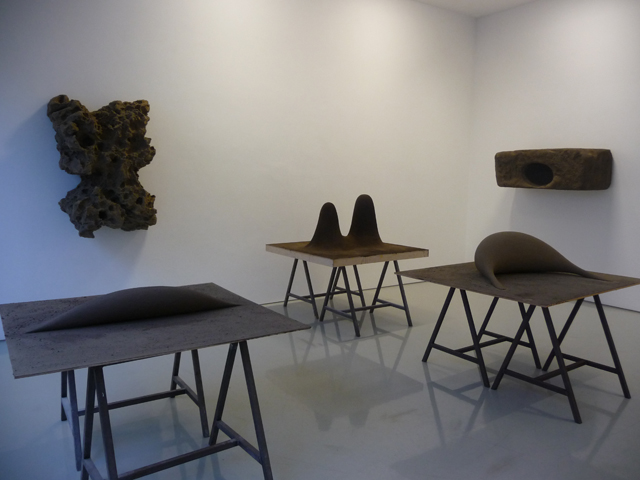

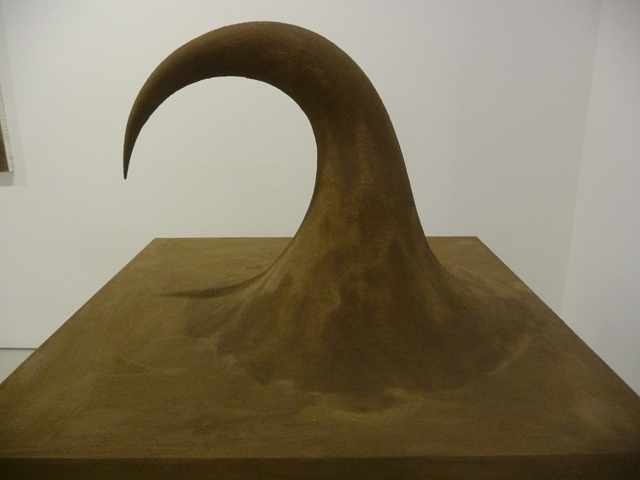

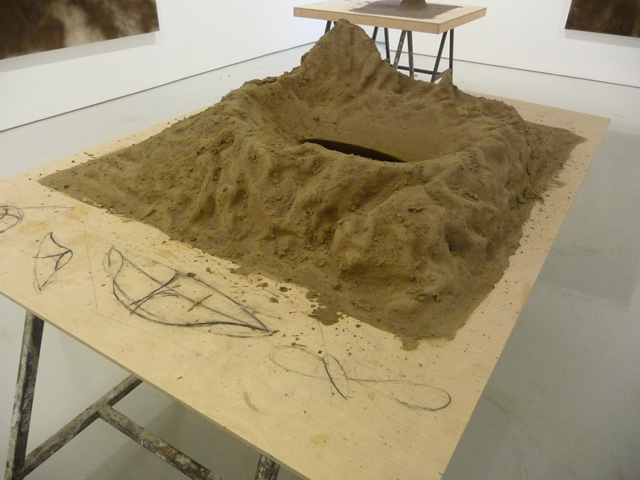

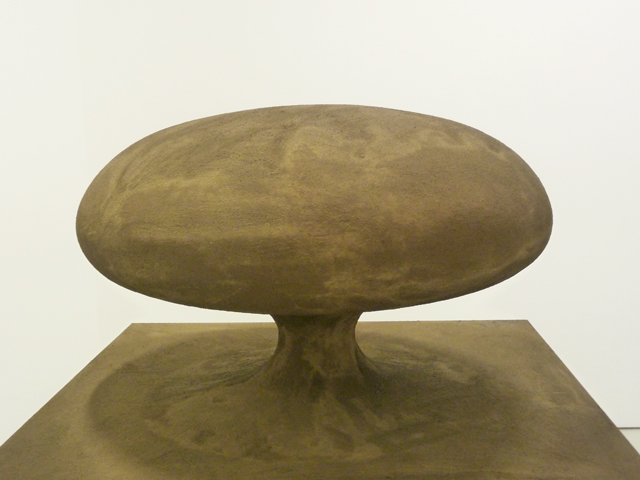

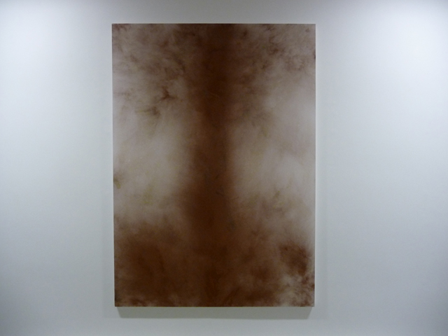

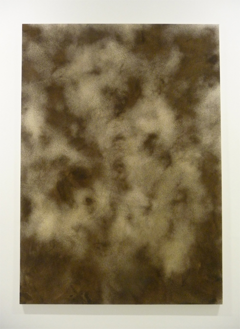

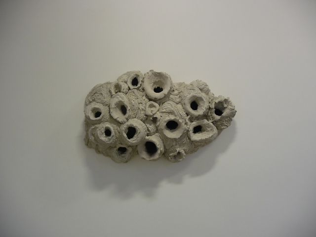

**2. Floating bowls**

And yet, in another room, there’s a complete turn around with the colourful fiber glass bowls lined up against the walls – here is the same Kapoor we love  – and more so in monochromatic colours, aquamarine, hot orange, lime green!  Has the colourful spot paintings of Damien Hirst finally rubbed on him? No – far from it –  this room spells like a time machine…I observe these bowls from the sides and front – not knowing what to make of these shapes. I feel like I am lost in space. Mars 2012 should be in this room.

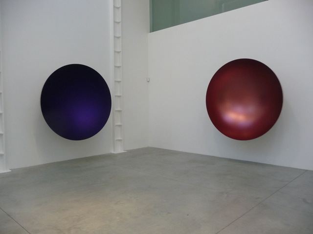

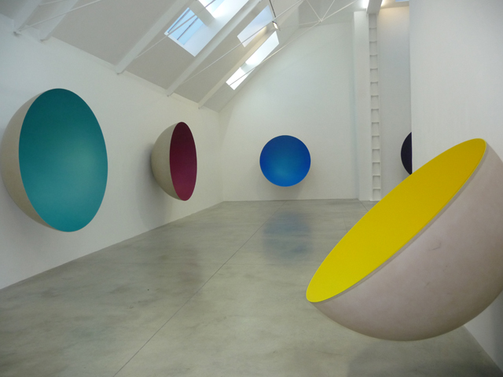

**3. Intersection 2012**

In the yard of the Lisson gallery sits a large-scale sculpture – colossal like The Orbit and made of the same material, Corten steel. The large opening invites you to come along and take a peek inside but stops you from going inside once you see the small hole in the intersection.

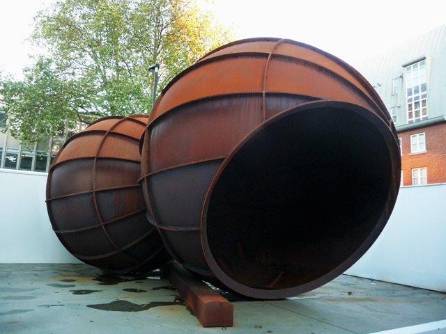

**4. Organ 2012**

The first ever ready-made sculpture from Kapoor – it’s a diesel engine and looks like a misplaced object in this sea of earth-like installations and resin-made sculptures. Crouched in a corner, this machine looks impersonal and devoid of any emotion. It clearly doesn’t belong here and yet it does, which is a point of discourse. Why Anish has suddenly ventured into ready-made sculptures is mind-blogging. Maybe he’s laughing at us now for this intended parody?

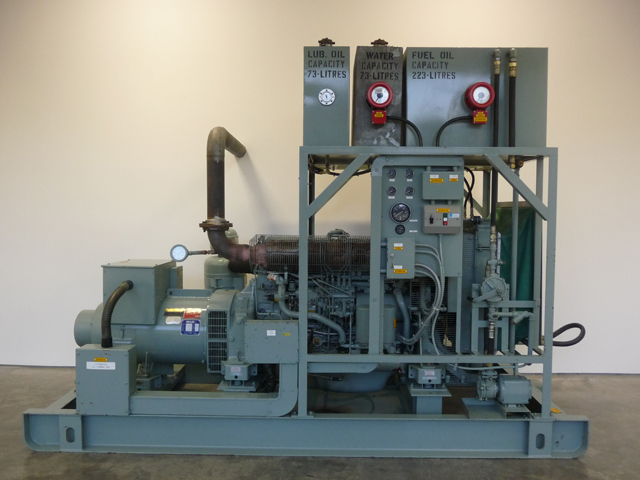

**5. Anxiety**

An installation in a very dark room can already give you some sort of claustrophobia. A bright light is projected unto the floor which strangely highlights its organic and earth-like surface.

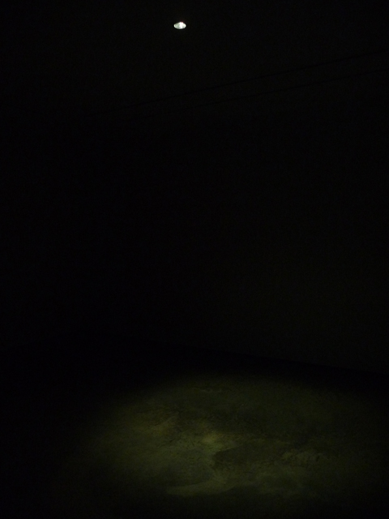

Read more:

- [Independent: Anish Kapoor Lisson Gallery](http://www.independent.co.uk/arts-entertainment/art/reviews/anish-kapoor-lisson-gallery-london-8204042.html)
- [Omg yahoo: Anish Kapoor Intersection 2012 (Photo)](http://omg.yahoo.com/photos/artist-anish-kapoor-poses-next-piece-intersection-2012-photo-140237182.html)
- [Londonist: Art review Anish Kapoor](http://londonist.com/2012/10/art-review-anish-kapoor-lisson-gallery.php)
- [Arrested Motion: Anish Kapoor (Lisson gallery)](http://arrestedmotion.com/2012/10/showing-anish-kapoor-lisson-gallery/)
- [Design Boom: Anish Kapoor](http://www.designboom.com/weblog/cat/10/view/24183/anish-kapoor-at-lisson-gallery.html)
