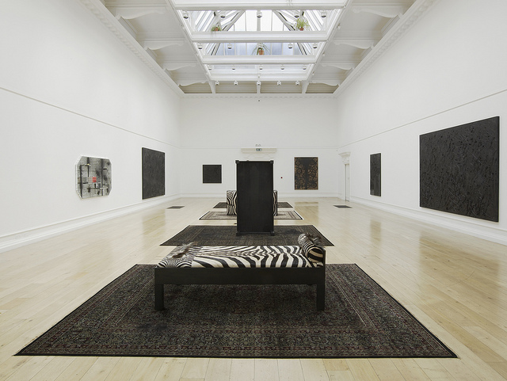
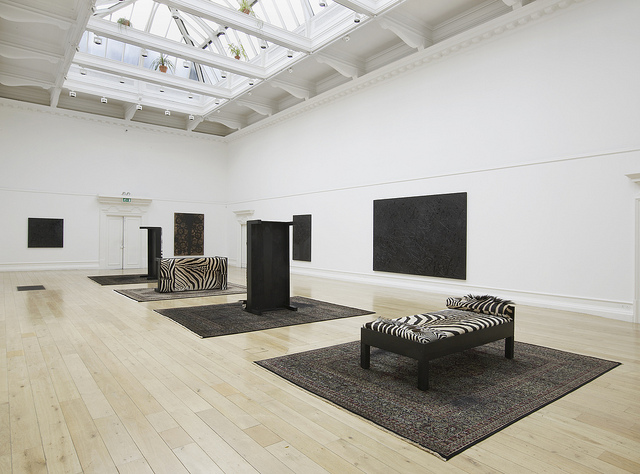
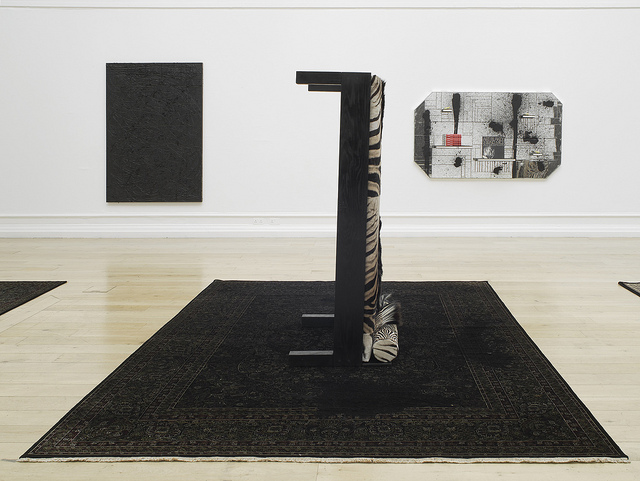
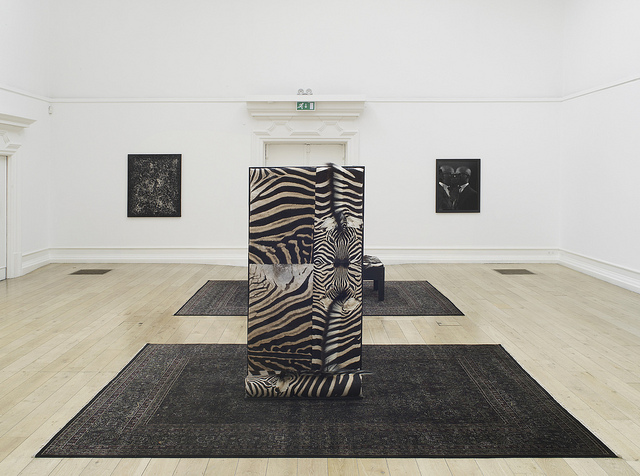
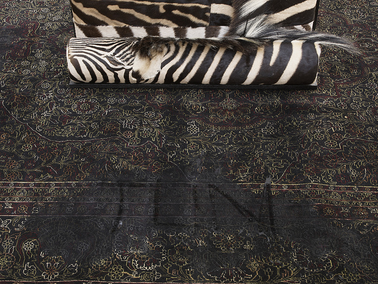
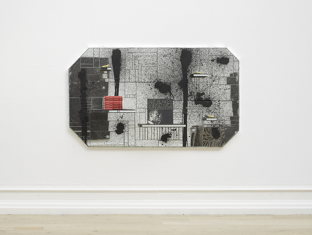
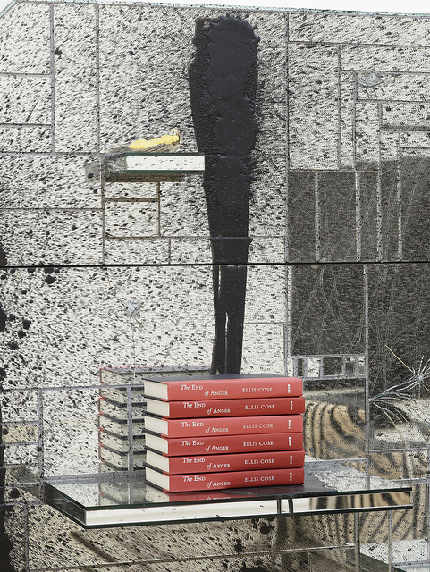
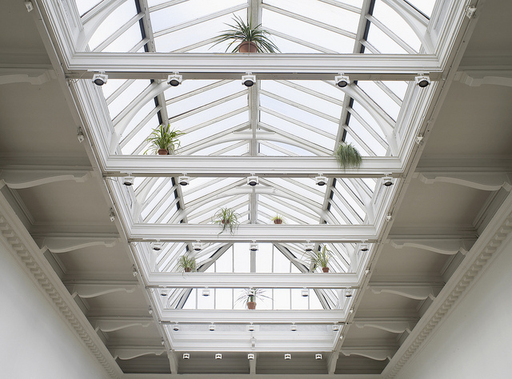

It’s the final week of Rashid Johnson’s Shelter at the [South London Gallery](http://www.southlondongallery.org/) and after reading the [TimeOut 5/5 review](http://www.google.co.uk/url?sa=t&rct=j&q=&esrc=s&source=web&cd=1&ved=0CCIQFjAA&url=http%3A%2F%2Fwww.timeout.com%2Flondon%2Fart%2Fevent%2F60258%2Frashid-johnson-shelter&ei=RaGrUMiKFKiq0AWt9IC4Bw&usg=AFQjCNEAUM1WUm7mQM6b1-vSAe5qgYhG9g), I was not going to miss it. Clad in my own black ensemble bag and jacket, little did I know that I’d be echoing the colour of Shelter.

**Shelter is a space where blackness pervades.** Somehow, all the blackened artworks all look familiar and comforting. Rashid has taken all these everyday materials, broken them down, ‘blackened, gouged, splintered’ and transformed them into an orderly chaos. Blackened parquet floors, soap and wax become almost zen-like abstract paintings – but I wonder at how violently these materials have been manipulated in order to achieve artworks that embody peace and calm.

At the same time, **there is really something unsettling in this space of peace**. **Six stained wooden day beds in zebra skins bear scorching marks and are lying on top of stained Persian rugs – all speaking of unspoken nightmares**. Just at the tip of the iceberg, it all looks Freduian-esque to me but it goes on to touch a deeper ground about cultural psyche or possibly a question about identity? Look at how the bed connotes African culture while the rug is very Oriental and all strangely presented as Western interiors.

Rashid has surely taken us into a psychological ride on Shelter. **Rashid calls his process as ‘hijacking the domestic’**, presenting us with concepts that are comfortingly familiar which somehow help us begin to open ourselves us more into space for self-reflection. Strangely, that sounds as if we are in a psychoanalytic therapy session. But isn’t it true that when finally succumbed into the depths of blackness, we can now ask if we really know who we  are and what we have become?

If I could only lie in one of these African zebra-skin beds….

Rashid Johnson: Shelter runs until 25 November at the [South London Gallery](http://www.southlondongallery.org/). You can also buy a catalogue [here](http://www.southlondongallery.org/page/rashid-johnson-shelter). Watch the BBC interview on [Rashid Johnson here](http://www.bbc.co.uk/programmes/p00zws0z).

Read more:

- [Time Out Review: Rashid Johnson – Shelter](http://www.google.co.uk/url?sa=t&rct=j&q=&esrc=s&source=web&cd=1&ved=0CCIQFjAA&url=http%3A%2F%2Fwww.timeout.com%2Flondon%2Fart%2Fevent%2F60258%2Frashid-johnson-shelter&ei=RaGrUMiKFKiq0AWt9IC4Bw&usg=AFQjCNEAUM1WUm7mQM6b1-vSAe5qgYhG9g)
- [Interface: Review: Rashid Johnson – Shelter. This is tomorrow: Rashid Johnson](http://www.thisistomorrow.info/viewArticle.aspx?artId=1528)
- [Style and then Some: Gimme Shelter – Rashid Johnson](http://styleandthensome.wordpress.com/2012/11/11/gimme-shelter-rashid-johnson-at-the-south-london-gallery/)
- [Video: BBC Culture Show – Rashid Johnson](http://www.bbc.co.uk/programmes/p00zws0z)
