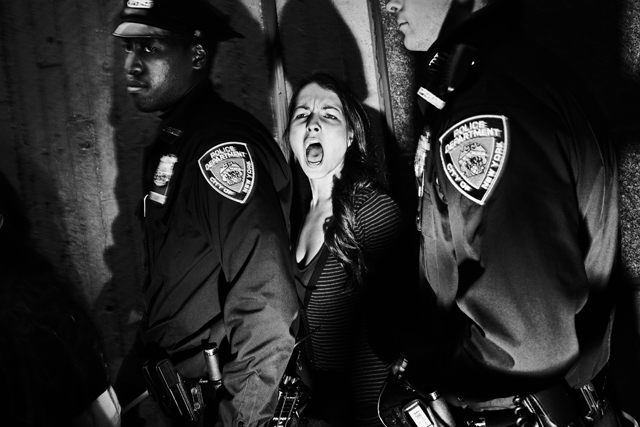

In a BBC documentary of his life and works, photographer **William Klein** said that everyone seems to be into photography these days. To quote loosely, he says what’s really fascinating is that people are producing things that are ‘avant-garde’ which professional photographers do not even dream of doing. 

I’m part of this community of instant snappers – with my Lumix and SLR everywhere I go just to capture pretty much ‘whatever’ without having a care in the world whether the picture is good enough. I am sure there are more gung-ho Instagrammers better than me who are producing more creative and quirky stuff but I still have yet to see photos that haunt, disturb or help us reflect about the world in which we live in.

Thankfully, the [World Press Photo Contest](http://www.worldpressphoto.org/2013-photo-contest) is an anti-thesis of Instagram. **Now showing at the [Southbank Centre](http://www.southbankcentre.co.uk/) here in London until 27 November**. It provides us with a line-up of the best of photojournalism, all done as a testament to our human history. From child brides, prostitutes to a winning prize photo of a Yemeni mother cradling his son, these are stories that are often overlooked or ignored. We might like our happy-go-lucky Instagram photos to make our day, **but these World Press images force us to look into a reality we often want to escape from.**

Here are the Top 19 images from the World Press Photo Contest:

Fatima al-Qaws cradles her son Zayed (18), who is suffering from the effects of tear gas after participating in a street demonstration, in Sanaa, Yemen, on 15 October. Ongoing protests against the 33-year-long regime of authoritarian President Ali Abdullah Saleh escalated that day. Witnesses said that thousands marched down Zubairy Street, a main city thoroughfare, and were fired on when they reached a government checkpoint near the Ministry of Foreign Affairs. Some demonstrators retreated, others carried on and were shot at again. At least 12 people were killed and some 30 injured. Ms Qaws—who was herself involved in resistance to the regime—found her son after a second visit to look for him, among the wounded at a mosque that was being used as a temporary field hospital. Zayed remained in a coma for two days after the incident. He was injured on two further occasions, as demonstrations continued. On 23 November, President Saleh flew to Saudi Arabia, and signed an agreement transferring power to his deputy, Abdurabu Mansur Hadi. Saleh’s rule ended formally when Hadi was sworn in as president, following an election, on 25 February 2012.

A model poses in front of a tailor’s stall in the center of Dakar, Senegal during the ninth edition of the Dakar Fashion Week. She is wearing a dress by US-based Senegalese designer Yolande Ngom Mancini. The Fashion Week began in 2003, as a private venture without government support, at the initiative of former model turned designer Adama Paris and has become a leading showcase for design from across the continent.

Marika Bajur sings ‘Kuriu’, in the restaurant Eurasia. Entertainers perform in restaurants in the Russian resort city of Sochi, on the eastern coast of the Black Sea. Greater Sochi sprawls for some 145 kilometers along the shoreline, attracting predominantly Russian holidaymakers, who come for the sun, sea, sand, and nightlife. Restaurants are plentiful and competition is fierce. Most provide entertainment. The singers come from all walks of life, and are of all ages. Some perform in one place all year round, others move from restaurant to restaurant during the summer season. They sing a mixture of Russian ballads and pop music, solo or in duos, accompanied on a synthesizer, by recorded music, or sometimes by live instruments.

Maria, a drug-addicted sex worker, rests between clients in the room she rents in Kryvyi Rih, Ukraine. The country has the highest incidence of HIV/Aids in Europe and, according to a UNICEF report, one in five sex workers is living with HIV. Maria says she remains HIV negative.

Tahani (in pink), who was married at the age of six, and her former classmate Ghada, also a child bride, stand with their husbands outside their home in Hajjah, Yemen. At first, Tahani hid whenever she saw her husband, who was 25 when they married.

Every year, all over the world, millions of girls below the age of 18 undergo marriages initiated by their families. The tradition of child marriage spans continents, religion, and class. Girls who marry early often abandon their education. The incidence of maternal and infant death is high for women who give birth under the age of 18. Child marriages often take place in defiance of national laws, and despite education programs about health issues. They are seen as an economic necessity in some regions, or are deeply ingrained in local culture.

A portrait of North Korea’s founder, Kim Il-sung, decorates a building in the country’s capital Pyongyang. The ‘Great Leader’, as he was known, was succeeded by his son Kim Jong-il, in 1994. Kim Jong-il died on 17 December, having designated his youngest son Kim Jong-un (aged 27 or 28) as heir.

Marcos and Monica were married for 65 years and, for much of that time, lived in the same apartment in Buenos Aires. In 2007, aged 84, Monica was diagnosed with Alzheimer’s. Marcos looked after her himself, coping with the emotional and physical stress of being a caregiver. In the later stages of Monica’s illness, Marcos had to feed her, pureeing her meals beforehand as she could not chew. During the last year of her life, Monica was bedridden and Marcos had to change her diapers three times daily and help visiting nurses treat her bedsores – activities that took up most of his day. She could barely recognize him, though cuddles and caresses helped her to connect, even if for a few seconds. But Marcos was determined to care for his wife at home. “Tell me where she is going to be better than here,” he said. “I treat her like a princess, here she has everything.” Monica passed away in July 2011.

Demonstrators on Tahrir Square, Cairo, react to a televised speech on 10 February, in which contrary to prior expectations, Egypt’s president Hosni Mubarak said he would not give up power. Since late January, protests against Mubarak’s 30-year-old regime had been held nationwide, with Tahrir Square as an increasingly volatile focal point. Crowds gathering in the square were already celebrating what they thought would be a resignation speech. Following Mubarak’s declaration that he would remain, the number and intensity of demonstrations increased across the country. Eventually, at 18.00 on 11 February, Vice-President Suleiman announced that Mubarak had resigned, handing leadership over to the Supreme Council of the Armed Forces. In response to demonstrators’ demands, the Supreme Council dissolved parliament and suspended the constitution, declaring that it would hold power for six months, or until elections could be held.

Tsunami waves created by a massive earthquake off the northeastern shores of Japan caused wide-ranging destruction along the coast. Iwate, Miyagi, and Fukushima—the three worst-hit prefectures—were overwhelmed by an estimated 22.63 million tons of debris. The economic impact of the tsunami was immense, affecting not only regional fishing, trade, and farming, but also transport and industry nationwide. The World Bank estimated the overall economic damage of the tsunami at €178 billion, making it the natural disaster with the highest cost in world history.

A young male polar bear climbs on a cliff face above the ocean at Ostrova Oranskie, in northern Novaya Zemlya, Russia, attempting unsuccessfully to feed on eggs from the nests of Brünnich’s guillemots, in early July. The location falls within the Russkaya Arktika National Park, covering more than 46,000 square kilometers of islands and sea in the Arctic Ocean, one of the largest protected areas in the northern hemisphere. A polar bear’s primary prey is the seal, the blubber satisfying the bear’s enormous energy needs. Bears hunt seals from sea-ice platforms, and also use ice floes to move from place to place. In summer months, when much sea ice melts, polar bears can become stranded, and have to forage for what food they can. Their dependence on sea-ice platforms for food, traveling, and also for breeding, makes polar bears vulnerable to the effects of climate warming. In 2011, the volume of Arctic sea ice was 66 percent lower than the average documented from 1979 through 2010.

An anti-poaching team guards a northern white rhino, part of a 24-hour watch, at Ol Pejeta Conservancy in Kenya. The park is home to four of the world’s remaining eight northern white rhinos, the world’s most endangered animal. Despite the fact that rhinoceros horn is illegal worldwide, demand is rising steeply as a newly wealthy Asian middle class is able to afford the prized substance, previously the province of the rich. Authorities are often bribed, or turn a blind eye to illegal trade in, and use of rhino horn. Ground rhino horn is used primarily as an anti-fever and anti-toxin medication, in practices that go back centuries. In Vietnam, where a senior government minister has claimed that rhino horn cured his cancer, it sells for €1,865 per 100g to local customers, and for over €6,340 to foreign buyers. With rhinoceros horn worth more than gold, the animals are the target of poachers. South Africa alone lost over 400 rhinos to illegal poaching in 2011. It is estimated there are only 16,000 rhinos left in the world, and the animal faces extinction.

A protester is arrested during demonstrations against police stop-and-frisk tactics in Harlem, New York on 21 October. Stop-and-frisk refers to the New York Police Department practice of detaining and sometimes searching people on the street, when they have not necessarily committed a crime. The police and mayor’s office maintain that this has significantly reduced crime in the city. Opponents argue that the practice victimizes low-income communities and people of color. The October demonstrations against stop-and-frisk attracted support from the Occupy Wall Street (OWS) movement. Scores of OWS supporters made their way up to Harlem from downtown Manhattan, where they had been protesting against corporate greed, social inequality, and what they saw as the power of major banks and multinationals over the democratic process.

Chieko Matsukawa holds up her daughter’s graduation certificate, which she salvaged from the ruins of their home in Higashimatsushima. On 11 March, a magnitude 9.0 earthquake struck 70 kilometers off the T?hoku coast, in northeastern Japan. The quake triggered a tsunami that swept inland over an area of some 500 square kilometers, destroying buildings, crippling infrastructure, and resulting in the displacement of more than 340,000 people. The earthquake was the most powerful ever to hit Japan and one of the most forceful documented in the world. Flooding and damage to transport connections, power stations, and other vital facilities severely hindered recovery operations.

Actress Mellica Mehraban, who was born in Iran but grew up in Denmark, played a lead role in the Iranian spy thriller ‘Fox Hunting’, which had its first Danish screening at an Iranian film festival in Copenhagen in May. The role presented her with some challenges, as she had to brush up on her Farsi, and learn how to portray love on screen without telling or touching the man in question. Mehraban also had to reconcile herself to playing the villain in what could be seen as an anti-Western film.

A new recruit at a police training center run by Germany, in Kunduz, Afghanistan. Young men recruited into the Afghan police force are often from rural areas where education is poor, and are largely illiterate. Many join the police solely for financial reasons—a police officer earns about €130 a month—but their loyalty to the government is thin. Harsh working conditions, and the risk of being killed by the Taliban, lead to many leaving the force before their contract ends.

Rebels battle for Ras Lanuf, an oil-refining town on the Libyan coast, on 11 March. The uprising against the regime of Colonel Muammar Gaddafi had grown out of clashes with authorities in the east-Libyan city of Benghazi, in mid-February. Anti-Gaddafi sentiment was strongest in the east of the country, and Benghazi came to be seen as the rebel stronghold. Ras Lanuf had fallen to anti-government forces on 4 March, during their initial advance west, towards the capital Tripoli. After heavy bombardment by land, sea and air, Gaddafi’s forces retook the city on 10 March, and began pushing the rebels back. For some days it appeared that even Benghazi would be retaken. Gaddafi’s counter-advance was halted after NATO planes began bombing Libyan military targets, following a UN resolution on 17 March. Rebel forces began moving west again and by the end of the month had recaptured Ras Lanuf, though they would not permanently occupy the city until late August.

Utøya island, Norway, 22 July 2011. On 22 July, Anders Behring Breivik (32) killed 69 people on the small island of Utøya, 40 kilometers northwest of Oslo, in Norway. The shootings formed the second of two sequential attacks, the first being a car-bomb explosion in the government quarter of the capital, which killed eight people and injured 92. The Utøya incident took place less than two hours later. The island is the site of an annual summer camp organized by the youth division of the Norwegian Labor Party. Breivik gained access by posing as a police officer who had come to conduct a routine check following the Oslo bombing. He went on to shoot indiscriminately, killing and injuring people around the island and firing on those who jumped into the water in an attempt to escape.

Local police did not have a helicopter appropriate for transporting groups of officers, and could not find a suitable boat to reach the island. When anti-terror police arrived from Oslo, they were eventually carried over to Utøya on civilian craft, reaching the island an hour after the first shots had been fired. Breivik was arrested, and later put on terrorist charges for both attacks. Breivik, who admitted carrying out both the bombing and the shooting, had been preparing for the attacks for a number of years, and had distributed a manifesto outlining his extremist beliefs.

Blackrock College scrum-half Conor Crowley releases the ball after a ruck, during a Division 1A All-Ireland League rugby union match against Old Belvedere, in heavy rain on 5 February, at Anglesea Road, Old Belvedere’s home stadium. Both rugby union clubs are based in Dublin, Ireland. They were originally formed as teams of former pupils of two of the city’s schools, but are now open. Old Belvedere won the match 10-9, and went on to become league champions.

Divers practice during the second day of the 14th FINA World Aquatics Championships, in Shanghai, China, in July.
