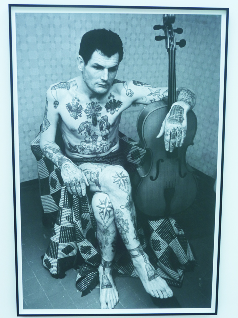
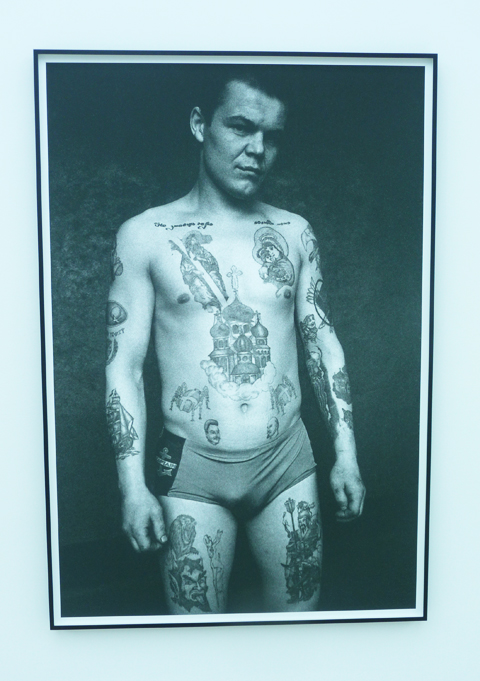
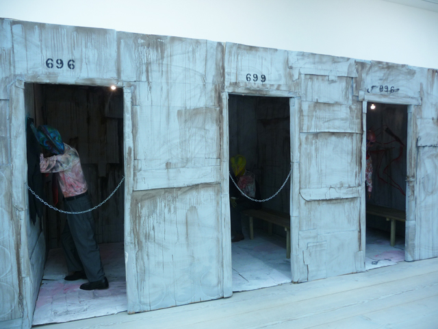
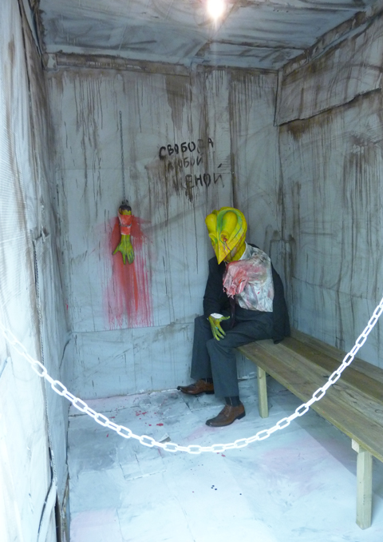
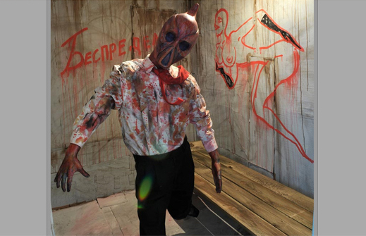
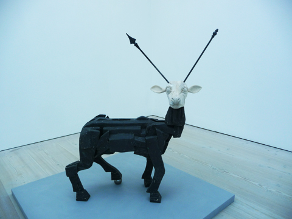

**From photographs of heavily-tattooed Russian criminals to prostitutes hanging about balconies and windows**, ‘Gaiety’ is not a gleeful comeback in Soviet art bur rather an assumption that dark Soviet humour still pervades. It’s no wonder that the curator entitled the new Saatchi show ‘[Gaiety is the most outstanding feature of the Soviet Union](http://www.saatchi-gallery.co.uk/artists/russia/),’ a quote from Stalin – the irony here is that it’s all done in jest. I guess when reality is so grim, you have no choice but to find the humour in it. The stars of the show are outcasts, delinquents and comical caricatures –  all playing a part in the circus of the damned. 

My favorite from the show are the photographs of Sergei Vasiliev. Vasiliev’s photographs of Russia’s hardened criminals lead the pack of ‘Gaiety’. Here the Russian criminals all look serious, a stark contrast to the elaborate graffitti that adorn their bodies from  head to toe. Vasiliev worked as a staff photographer in 1948 and also worked as a prison warden.

Tattoing then was illegal so just imagine what these convicts had to do to just get inked up. The tattoos carry coded messages documenting the criminal’s life and also as an act of protest against the Soviet government.  I read they used blood and urine for tattoos. I guess when you are silenced, you’ll do anything to speak up.

[Gosha Ostretsov’s Criminal Government](http://www.saatchi-gallery.co.uk/artists/gosha_ostretsov.htm?section_name=new_art_from_russiahttp://) is a cartoonish depiction of torture. There are male realistic figures, supposedly government officials, with abstract heads and missing limbs, punished or pushed to commit suicide. Each cell is like a staged cartoon show – even the bloodied graffitti on the wall is freakish comedy. Gosha Ostretsov has taken inspiration from comics in order to interpret contemporary Soviet culture and all its bizzareness. Have a look at the *Wounded Deer* – it’s decapitated head and junkyard mash-up of a body reek of the remnants of the Iron Curtain. The great thing about *Wounded Deer* is it may speak about the Soviet’s past but it sure hell looks funny.

Read more:

- [The Observer: Gaiety is the most outstanding feature of the Soviet Union](http://www.guardian.co.uk/artanddesign/2012/nov/25/gaiety-outstanding-russian-art-saatchi-review?intcmp=239)
- [Sunday Times: Doom with a View](http://www.saatchi-gallery.co.uk/current/gaiety/Sunday_Times_Culture_2_December_2012.jpg)
- [Financial Times: Post-soviet Survivors by Jackie Wullschlager Staring into the Abyss by Andrew Graham Dixon](http://www.saatchi-gallery.co.uk/current/gaiety/1-022-C-C-RVU-SU-1-251112-K0000.pdf)
- [The Independent: The Hammer and Tickle – the dark humour of Soviet art](http://www.independent.co.uk/arts-entertainment/art/features/hammer-and-tickle-the-dark-humour-of-soviet-art-8348784.html)
- [Huffington: Russian Art is Hot](http://www.huffingtonpost.co.uk/katerina-zherebtsova/russian-art-is-hot-says-t_b_2174888.html)
