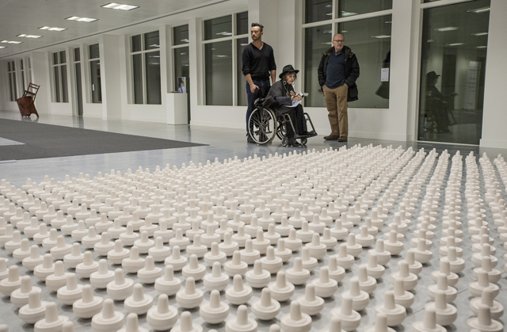
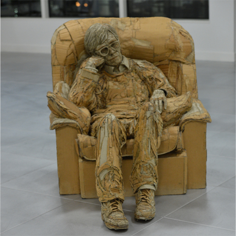
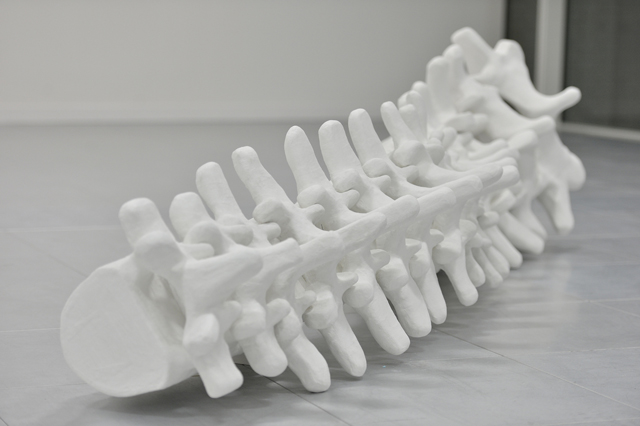
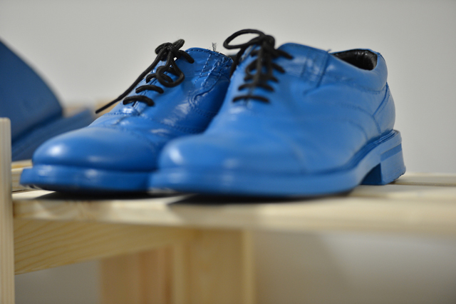

Artist [Noemi Lakmaier](http://www.noemilakmaier.co.uk/) is sitting in one desk and one-by-one painting shoes in blue road-marking paint, the colour of paint used for disabled badge holder’s parking bays. **Her goal is to individually paint more than 500 shoes** for ‘The Observer Effect’,  one of the many sculptural pieces and installations for the new Pop Up Gallery at [Shape Arts](http://www.shapearts.org.uk/).

A cultural institution that develops opportunities for disabled artists, **Shape Arts has transformed its 60,000 square foot contemporary space to accommodate more than 130 artworks by 30 artists**. The show will be running until 30 May 2013 so please be sure to check it out. I am especially excited to see[ James Lake’s](http://www.jameslakesculpture.co.uk/) ‘Sitting without a purpose’ cardboard sculpture! I will update the blog next week when I have more pictures to share.

**Shape CEO Tony Heaton said: ‘This is a new initiative for Shape and a fantastic opportunity to show the work of some of Britain’s most talented disabled artists working today** – we also want to invite the city to come in and enjoy some lunchtime culture! And… if you are looking for some different shoes we have them… Come over and see us, you will be very welcome.’

**Anne Deeming** ‘You’ll meet yourself coming back': Based in Bristol, has exhibited as a part of a group exhibition at the 2011 National Open Competition Motorcade/ Flash Parade in Bath. [www.annedeeming.com](http://www.annedeeming.com) 2012 graduated with MA Fine Arts at Bath Spa School of Art & Deisgn.

**James Lake** ‘Sitting without a purpose': Uses cardboard as his main media to sculpt beyond traditional materials and to blur the boundaries between high and low art. He works and leads community projects in primary and secondary schools where they can create cardboard sculpture with out the need of a specialised work space. James Lake is currently involved in the ‘Gold Run Project’ inspired by the history of the Paralympic Games for [Outside In.](http://www.outsidein.org.uk/james-lake)

Lisa Gunn 'Columna Verterbralis': The Trapezius Exhibition 2011 at the Herbert Art Gallery included the Columna Verterbralis which is an 11ft sculpture representing her damaged spine. Lisa Gunn has had works exhibited at the The Cafe Gallery, The Hockney Gallery and The Gulbenkian Gallery at The Royal College of Art, Kensington Gore London.

Noemi Lakmaier The Observer Effect”: In 2008 ‘Experiment in Happiness’ was where Noemi meticulously painted hundreds of pairs of shoes which led to The Observer Effect. She has been honoured the NAN New Collaborations award, the Adam Reynolds Bursary and the Fire Station Studio Award.

")

Susan Kruse ‘Love (pain)': This piece of art was commissioned for the Lux Festival at York in 2007. Susan is involved in an ongoing research project ‘The Library of Lost Books’ which rescues and restores damaged old books. This exhibition will be located in Birmingham 2013 and will tour the UK.

<iframe allowfullscreen="" class="youtube-player" frameborder="0" height="505" src="//www.youtube.com/embed/orRd8pGdFQM?wmode=transparent&fs=1&hl=en&modestbranding=1&iv_load_policy=3&showsearch=0&rel=0&theme=dark&feature=player_embedded" title="YouTube video player" type="text/html" width="640"></iframe>

<figcaption>About Shape Arts*</figcaption>

## Pop Up Gallery general information

The General Opening Times of the Pop Up Art Gallery is Monday to Thursday 10-2 pm. 40 Gracechurch Street, London, EC3V 0BT.

For appointment only Monday and Thursday between 2-6 pm and from 10- 6 pm on Friday. To make an appointment email [popupgallery@shapearts.org.uk](mailto:popupgallery@shapearts.org.uk) or ring 02076210900 or 07849281054.

The Gallery is Free Admission and on arrival, report to the the receptionist in the building that you’re visiting Shape pop up art gallery. Here is the website for the charity: [www.shapearts.org.uk](http://www.shapearts.org.uk/)

I just received news that the exhibit has now been extended until the 30th of May 2013.
