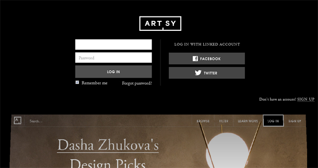
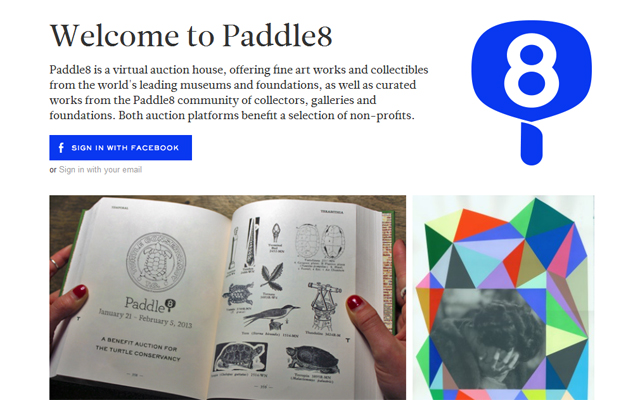
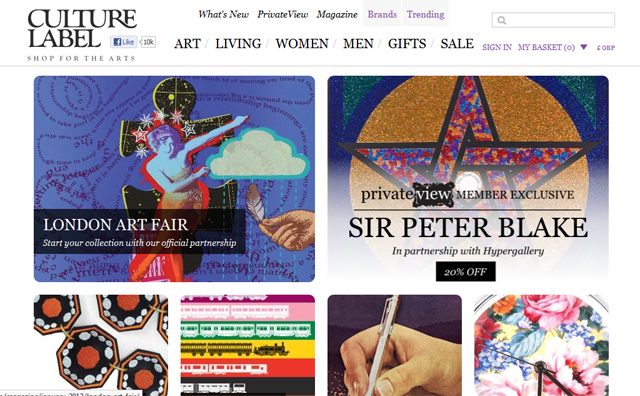

Forget all those expensive art. Here’s your chance to buy affordable art with a click of your finger. In recent years, the online art business has mushroomed into a formidable market – and by the looks of it, it’s going to become bigger and bigger. Leading the pack are the recently baptised new Amazon of art ‘**[Artspace](http://www.artspace.com/)‘, [Artsy](http://artsy.net/) and [Paddle 8](http://www.paddle8.com/)** – all American-led companies. There’s one  from the UK, – [**Culture Label**](http://www.culturelabel.com/)- which are selling art prints rather than traditional art but also worth mentioning.

It’s nice to own a good piece of art and hang it about our bedroom but for me, **buying art online** is not just about doing it as an investment. Here’s our opportunity to have a say about what kind of art we like and hopefully influence and dictate the movement of contemporary art.  **The internet has leveled the playing field for most industries and why not art?** Is it right that something so beautiful should just stay within a certain status quo? The art e-commerce offers a line-up of  curated art but hell yeah, if we are going to really go for the internet revolution, all kinds of businesses – even art –  have nowhere to hide.

So here we are. Take a look at these four online art shops and see where you want to put your money on.

**[Artspace](http://www.artspace.com/)**

**Membership is free** so register and voila – browse the collection just like any fashion e-commerce website you’ve encountered before. Artspace boasts of having a team of curators who collaborate with top American museums and galleries to compile their collection. Artworks range from **under $250 up to over $5000** and the collection includes photographs, paintings and even sculpture from rising stars to established artists. They even offer e-gift cards if you want to buy someone a gift!

**[Artsy](http://artsy.net/log_in)**

Artsy is not your traditional type of e-commerce site. In fact, they don’t have anything up for sale on their site and you need to connect with their gallery partner to make the purchase. The great thing about Art.sy is that it allows you to discover art and learn more about your favourite artists.  After registering, **you are given the option to personalise your page and follow your favourite artists** and also discover artists that have been inspired by them. So let’s say your artist does not have any artwork for sale, you can then check some artworks of the same type of genre. So far, Art.sy has a list of **10,000 works available in partnership with galleries**.

**[Paddle8](http://www.paddle8.com/)**

Paddle 8 is a virtual auction house boasting of a collection from top museums and galleries. Here, you can bid for the artwork you like and then** galleries have 72 hours to respond to arrange for shipping**. **The act of bidding for the artwork is the hook**.  As it is, an artwork that starts at $250 may probably end up at $2500 so Paddle 8 seems to be higher-end option than Artspace and Art.sy. Nevertheless, it’s a chance for new collectors to participate in this fun and enjoyable bidding process a la [Sotheby’s ](http://www.sothebys.com/en.html) or [Christie’s](http://www.christies.com/) and you don’t need to be a mega-millionaire to be ‘in’.

**[CultureLabel](http://www.culturelabel.com/)**

Based in Britain, CultureLabel sell art prints and other souvenir items from top UK cultural institutions like Tate and the V&A museum. Price range starts as low as £2 pounds and there’s a wealth of souvenirs to choose from. Items are categorised for men and women or by budget – and **there’s a [28 day return policy](http://www.culturelabel.com/pages/about/delivery-returns/) if you’re not happy with your purchase**.
