[caption] Chromosaturation by Carlos Cruz-Diez[/caption]
**Let there be light!** Last Tuesday, I attended the press preview of [Hayward Gallery’s new Light show](www.haywardlightshow.co.uk/) and was left bedazzled by the possibilities of light-based art. With more than** 25 illuminated installations and sculptures by major international artists**,  it can literally be light-changing especially if you see **Olafur Eliasson’**s *Model for a timeless garden (2011)* – my favourite among the entire show. I suggest that you see this piece last if you want to have the best enlightened experience.

The whole show is dazzling in so many ways: **It is truly a homage to light and its power to change our perception**. The artists who have participated in the show have long been purveyors of light even as early as the sixties. But here they do not only explore light as a spatial and environmental experience, they also provide us with a big techie-geeky showmanship. By marrying the art of the light form with technology, we experience some **radioactive psychedelic transcendence** where we end up getting light years away high without the paraphernalia.  Expect this show to not only will  mess with your senses, but also get ready for some form of eureka moment. **Don’t blink.**

**[1. Leo Villareal](http://www.haywardlightshow.co.uk/artists/#leo-villareal)**
Cylinder II (2012) (picture above)
White LEDs, mirror finished stainless steel, steel, custom software, electrical hardware

Leo Villareal is an American artist whose uses LED lights and encoded computer programming to produce his light sculptures. Cylinder II is animated by complex changing patterns that orchestrates unique natural phenomena.

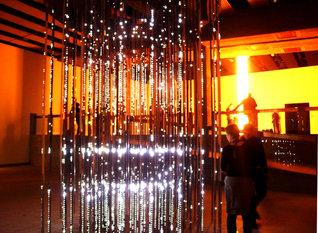

**[2. David Batchelor](http://www.haywardlightshow.co.uk/artists/#leo-villareal)**
Magic Hour (2004-2007)
Found steel and aluminum boxes, found steel supports, acrylic sheet, fluorescent light, cable**

David Batchelor’s art celebrates the light and the urban altogether. He uses plastics and electricity to evoke the edginess of modern cities.

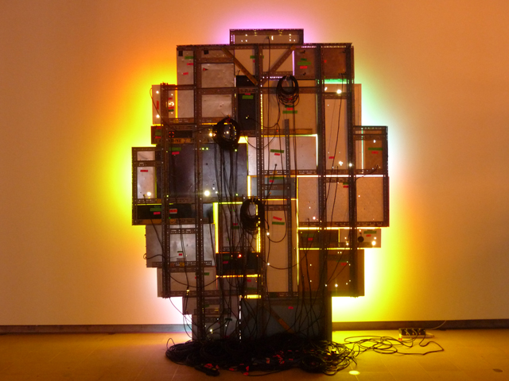

**[3. Jim Campbell](http://www.haywardlightshow.co.uk/artists/#jim-campbell)**
Exploded View (Commuters) (2011)
Custom electronics, 1152 LEDs, wire, steel

Jim Campbell stretches the possibility of light into the cinematic realm, often giving it a 3d feel.

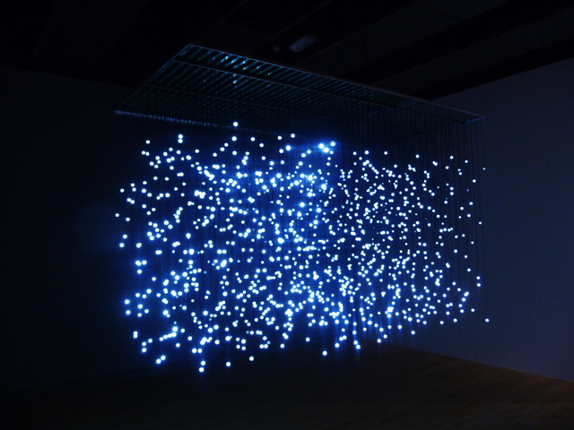

**[4. Carlos Cruz-Diez](http://www.haywardlightshow.co.uk/artists/#carlos-cruz-diez)**
Chromosaturation (1965-2013)
Three chromocubicles (fluorescent light with blue, red and green filters)

In Chromosaturation, Carlos Cruz-Diez creates immersive chambers using artificial light environments in red, blue and green.

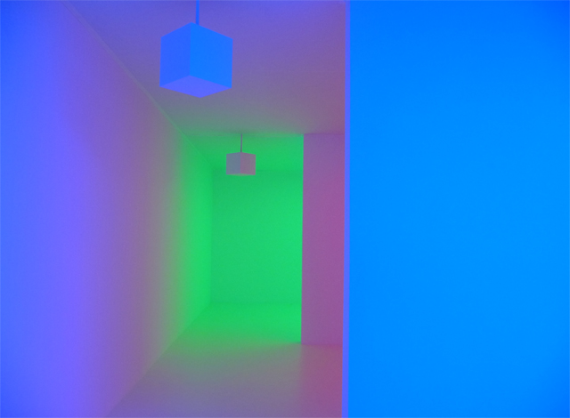

**[5. Bill Culbert](http://www.haywardlightshow.co.uk/artists/#bill-cullbert)**
Bulb Box Reflection II (1975)
Wooden box, mirror glass, light bulbs, electric cable

Bulb Box Reflection II, is a light bulb sculpture using magician props. For years, Bill Culbert has used light as element of photography, sculpture and installation.

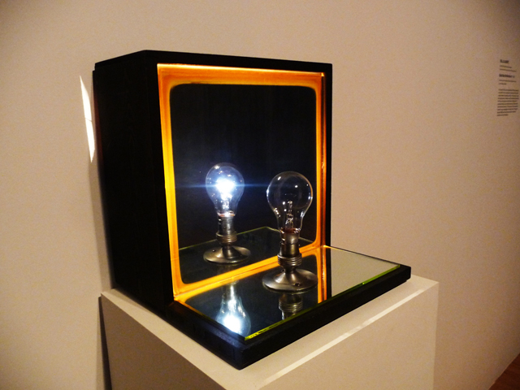

**[6. Dan Flavin](http://www.haywardlightshow.co.uk/artists/#dan-flavin)**
the nominal three (to William Ockham) (1963)
daylight fluorescent light

For most of his career, Dan Flavin has used flourescent lights as his medium to create artworks of standard beauty and intensity.

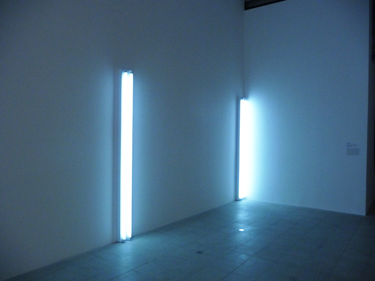

**[7. Dan Flavin](http://www.haywardlightshow.co.uk/artists/#dan-flavin)**
untitled (to the “innovator” of Wheeling Pechblow) (1966-1968)
daylight, yellow and pink fluorescent light

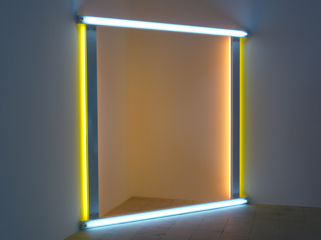

**[8. Fischli and Weiss](http://www.haywardlightshow.co.uk/artists/#fischli-and-weiss)**
Son et Lumiere (Le Rayon vert) (1990)
Flashlight, turntable, plastic cup, adhesive tape
(Picture below – screenshot from the Hayward gallery website)

An artistic collaboration between Swiss-born Peter Fischli and David Weiss, both have long explored the use of  light and the homemade to create sculptures and installations.

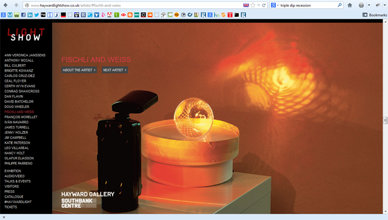

**[9. Ceal Floyer](http://www.haywardlightshow.co.uk/artists/#ceal-floyer)**
Throw (1997)
Theatre light, metal gobo (no. 8136)

Ceal Floyer has incorporated the sculptural aspect of light to explore the interplay of idea and physical presence to change perception. Here, Throw suggests light as a puddle of paint thrown at the floor.

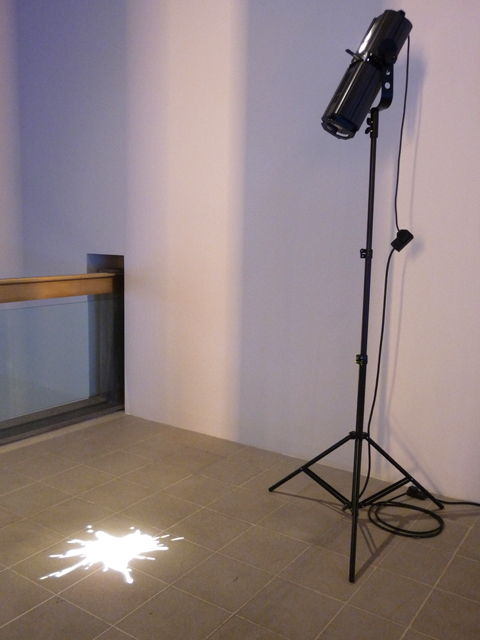

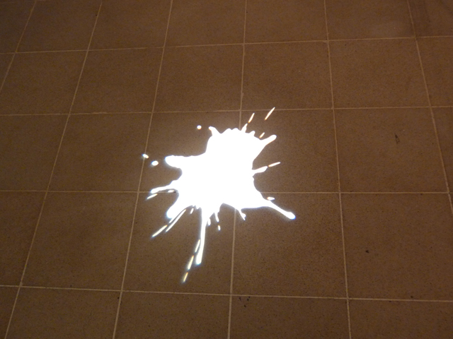

 
**[10. Nancy Holt](http://www.haywardlightshow.co.uk/artists/#nancy-holt)**
Holes of Light (1973)
Two 650-watt quartz lamps, polyurethane board, pencil

Nancy Holt focuses on the use of holes and light to trigger awareness of the physical space. In Holes of Light, the illumation switches from varying points of view, creating an effect of light and shade.

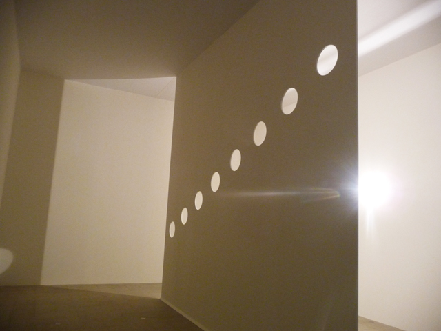

**[11. Ann Veronica Jannsens](http://www.haywardlightshow.co.uk/artists/#ann-veronica-janssens)**
Rose (2007)
Installation with spotlights and artificial haze

Ann Veronica Jannsen’s Rose installation uses the combination of beams of light and fog to give a cinematic space-time experiences that feel  almost like altered states of consciousness or beyond.

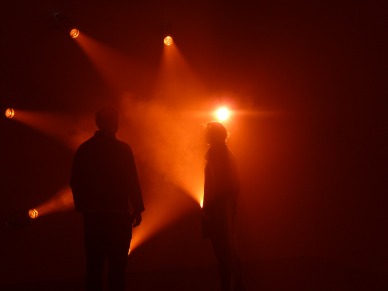

**[12. Brigitte Kowanz](http://www.haywardlightshow.co.uk/artists/#brigitte-kowanz)**
Light Steps (1990-2013)
Fluorescent lamps, dimensions variable

Brigitte Kowanz’s Light Steps are ascending steps of flourescent lights meant to resemble a flight of stairs. She has been using artifical

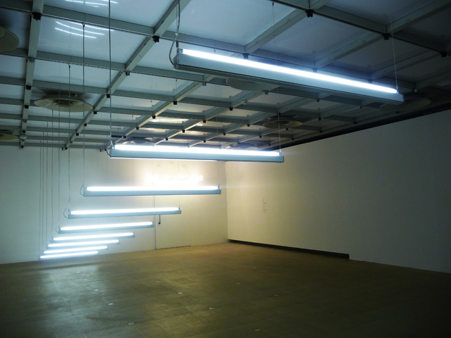

**[13. Anthony McCall](http://www.haywardlightshow.co.uk/artists/#anthony-mccall)**
You and I, Horizontal (2005)
Solid light installation: computer, Quicktime movie file, video projecter, haze machines

Anthony McCall has been a leading figure of using light as a sculptural vehicle. In You and I, Horizontal, this 3d light installation invites the viewer to interact –  around, into and through – with light.

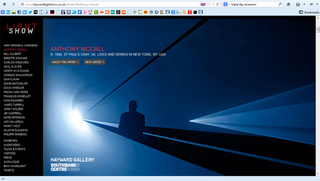

**[14. Francois Morellet](http://www.haywardlightshow.co.uk/artists/#francois-morellet)**
Lamentable (2006)
8 blue neon tubes, electric cables, 2 transformers

Lamentable are made out of neon lights manipulated to form a sculptural object that interacts with space. Francois Morellet’s early neon works were dynamic but in recent years they have been more static which relate more to architectural space.

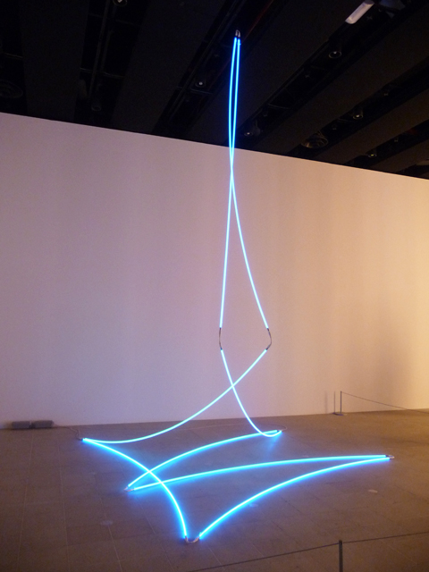

**[15. Ivan Navarro](http://www.haywardlightshow.co.uk/artists/#ivan-navarro)**
Reality Show (2010)
LED, aluminum door frames, mirrors, one way mirrors, wood and electric energy

Dictatorship in Chile is so much part of the art Chilean artist Ivan Navarro who is now based in New York. Control, repression are all explored thru the medium of light and sculpture in Ivan’s works just like this Reality Show, Burden and the Hayward Fence.

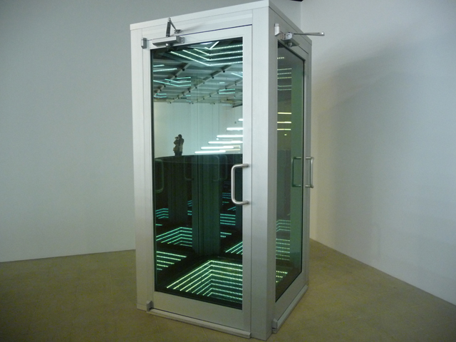

**[16. Ivan Navarro](http://www.haywardlightshow.co.uk/artists/#ivan-navarro)**
Burden (Lotte World Tower) 2011
Neon, wood, paint, Plexiglass, mirror, one-way mirror and electric energy

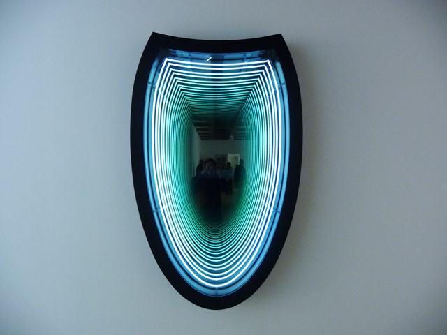

**[17. Ivan Navarro](http://www.haywardlightshow.co.uk/artists/#ivan-navarro)**
The Hayward Fence (2013)
Neon, aluminum and electric energy
(no photo)

**[18. Philippe Parreno](http://www.haywardlightshow.co.uk/artists/#philippe-parreno)**
Marquee (2011)
Transparent acrylic glass, neon tubes, light bulbs, converters, controller, cables

Philippe Parreno uses marquees as electric tiaras designed for landmarks inspired by cinema and theatres.

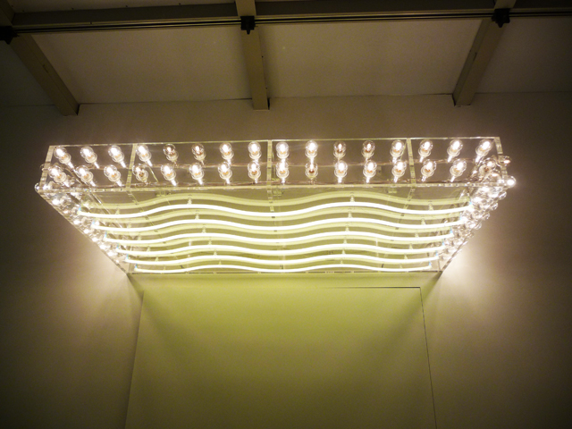

**[19. Katie Paterson](http://www.haywardlightshow.co.uk/artists/#katie-paterson)**
Light bulb to Simulate Moonlight (2009)
Set of 289 lightbulbs with halogen filament, frosted coloured shell, 28W, 4500K

Katie Paterson recreates Moonlight through the use of 289 set of blue lightbulbs as a response to our obsession with recreating daylight.****

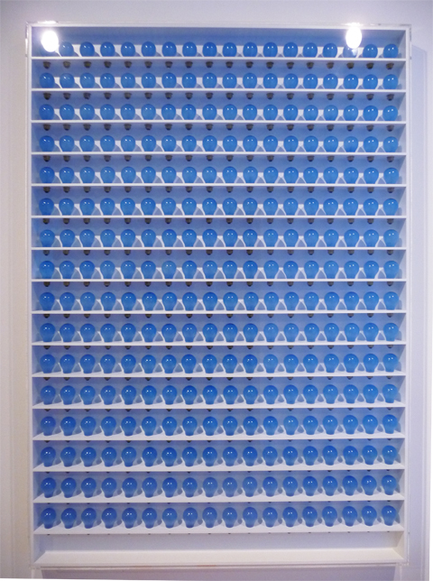

**[20. Conrad Shawcross](http://www.haywardlightshow.co.uk/artists/#conrad-shawcross)**
Slow Arc Inside a Cube IV (2009)
Mechanised system, steel, light, aluminum and motors

British artist Conrad Shawcross is an interesting interplay of moving light and shadows which provide an almost 3d sculptural experience within the realm of light and movement.

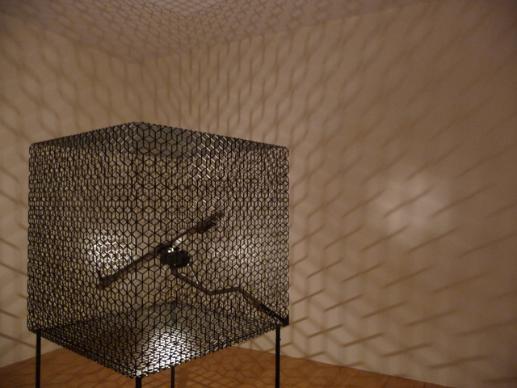

**[21. Cerith Wyn Evans](http://www.haywardlightshow.co.uk/artists/#cerith-wyn-evans)**
S=U=P=E=R=S=T=R=U=C=T=U=R=E (‘Trace me back to some loud, shallow, chill, underlying motive’s overspil…’) (2010)
Mixed Media

This piece uses light, movement and text to create this conceptual superstructure by Cerith Wyn Evans that interplays with the epic poem of James Merrill.

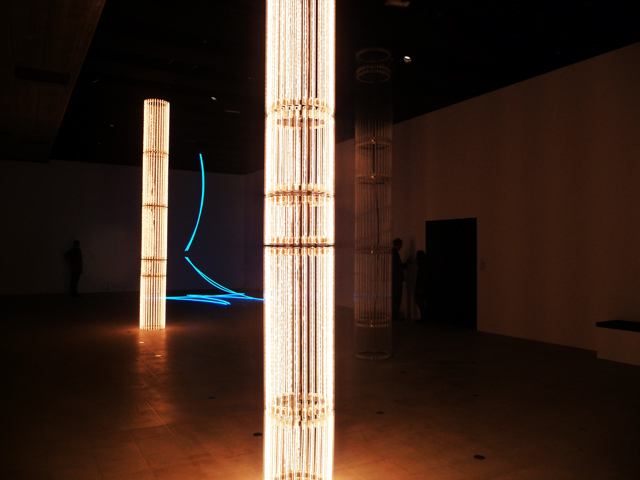

## Other light installations in Hayward Gallery (no pictures)

**22. Doug Wheeler**
Untitled (1969)
Sprayed lacquer on vacuum-formed Plexiglass and white UV neon light
(no photo)

**23. James Turrell**
Wedgework V (1974)
Flourescent light, fiber optic
(no photo)

**24. Jenny Holzer**
MONUMENT (2008)
9 double-sided semicircular electronic LED signs: red and white diodes on front and back. 9 double sided semicircular electronic LED signs: red and blue diodes on front, blue and white diodes on back
Text: US government documents
(no photo)

**25. Olafur Eliasson**
Model for a timeless garden (2011)
water, pumps, nozzles, stainless steel, wood, foam, plastic, strobe lights, wall mounts, control unit.
(no photo)

Read more critic reviews:

- [How the Hayward Gallery’s light show monkeys with your eyeballs by Adrian Searle for the Guardian](http://www.guardian.co.uk/artanddesign/2013/jan/28/hayward-gallery-light-show-exhibition)
- [Art Review: Light show @ Hayward Gallery from the Londonist](http://londonist.com/2013/01/art-review-light-show-hayward-gallery.php)
- [Exhibition review from the Upcoming](http://www.theupcoming.co.uk/2013/01/30/exhibition-review-light-show-at-the-hayward-gallery/)
- [Look at the Bright Side – from The Independent](http://www.independent.co.uk/arts-entertainment/art/look-on-the-bright-side-light-show-at-the-hayward-gallery-8478999.html)
- [Disco party takes over Hayward Gallery – Bloomberg ](http://www.independent.co.uk/arts-entertainment/art/look-on-the-bright-side-light-show-at-the-hayward-gallery-8478999.html)
