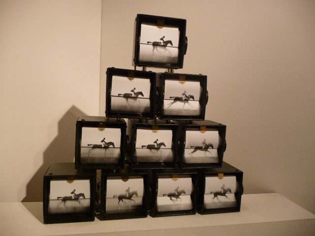

The more our lives become intertwined with technology, the more the [Kinetica Art Fair](http://www.kinetica-artfair.com/) becomes a relevant platform for ambitious tech-related type of art. Now on its fifth year, **Kinetica Art Fair is bustling with energy and possibilities.** The great thing about the Kinetic Art Fair is that it looks to the future and yes, it’s future is oh so bright.  I predict that in a few years to come, it will become a much more important exhibition and would garner more funding from not just new media outfits but also by top art ponchos.

A convergence of kinetic, electronic, robotic, sound, light, time-based and multi-disciplinary new media art, Kinetica Art Fair brings artworks from more than **35 galleries and some of the artists featured are with international pedigree**. It’s not surprising that this is not a curated art fair.  Art is for all and so is technology although I am sure that if it is curated better, it can be a formidable force in the arts world. But for now, here in the Kinetica Art Fair, there is a sense of **collaborative spirit all happening between artists, designers, architects and new media students** so much so that it seems like they are breeding this into their own playground.

Interactivity is in the heart of the Kinetica Art Fair: from a typewriter that beats drum sounds into bottles to a large-scale sculptural zoetrope, there are unexpected things in this exhibition that can take your breath away.

**1. A sculptural dream-world**

<iframe allowfullscreen="" class="youtube-player" frameborder="0" height="505" src="//www.youtube.com/embed/OIHxjqZ7pTU?wmode=transparent&fs=1&hl=en&modestbranding=1&iv_load_policy=3&showsearch=0&rel=0&theme=dark" title="YouTube video player" type="text/html" width="640"></iframe>

<figcaption>Gregory Barsamian at Kinetica Art Fair 2013. A modernisation of the Zoetrope, inspired by Carl Jung</figcaption>

**2. 3d but 2d**

<iframe allowfullscreen="" class="youtube-player" frameborder="0" height="505" src="//www.youtube.com/embed/GPOtykKvTFI?wmode=transparent&fs=1&hl=en&modestbranding=1&iv_load_policy=3&showsearch=0&rel=0&theme=dark" title="YouTube video player" type="text/html" width="640"></iframe>

<figcaption>The Trulife™ Hologram reproduces the same light wave which reflected off the original object. Created by [Colour Holographic](http://www.colourholographic.com/)</figcaption>

**3. Tech Ocean**

<iframe allowfullscreen="" class="youtube-player" frameborder="0" height="505" src="//www.youtube.com/embed/vAlrnRrrVpw?wmode=transparent&fs=1&hl=en&modestbranding=1&iv_load_policy=3&showsearch=0&rel=0&theme=dark" title="YouTube video player" type="text/html" width="640"></iframe>

<figcaption>The Mechanical Ocean Wave Simulator, Ciboure 2013 by [Matthieu Schönholzer](http://www.kinetica-artfair.com/?exhibitors/2013?cat=5). One of the pioneers of 3d-FX computer graphics industry, this is Matthieu’s foray into the world of interactive sculpture*</figcaption>

**4. Fibre optic figure**

 by Roseline de Thelin. Roselin used fibre optics to create light points to create an illusion of a seated figure")

**5. Type some sounds**

**6. Flipping books**

**7. Keyboard beauty**

**8. Breathing H20**

**9. Fishing line but not for fish**

**10. Tech fingers**

Read more:

- [Wunderkammeras and techno-animalism: Kinetica Art Fair returns to Ambika P3 –  Culture 24](http://www.culture24.org.uk/art/sculpture%20%26%20installation/art422490)
- [Kinetica comes into its own illusory adventures – New Scientist blog](http://www.newscientist.com/blogs/culturelab/2013/03/kinetica-artfair.html)
- [When Art and Science Collide (Pictures) – Huffington Post](http://www.huffingtonpost.co.uk/2013/03/01/kinetica-2013-art-fair_n_2789402.html?utm_hp_ref=uk)
- [Kinetica Art Fair – Half Matrix – Half Diagon Alley – Artlyst](http://www.artlyst.com/articles/kinetica-art-fair-2013-half-matrix-half-diagon-alley)

<iframe allowfullscreen="" class="youtube-player" frameborder="0" height="505" src="//www.youtube.com/embed/eqNRrUDSI8Y?wmode=transparent&fs=1&hl=en&modestbranding=1&iv_load_policy=3&showsearch=0&rel=0&theme=dark" title="YouTube video player" type="text/html" width="640"></iframe>

<figcaption>More on Kinetic Art Fair 2013</figcaption>
