[Art 13](http://artfairslondon.com/) – the new contemporary art fair that graced London this week was a success: Artinfo reports the **positive sales** incurred during the show and it signals a bright future for this art newcomer. For me, despite not seeing the presence of major London galleries here, what I really enjoyed most was discovering foreign galleries and seeing Oriental artists take centre stage (if they haven’t been basking in the Art limelight already).

The great thing about these (South east) Asian artists is their new found confidence and their boldness in merging both **tradition and Western ideals in their artwork**. It’s not anything new of course – a lot of artists explore their history to create a new language in their work. But personally, (and possibly with a lot of bias), I am drawn to the ingenuity and the new energy that these artists bring.

**The Boat – a monumental rice paper sculpture by Chinese artist Zhu Jhinsi** was, in my opinion, the most audacious piece of art in the fair. But aside from the stunning artworks from these Oriental artists, overall Art 13 is truly Europe’s global art fair. With more than 129 art galleries from 29 countries, it might be too much to take in. (How do critics do it?) –  my small self can only pick a few favourites.

## Here’s my Top 27

**1. Zhu Jinshi**
Untitled
Gallery: Pearl Jam Galleries
China/Singapore HK

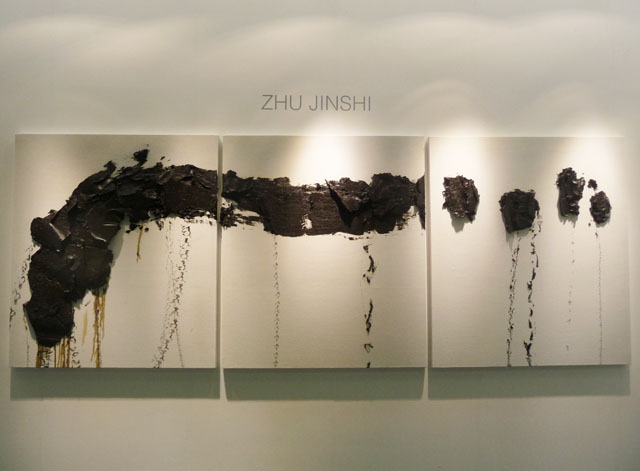

**2. Zilvinas Kempinas**
(b.1969 Lithuania)
Title: Fountain 2011
Gallery: Saatchi Gallery
fan, magnetic tape, metail ring

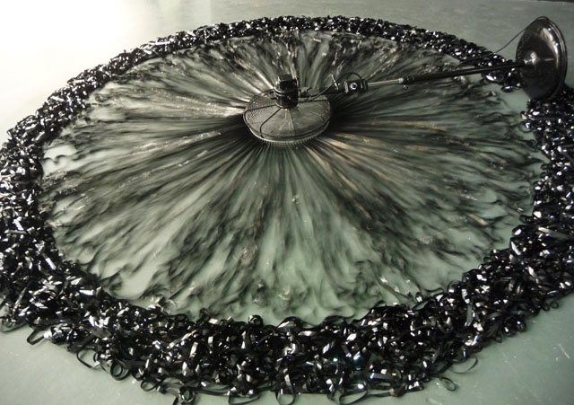

**3. Szilard Cseke**
(b. 1967, Hungary)
Title: Deep Look, 2012
Medium: Tyres, polystyrene balls, electric fans, fluorescent tube, electric control, iron, wood

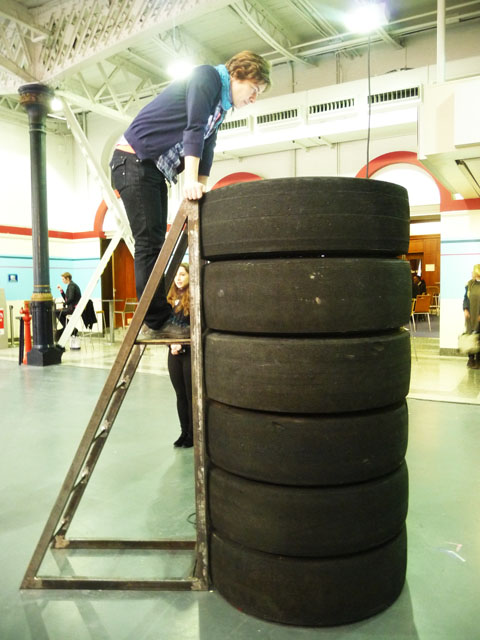

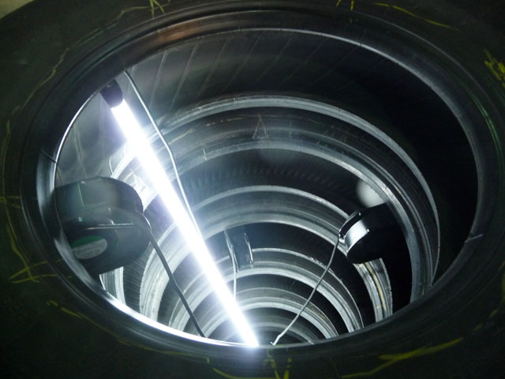

**4. Nathan Slate Joseph**
Title: Time for Peace II, 2004
Gallery: Sundaram Tagore Gallery
Medium: Pure pigment on steel

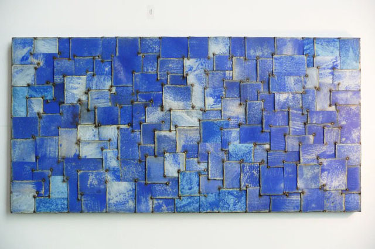

**5. Hiroshu Senju**
Title: Waterfall, 2012
Medium: Natural pigments on Japanese mulberry paper

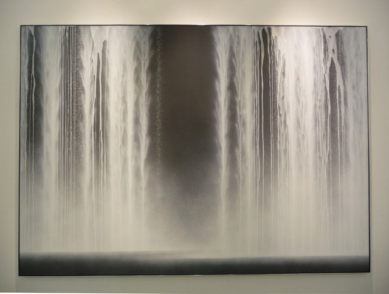

**6. Peter Newman**
London, St Mary Axe, 2012
Gallery: Fine Art Society Contemporary
Medium: Stainless steel, transparency, LED lightbox

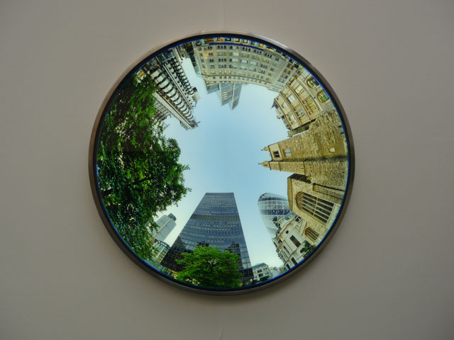

**7. Bernard Cohen**
Study I, 2008
Gallery: Flower Gallery
Medium: Acrylic on Linen

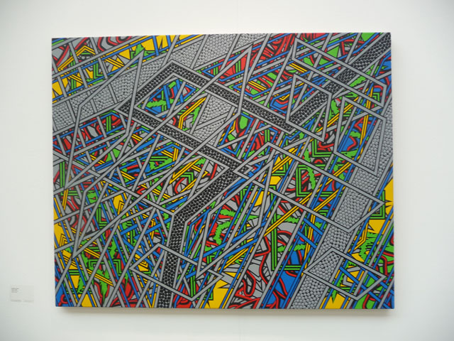

**8. Grayson Perry**
Map of the Truths and Beliefs
Gallery: Paragon
Medium: Tapestry, ed. of 12

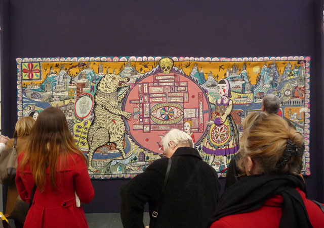

**9. Chai Jeong-Hwa**
Breathing Flower
Gallery: Gana Art – South Korea
Medium: Variable size, Fabric, LED Lights, motor

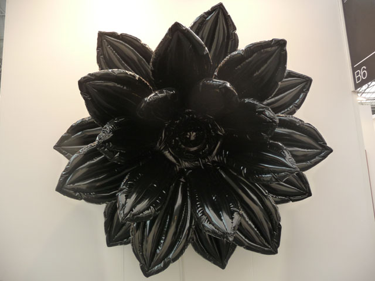

**10. Yi Hwan-Kwon**
Summer (ed. 2/5)
Gallery: Gana Art – South Korea
Medium: handpainted on F.R.P., mixed material

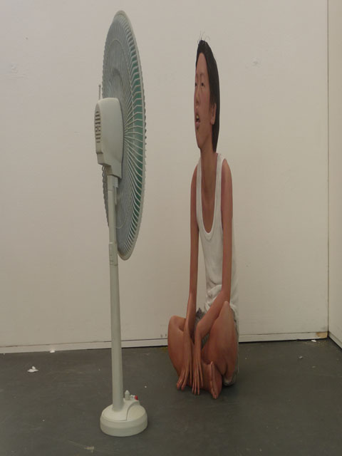

**11. Yi Hwan-Kwon**
Jae Min (ed. 5/5)
Gallery: Gana Art-South Korea
Medium: Hand-painted on F.R.P.

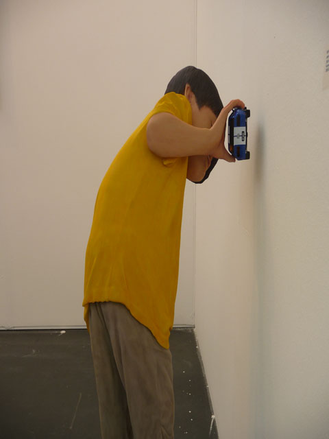

**12. Lee Kyoung Mi**
Le Sablon Bruxelles on the Table
Gallery: Cais Gallery – Hongkong/South Korea
Medium: oil on constructed birch

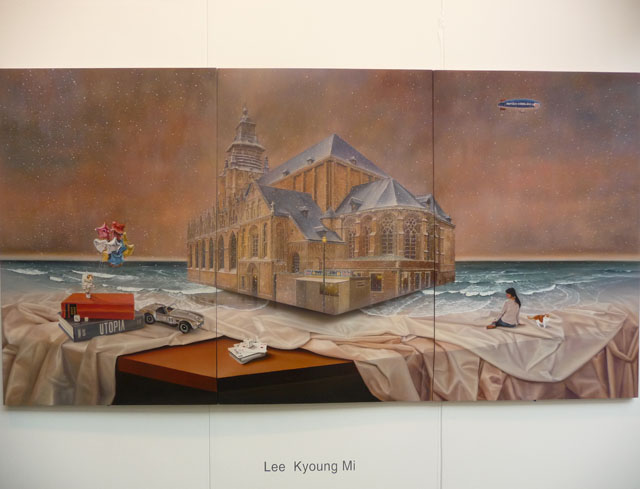

**13. Choi, Xoang**
Puppeteer
Gallery: Cais Gallery (Hongkong/South Korea)
Medium: Oil on Resin

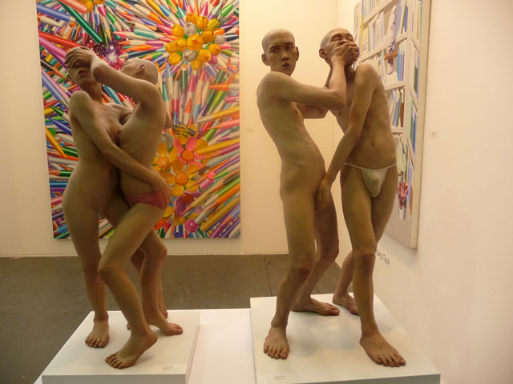

**14. Lee Jaehyo**
Various works
Gallery: Albermarle Gallery

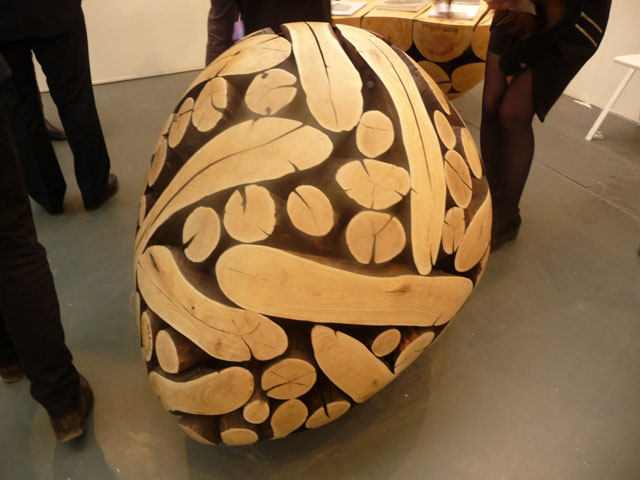

**15. Sam Havad Toy**
Lenin 2011
Gallery: Kalman Maklary Fine Arts
Medium: Acrylic paint on fiberglass

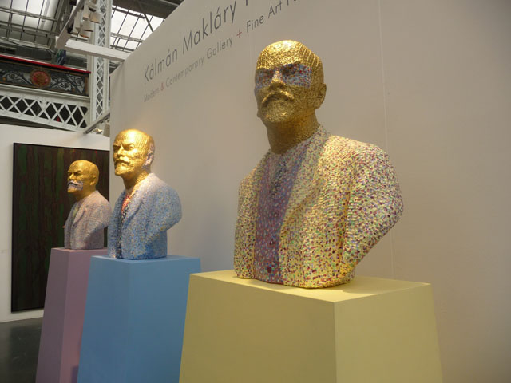

**16. Sam Havad Toy**
Untitled, 2008
Gallery: Kalman Maklary Fine Arts

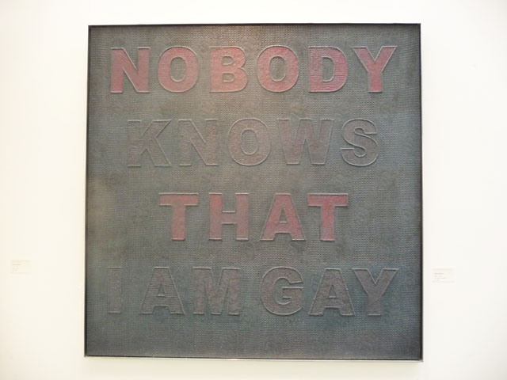

**17. Shi, Sang-Ho**
Wrapping Future City 2010
Gallery: Lee Hwaik Gallery
Medium: Glazed Ceramic

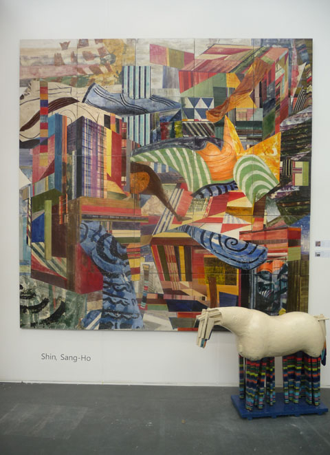

**18-19. Chen Guangwu / Young-Jae Lee**
Ink, Earth and Fire
Medium: Calligraphy and Ceramics

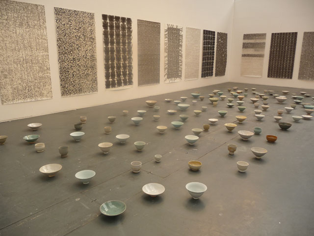

**20. Wang Shugang**
Listening I 2011/Man Playing with Birds/Man Playing with Ball
Gallery: Alexander Olus Galleries
Medium: Bronze

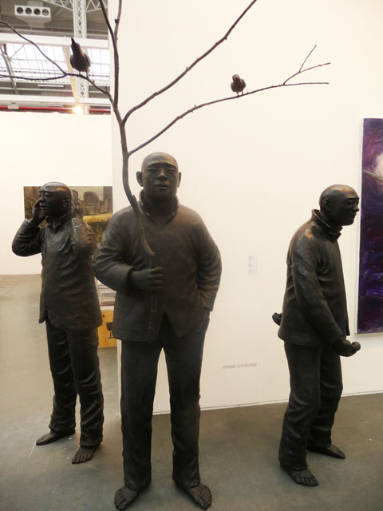

**21. Kambiz Sabn**
White Dive, 2012
Gallery: Artspace Dubai/London
Medium: Fiberglass Ed 3

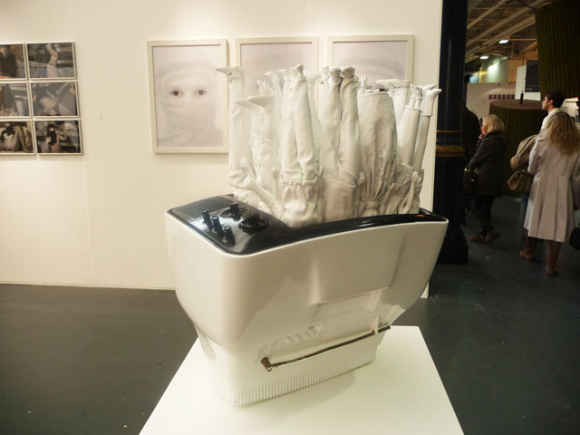

**22. Zhu Jinshi**
Boat
Gallery: Pearl Lam G
Medium: rice paper

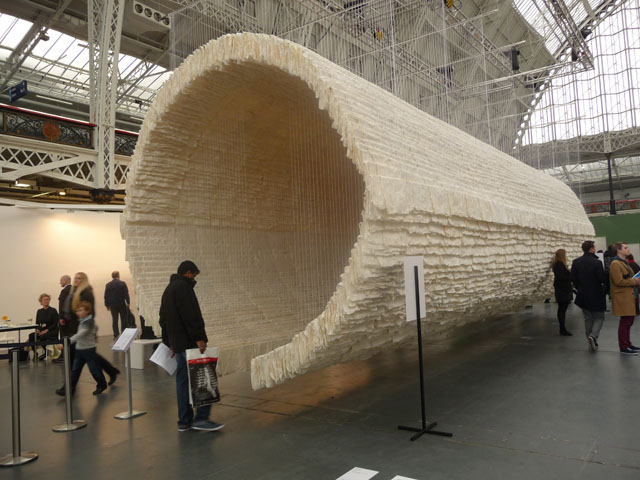

**23. Mu Boyan**
Worm
Gallery: Aye Gallery China
Medium: Color on resin + Color on Bronze

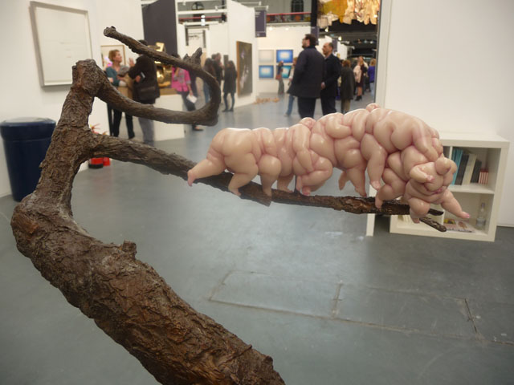

**24. Nyoman Masrindi**
God Like 2013
Gallery: Gajah Gallery
Medium: Acrylic on Canvas

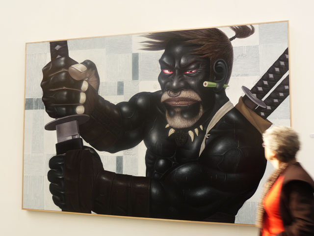

**25. Rimuald Hazoune**
Petrol Cargo

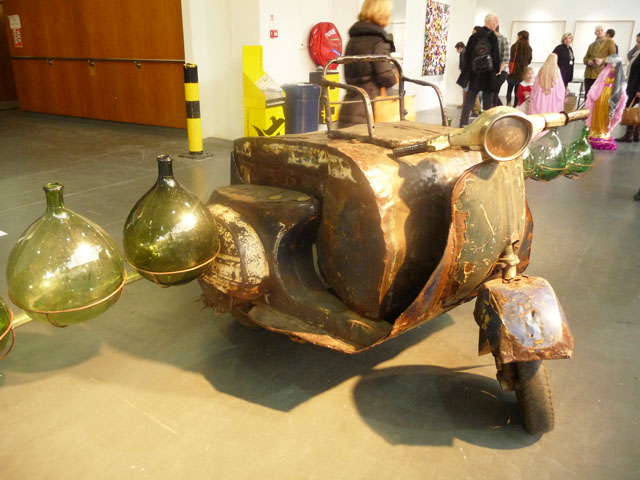

**26. Huang Xu**
Fragment no. 2, 2007
Gallery: October Gallery
Medium: chromophotograph

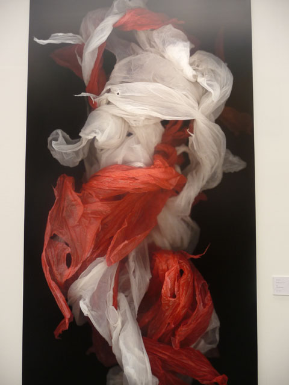

**27.  Ei Anatsui**
Balkan 2012
Gallery: October Gallery
Medium: Aluminum and copper wire

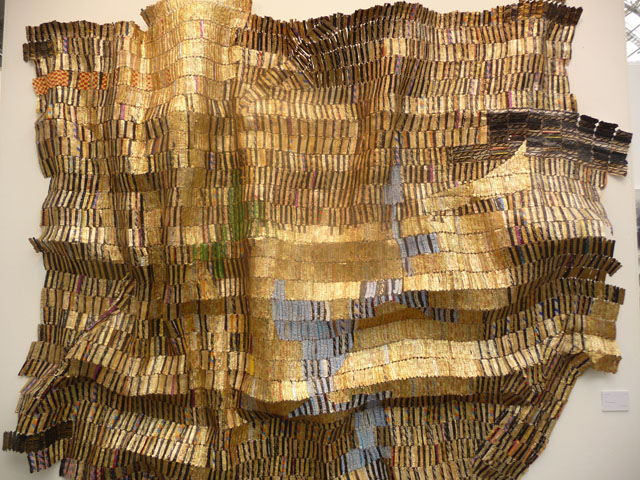

Related articles:

- [Art13: pop stars mix with artists at London’s latest contemporary art fair – Telegraph](http://www.telegraph.co.uk/culture/art/art-news/9908397/Art13-pop-stars-mix-with-artists-at-Londons-latest-contemporary-art-fair.html)
- [Inaugural Art13 hailed a success – Event Magazine](http://www.eventmagazine.co.uk/Events/article/1173323/inaugural-art13-london-hailed-success/)
- [Art13 London brings global cultural elite to the capital – Exhibition news](http://www.exhibitionnews.co.uk/newsdetails/2875/art13-london-brings-global-cultural-elite-to-the-capital)
- [Art13 draws 25000 people and international collectors – Spear’s](http://www.spearswms.com/spears-world/wire/44442/art13-draws-25000-people-and-international-collectors.thtml)
- [UK rooms with a view – Wall Street Journal](http://online.wsj.com/article/SB10001424127887323384604578328331706023940.html)
- [Art13 London – Financial Times](http://www.ft.com/cms/s/2/aa66ddf6-7a7a-11e2-9c88-00144feabdc0.html#axzz2MnIOPpeC)
