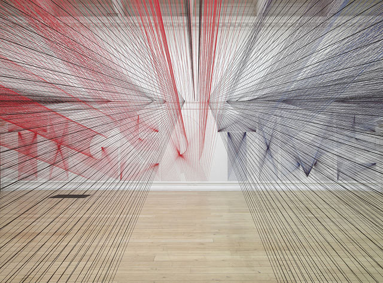
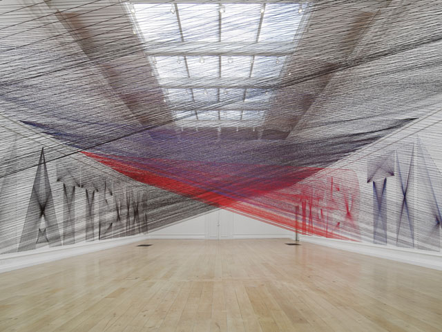
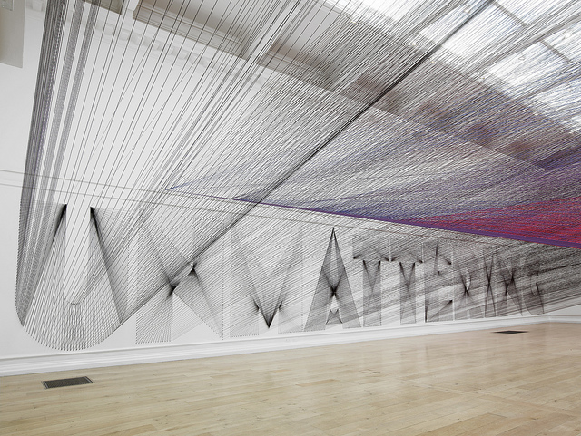
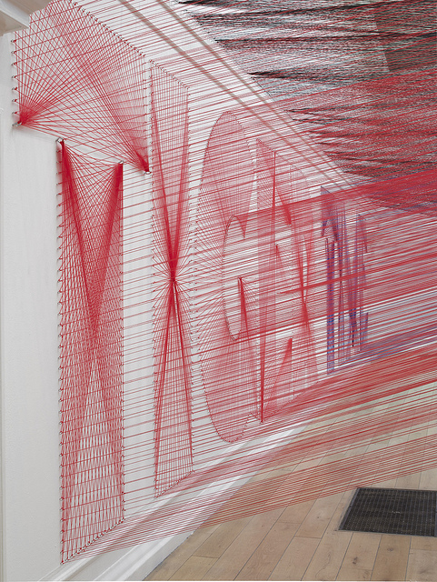
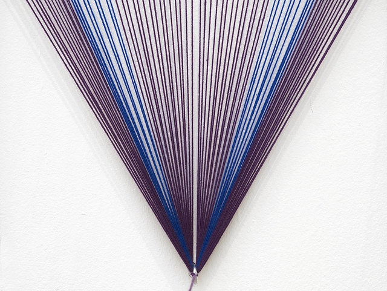
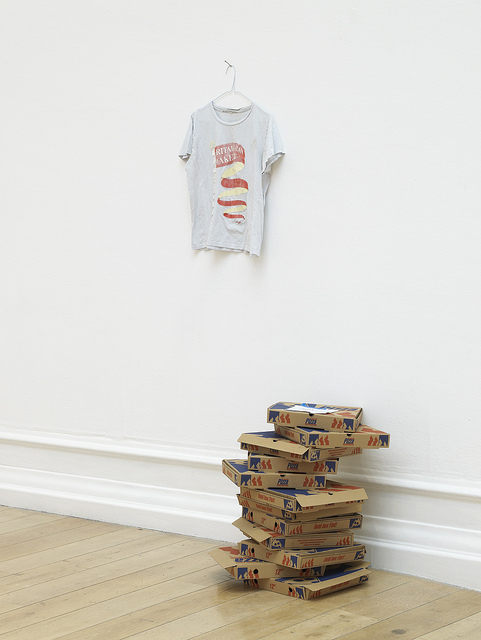

Whether it be smoke image tapestry or works that defy the lines between applied and fine art  **multi-media artist Pae White** never fails to craft temporal artworks into monumental pieces.

In her new exhibition ‘[Too Much Night, Again’ at the South London Gallery](http://www.southlondongallery.org/page/pae-white-too-much-night-again), the American artist has transformed the main exhibition space into large-scale site-specific installation with massive amounts of colourful yarn criss-crossing all over the room while spelling words ‘Tiger Time’ and ‘Unmattering’ on two opposite walls. With more than 48000 yarn to play with, Pae White has spun the South London gallery space into a live string sculpture.

**As if stepping into a dream-like realm**, I took my time to look at the expanse of this thread installation hanging over me like a cloud of colourful screens meshing together on top of my head. I really wanted to touch them or strum them like guitar strings, or hope that they would play some kind of music that would fit this otherworldly realm. Even my steps were paced slowly –  me and my fellow gallery visitors moved about carefully as if afraid to disturb some presence in the room. **No one dared to speak except to breathe.**

My head swirled around following the lines and destinations of the yarn only for my gaze to fall unto the two words scribbled on the wall – ‘Tiger Time’ and ‘Unmattering’  which you only discover while moving across the room. I would have preferred not to have these words at all – I was already quite happy to be in a thread-like universe where nothing needs definition. At the end of the room, you can see Pae’s shirt hanging about above stacks of empty pizza boxes.

Incidentally, **Pae was inspired to recreate her experience with insomnia in this installation while also exploring the transience of our existence**. It is for this reason why there is a dream transformation once you step into the space of installation combined with her use of an everyday, common object like the yarn to symbolise a temporal dimension.

In one of her interviews*, Pae says *‘For the last several years, my practice has focused on an **exploration of the neglected, the forgotten, the spaces between things, even the things between things.** I am equally drawn to the temporary, the fleeting, to the ephemera of everyday life. My work has attempted to subvert the viewer’s expected relationship to an everyday object, nudging them off balance, encouraging a deeper.’

<iframe allowfullscreen="" class="youtube-player" frameborder="0" height="505" src="//www.youtube.com/embed/unKwUj3NzvA?wmode=transparent&fs=1&hl=en&modestbranding=1&iv_load_policy=3&showsearch=0&rel=0&theme=dark&feature=player_embedded" title="YouTube video player" type="text/html" width="640"></iframe>

<figcaption>Installation of Too Much Night at the South London gallery</figcaption>

Related articles:

- [Aesthetica Blog: Pae White – Too Much Night again](http://www.aestheticamagazine.com/blog/pae-white-too-much-night-again-london/)
