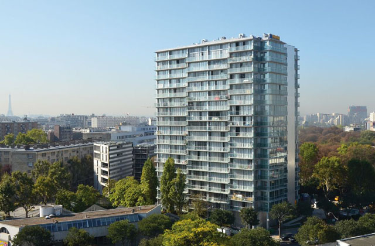
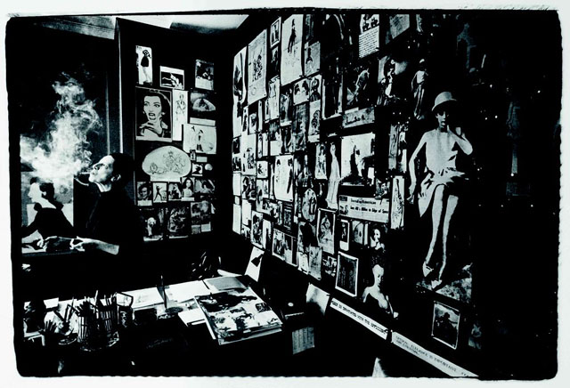
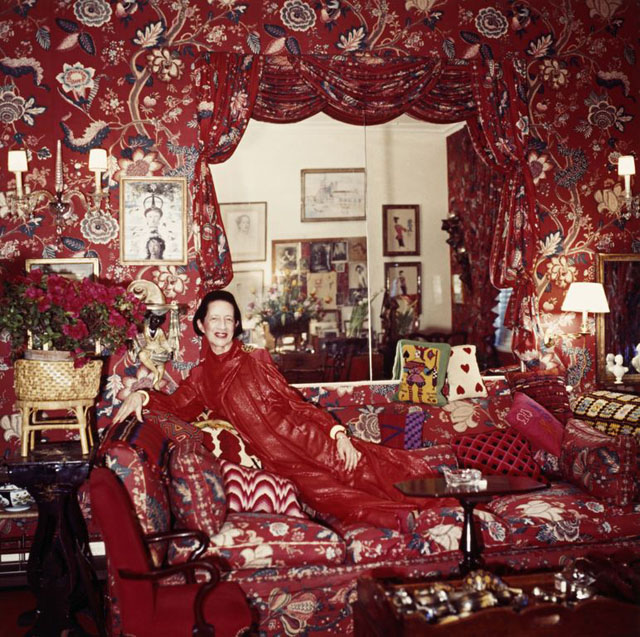
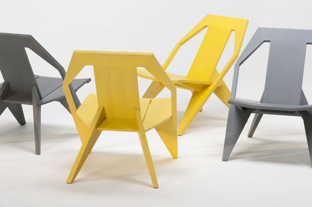
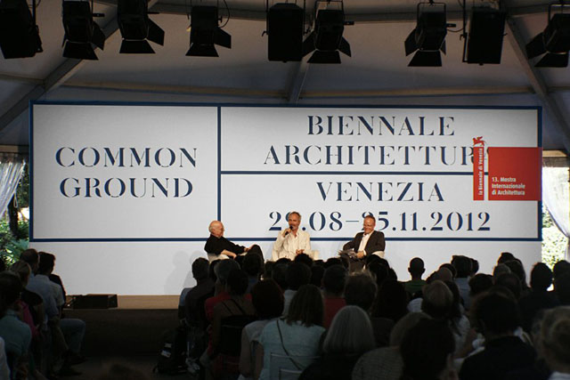
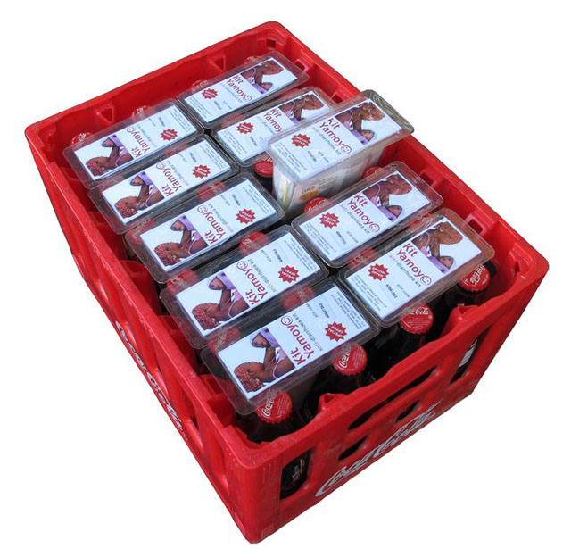
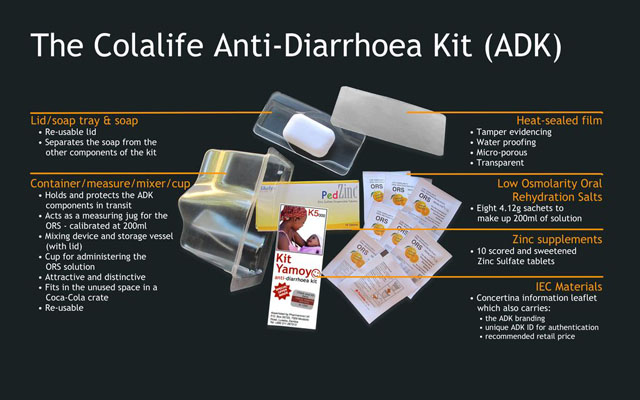
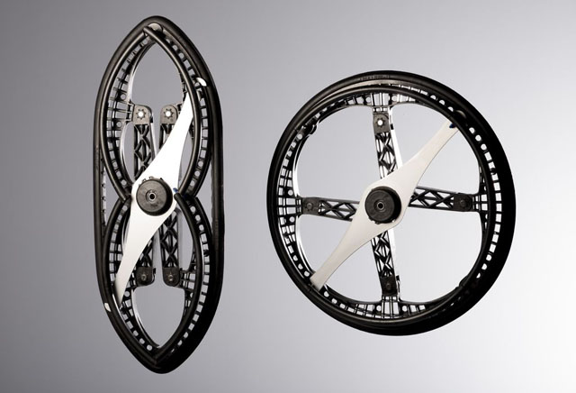
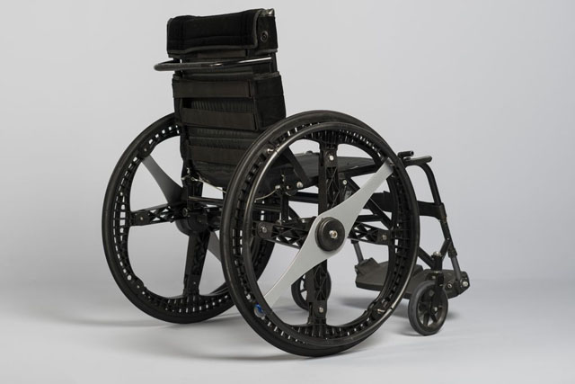

**The ‘Designs of the Year’ winners have just been announced** – covering seven categories in the field of architecture, product, fashion, digital, fashion, transport and graphics. Some of my favourite designs did not win – like **Heatherwick’s Olympic cauldron or Olafur Eliasson’s Little Sun** – but this does not diminish the fact that these are great designs that have made a powerful impact in society and our consciousness. Who can get the cauldron out of his mind after seeing that monumental candelabra which opened the London 2012 Games?

But this year’s winners all deserve to win. I’ve added the pics of the winners below but it’s better to book yourself a ticket to the [Design Museum](http://designmuseum.org/) to see them for yourself. You might have your own favourites (like I do!)  that might not have made the cut. (Read my next article on who are my favourites). But these winners have all been selected by a panel of nominators and the Design awards are considered the Oscars in design.

## Here are the big winners:

**1. Architecture**
Winner: TOUR BOIS-LE-PRETRE, PARIS
Designed by Frederic Druot, Anne Lacaton and Jean-Philippe Vassal

**2. Digital**
Winner: GOV.UK WEBSITE
Designed by Government Digital Service

**3. Fashion**
DIANA VREELAND: THE EYE HAS TO TRAVEL
Directed by Lisa Immordino Vreeland

**4. Furniture**
Winner: MEDICI CHAIR
Designed by Konstantin Grcic for Mattiazzi; Graphics

**5. Graphics**
VENICE ARCHITECTURE BIENNALE IDENTITY
Designed by John Morgan Studio

**6. Products**
Winner: KIT YAMOYO
Designed by ColaLife and PI Global

**7. Transport**
Winner: MORPH FOLDING WHEEL
Designed by Vitamins for Maddak Inc. Pete Collard, Curator of Designs of the Year

[Read about this year’s nominees](http://designmuseum.org/exhibitions/2013/designs-of-the-year-2013)

Related articles:

- [Artlyst: Designs of the Year awards – seven category winners announced](http://www.artlyst.com/articles/designs-of-the-year-awards-seven-category-winners-announced)
