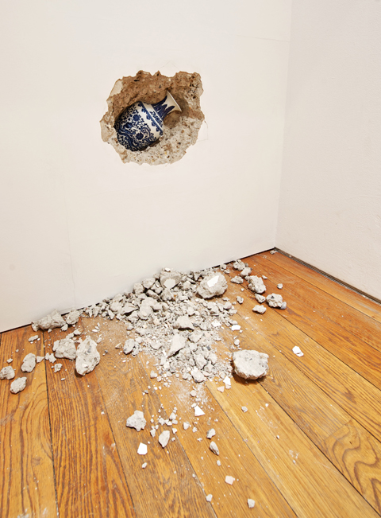
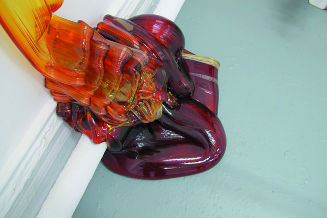
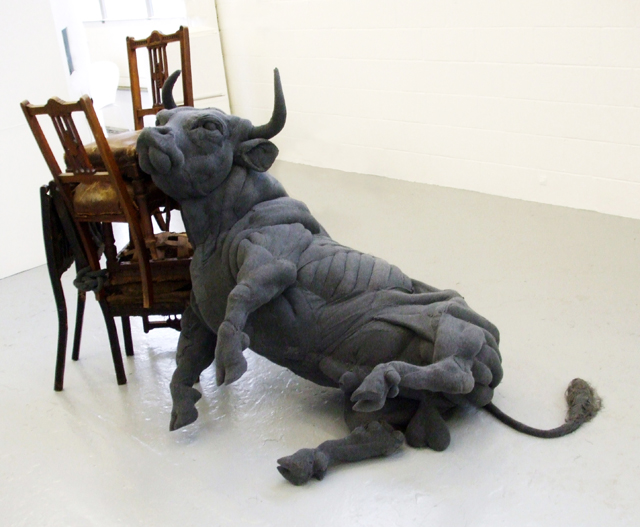
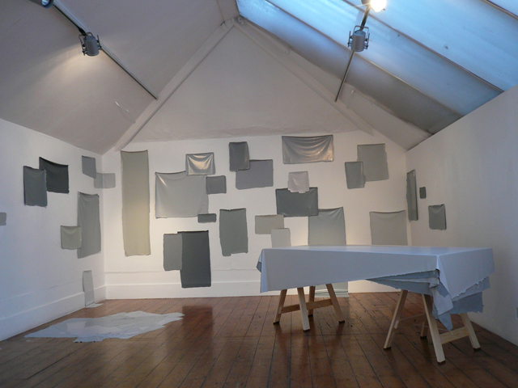
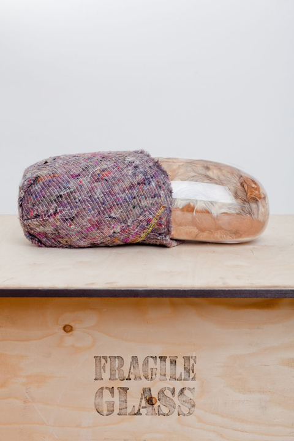
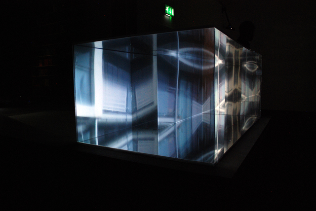
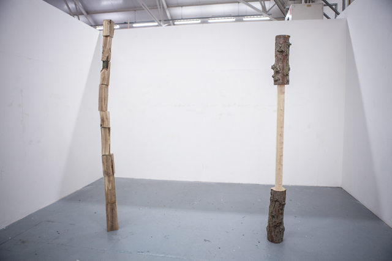
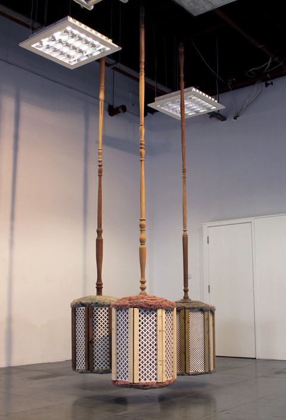
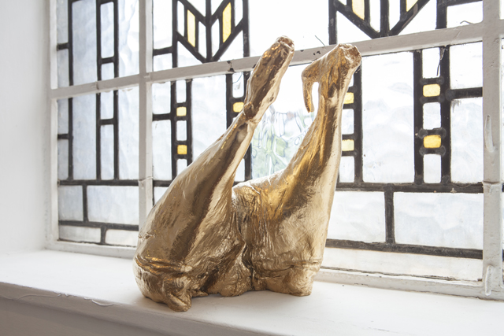
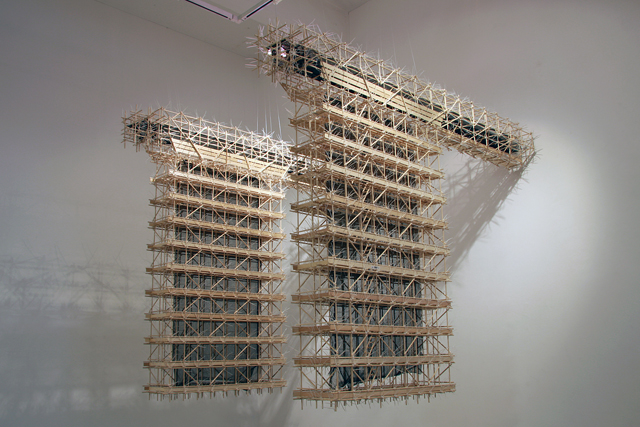

Frieze is here! But before you get into that Frieze pandemonium mode again, you have two days to visit the **[Bursary Awards 2013](http://rbs.org.uk/exhibitions/bursary-awards-2013) exhibition at the Royal British Society of Sculptors**. Before Frieze, please do check out the works of some of the top emerging contemporary sculptors chosen by RBS. In a few year’s time, some of the artists here will be massive and this is a great opportunity to view their works at the early stages of their art career. Next time, we’d need to pay a ticket to see them!

I was able to attend the Sculpture Slam event (back to back talks) and heard a sneak peak of what these sculptors have done. My favourite from this year’s group is **Shan Hur** – a London-based artist who creates embedded sculptures into walls etc. He takes familiar objects and embeds them in the strangest places whilst incorporating the space around it to become an extension of the sculpture.

Here’s Shan Hur’s work and the rest of the Bursary Award winners:

**1. Shan Hur, Forgotten #06, 2011, Concrete, plywood, timber, and vase**

‘My work reflects my primary interest in the relationship between the mobile viewer and modern architectural space. As exposure to the built environment has increasingly become a banal part of daily life my work provokes the viewer to rethink their surroundings, revoking their sense of spatial-temporal experience.’

**2. Ruth Brenner, Amorphous/restrain, 2012, Amber rosin, oil and steel**
‘My practice is intuitively based on material exploration and the act of making. Familiar or industrial materials are used to make ambiguous works that provoke associations beyond the formal qualities of the object, often with uncanny results. It is important that the end results have vestiges of beauty, not in the orthodox sense but rather an uneasy, troubled beauty that incites curiosity. I attempt to subvert expectations by creating objects that pose questions regarding their origins either materially or functionally.’

**3. Dorcas Casey, Bull, 2011, Hand stitched fabric, furniture and mixed media**

‘My work seeks to translate the recurring and mysterious motifs of animals in my dreams into tangible objects. These sculptures embody a myriad of emotions and sensations in one piece; exploring the unconscious associations we have with familiar creatures.’

**4. Martin Cordiano, Greywashing, 2013, Household paint, trestle legs, table and copper nails**

‘Greywashing’ is inspired by the layers of society present on the streets of Beijing. It draws upon the black ink advertisements subsequently concealed with grey paint by the Chinese government which leave the city’s walls covered with grey patches. Using the same visual language I introduce my mark in this endless socio-economic circuit generated by these two antagonistic forces.

**5. Adeline de Monseignat, Mother in Child (detail), 2013, Hand blown glass, vintage fur, pillow filler, steel, wood, mirror and transit blanket**

‘Life is where my core interest lies; the way in which we feel, think, move, touch, procreate and give life, and that the cycle starts all over again. I explore this through materials, turning them into ‘creaptures’, creature sculptures that aim to hold a sense of life.’

**6. Joe Drakeford, Liquid Landscape, 2012, Two-way mirror and film projection**

‘Furnished by mirror and glass the cityscape renders real space closer to a screen than anything physical, creating an ageless digital dystopia symptomatic of disorientation in the concrete of the present. In my work I aim to explore the psychological effects that mirror and glass can have upon us when used in one of the most tangible of mediums, architecture.’****

**7. Matt Moser-Clark, Sentinels, 2013, Oak and cypress**

‘There are many hinges and points I turn on, gathering knowledge from cross-table discussions, making work drunk with instability, drawing until you’re too tired to stand, lying flat on the floor until you’re too cold to breathe. Breaking rules and having rules break you. Cutting, dividing, spreading, layering then cutting again and again.’****

**8. Lisa Selby, Extend-Impend-Fortify, 2012, Wood, decorative radiator protectors, dyed eco roof insulation wool and hinges**

‘My work begins with found objects from the domestic environment, my sculptural forms revitalise and re-conceive their function; the imperfect copies then being estranged from their originals. The fragility and impermanence of my work evokes images of vulnerable homely spaces; creating the lingering sentiment of failure and melancholy through my use of delicate materials, poised to fall and domestic liquids, left to evaporate.’

**9. Lucy Tomlins, Tangential Status, 2013, Gold-plated bronze’**

‘My work is firmly rooted in the everyday and directly references the material objects of our society. Remaking the ready-made, I draw on the very specific cultural references and symbolic qualities imbued in the original object but not the object itself. The remaking materially shifts the subject, removing any unproductive associations. Through formal and material transformative decisions and juxtapositions I am able to play with uncanny relationships between seemingly disparate materials and things.****

**10. Jiho Won, Two Flag, 2012, Cable ties and scaffolding net**

‘My recent projects are focused on two strong symbols of a national group, flags and anthems. Long used as a tool to keep patriotism alive in a group of people they also draw clear lines between groups. Where most existing art about conflict tends to focus on depicting the horrors of war, my work instead aims to explore the ways in which art is more directly involved in social turmoil by questioning more fundamental examples.’****

