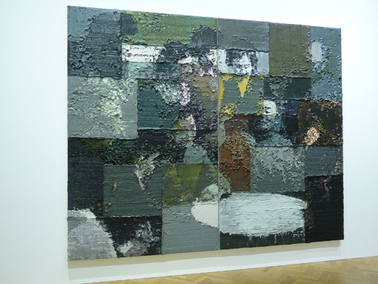

Li Songsong’s exhibition at the [Pace Gallery](http://www.pacegallery.com/) is just simply superb. I am actually campaigning to have this exhibition extended because it’s that good. Even Ai Weiwei himself has given his stamp of approval by writing two essays about this artist in the show catalogue.

For this show, Li Songsong has taken his inspiration from historical figures and events from his native country China and yet, – and this is the impressive part – **reconstructs them, almost sculpturally** square by square in massive aluminum-panelled paintings, and **abstractly with thick layers of paint**.

I am mesmerised by the rawness that the thick texture of paint brings to the artworks and can imagine the spontaneity of how he must have laboured applying the paint. Up close, they bring a sensation, or at least, some hints of the **action painting process of Jackson Pollock, spontaneous and perhaps violent**. On the other hand, you know that the creative process is still calculated, as the grand idea is to make the small sections fit into a whole picture – **there must have been careful planning thing there, like an architect drafting plans before his build.**

But even if I take a step back, all the way til my shoulder blades almost touch the other wall of the gallery, (hoping to make sense of what I am seeing before me), the choices that Li Songsong makes for each artwork, **(colourful and yet also sombre!), and the way he explores historical reality, is just for me personally, revolutionary**. Isn’t this how we really view  reality? We can zoom in and out of historical consciousness, making things small when we want to and significant depending on how it fits our taste.

I have seen a lot of art exhibitions this year and even though my knowledge is still in its infancy but **this artist is really really special.**

*Note: Photos were taken during the gallery visit. I had no time to request for press images from Pace Gallery. Copyright belongs to the artist and the gallery.*

Read more:

- [Li Songsong’s first show at the Pace Gallery by Phaidon.com](http://uk.phaidon.com/agenda/art/articles/2013/september/27/li-songsongs-first-london-show-at-pace-gallery/)
- [Li Songsong at Pace London – Royal Academy of Arts blog
](http://www.royalacademy.org.uk/ra-magazine/blog/li-songsong-at-pace-london,455,BAR.html)
- [Exhibition of new paintings by the Chinese artist Li Songsong opens at Pace London – Art Daily](http://artdaily.com/news/65174/Exhibition-of-new-paintings-by-the-Chinese-artist-Li-Songsong-opens-at-Pace-London#.UnQiPFND6So)
