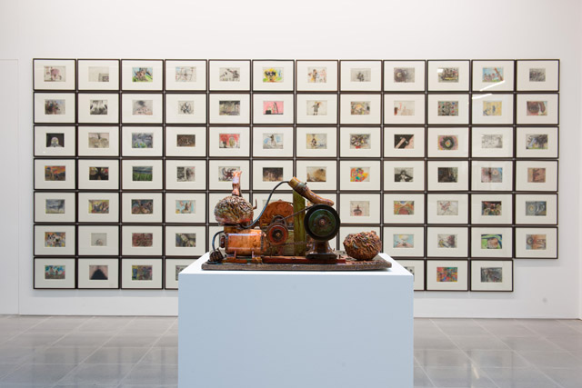

I’ve been told many times by friends that the **Chapman brothers are overrated**. Whatever.
I know for a fact that I am always entertained, provoked, perplexed every time I see an exhibition from this duo – with all the flurry of emotions when I see great art. Even in the face of apparent multimedia absurdity such as the **Ku Klux Klans hanging about corridors and mini-Ronald Mcdonalds crucified like Jesus**, a [Jake and Dinos Chapman exhibition](http://www.serpentinegalleries.org/exhibitions-events/jake-and-dinos-chapman-come-and-see) will shock your guts out to the point that you laugh like a madman, because somehow it connects with our psyche and voila, it all makes sense. (I see **Antony Gormley** laughing his heart out watching the masters of history film amongst seated Ku Klux sculptures, and that in itself is a distraction). 

And that is probably it. Going to see a Jake and Dinos Chapman show means, leaving your art prejudices at home. It’s **almost like a circus freak** and you don’t know where to look. There is too much going on in ***Come and See*** that it will definitely make your head spin, but it will show you the extraordinary output of the team from prints, collage, film, sculpture – they got all the she-bang.

The glass cases with mangled miniature corpses piled up like mountains, heads on sticks, Mcdonalds and Godzillas in ***The Sum of All Evil (2012-2013)*** are all gory but very detailed, and its a testament to the brothers’ craftsmanship skills and attention to detail, and the result of which is almost like theatre with a dash of Apocalypse Now. Nothing is eye-candy here but I think it’s my favourite out of all the show because it reveals that the Chapman brothers don’t always just play the ridiculous game for shock effect. There is a level of maturity in a deep, dark level in this installation about the horrors and absurdity of war.  And for Jake and Dinos Chapman, even if Godzillas roam the earth, wars will always be ridiculously insane. 

, 2012-2013. Fibreglass, plastic and mixed media in four vitrines. 84 5/8 x 50 11/16 x 98 3/8 in. (215 x 128.7 x 249.8 cm). Courtesy White Cube. © Jake and Dinos Chapman")

, 2012-2013. Fibreglass, plastic and mixed media in four vitrines. 84 5/8 x 50 11/16 x 98 3/8 in. (215 x 128.7 x 249.8 cm). Courtesy White Cube. © Jake and Dinos Chapman")

, 2012-2013. Fibreglass, plastic and mixed media in four vitrines. 84 5/8 x 50 11/16 x 98 3/8 in. (215 x 128.7 x 249.8 cm. Courtesy White Cube. © Jake and Dinos Chapman")

Read more:

- [Jake and Dinos Chapman: Come and See Serpentine Gallery Review – Telegraph](http://www.telegraph.co.uk/culture/art/art-reviews/10483203/Jake-and-Dinos-Chapman-Come-and-See-Serpentine-Sackler-Gallery-review.html)
- [Jake and Dinos Chapman: Come and See – TimeOut Review
](http://www.timeout.com/london/art/jake-and-dinos-chapman-come-and-see)
- [The shocking truth: Why Jake and Dino’s tactics are wearing thin – Independent](http://www.independent.co.uk/arts-entertainment/art/features/the-shocking-truth-why-jake-and-dinos-chapmans-tactics-are-wearing-thin-8976049.html)
