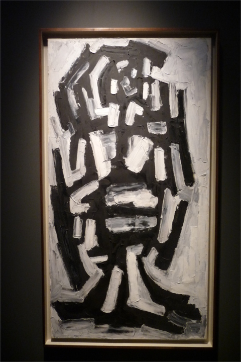
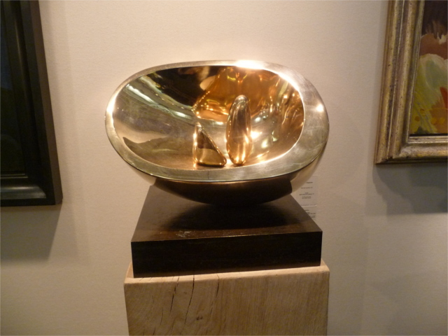

According to their newsletter which I received on my mail this week, **over 30,000 people have visited the London Art Fair 2014**. A good number of galleries are also saying that they’ve had fantastic sales on all price points. Great news all in all and a really great start for the art industry in this new year.

This all sounds very exciting as it reflects the mass appeal now of the art market, but of course as you know, I am not a collector yet and all I wanted to do in this fair was to see good art. I was really looking forward to see emerging artists –  yes there were plenty but having them all alongside some of the great masters such as the unique exhibition of British Modernism from The Hepworth Wakefield and a few sprinkled here and there in some gallery stands, I can’t help but be pulled in to see works from** Barbara Hepworth, Henry Moore and of the recently deceased Sir Anthony Caro** and found myself really biased. I’ve spent more time looking at the prints of **Henri Gaudier-Brezska and of Eduardo Chillida**, and less of the younger and perhaps more flamboyant ones. I do like contemporary art and I would like nothing more to discover young and new artists, but in that moment, **I found some solace and hope that what I was looking at was great art.**

There must be a reason why Modern Art has been performing well and attracting collectors and art enthusiasts. In fact, The Economist has mentioned that last year’s art sales was mostly from the 20th  or 21th century. Personally, I enjoyed the London Art Fair very much, not for the contemporary art, though I’ve got a few favourites below. If it weren’t for the museum partnership with The Hepworth gallery – who aren’t really selling – I would not have enjoyed it as much, but that’s only me and is a matter of personal preference. It doesn’t really matter anyway.  I won’t be able to collect art in any which way, young or old.  In art fairs, the opinion of those buying art matters. So I better shut up. 

In any case, here are my favourites: 

## Hepworth Wakefield

**1. Eduardo Paolozzi, 1929-2005**
White Plaster Relief, 1975
painted plaster and wood

**2. Kenneth Armitage, 1916-2003**
SeatedWoman with Square Head
bronze

**3. Kenneth Armitage, 1916-2003**
Figure Lying on its side
bronze

**4. Bryan Wynter, 1915-1975**
High Country, 1956

**5. Sir Anthony Caro (1924-2013)**
Table Place CLXIX, 1973-74

**6.William Crazer, 1930-2011**
Essex Landscape, 1959

**7.  Sir Eduardo Paolozzi, 1924-2005**
Head (self-portrait)
bronze

**8. William Turnbull, 1922-2012**
Untitled

**9. Barbara Hepworth, 1903-1975**
Kneeling Figure, 1932

**10. Ben Nicholson, 1984-1902**
Piquet, 1933
oil on gesso

**11. Henry Moore, 1898-1986**
Five Metal Forms, 1937
crayon and chalk on paper

**12. Henry Moore, 1898-1986**
Pitboys at Pithead, 1942
(Pencil, pen and ink)
wax coloured crayon and watercolour wash on paper

## Main London Art Fair 2014

**1. Jin Young** 
Yu
Union Gallery

**2. Keith Coventry**
Bancroft Estate, 1907
oil on canvas, wood, gesso and glaze
Vigo Gallery

**3. Wycliffe Stutchbury**
Sheffield Park, 2013
Bug Oak

[

**4. Alan Davie b1920**
Snake Dream, Feb 1983
oil on canvas
Anthony Hepworth Gallery

**5. John Forrester 1922-2002**
Sigena with Red
oil, sand and grit on canvas
Paesnel Gallery

**6. Henri Gaudier-Brzeska, 1891-1915**
Rotten Row, circa 1913
pen and ink
Browse and Durby gallery

**7. Reg Butler**
St. Catherine 1959
Goodman Fine Art

**8. Reg Butler**
Head Looking Up, 1952
Monotype
Goodman Fine Art

**9. Henry Moore**
Animal Head, 1956
Goodman Fine Art

**10. Barbara Hepworth**
Oval with Two Forms, 1971
bronze
Jenna Burlingham Fine Art

**11. Terry Frost, 1915-2003**
Title, unknown
watercolour on paper

**12. David Bomberg, 1890-1957**
Barge and Canal Bank
signed 1921
gauche on paper

**13. David Bomberg**
St Paul’s 
signed 44
charcoal on paper
Waterhouse and Dodd Gallery

**14. Maria Colonne, 1951**
Portland 
collage
Portland Gallery

**15. Sir Anthony Caro**
Basket Table Bronze, 1989-90
cast bronze
Annely Judia Fine Art

**16. Gro Thorsen, 1966**
‘Gallery Studies’
oil on aluminum
series of 105
Jill George Gallery

**17. Bruce Mclean, 1944**
Garden Blue, 2012
Monoprint with collage
Jill George Gallery

**18. Alison Lambert, 1957**
‘Magnus’, 2013
charcoal and pastel on paper
Jill George Gallery

**19. Kelly Ratchford b. 1963**
‘Be Not Afraid’, 2013
acrylic and charcoal on matchboxes
set of 25

**20. Eduardo Chillida**
Lithograph
Adam gallery

Read more:

- [The art market: The rapid growth of art fairs is changing how galleries operate – The Economist](http://www.economist.com/news/britain/21594262-rapid-growth-art-fairs-changing-way-galleries-operate-fairly-popular)
