I was very excited to see Art 14 and had great expectations that this one will top last year’s fair. I enjoyed last year’s exhibition and with the number of international galleries exhibiting, it helped piqued my interest again in Asian art which I didn’t have a lot of access to – living in London and Europe for almost 13 years. Thank God for this kind of art fair, I am able to see galleries that I normally won’t be able to see here in London. 

**This year, Art14 seems to be going on the same momentum with a lot of varied art works from all over the world**. There are some   that I’ve recently seen at the London Art Fair a few weeks ago and a few other artists and artworks that were already featured last year. Kind of disappointed with that but I don’t undermine that these are interesting artworks. Nonetheless, I’m glad I went because I have discovered artists that I haven’t known before or haven’t known as painters.

One of my favourite pieces was a painting from **Gao Xingjian, the Nobel Prize laureate for Literature** who won for his novel Soul Mountain (which I’ve read before I moved to Europe) who is actually a celebrated Paris-based painter. Gao uses Chinese ink to paint on canvasses with the technique of Chinese ink painting. The result of which is really a meditative piece. **Zhao Zhao**, former assistant of **Ai Weiwei**, blew my mind with Waterfall, a mixed media installation of an imperial throne, awashed with red wax dripping like blood. Another favourite of mine is **Liu Wei’s** male portrait which almost feels like a handwork of Lucien Freud, reborn with a new contemporary Asian mind-set. 

For those who weren’t able to go to see Art14, here are some of my favourites:

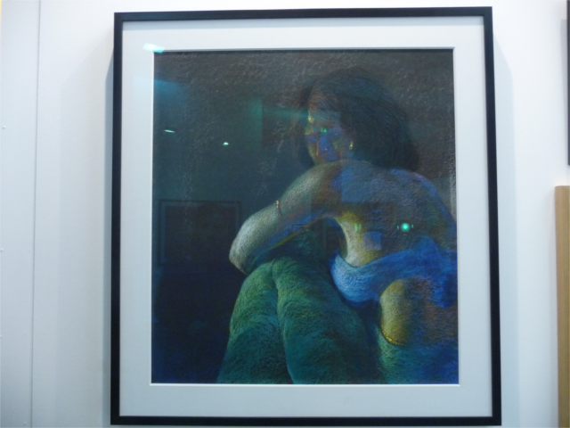

")

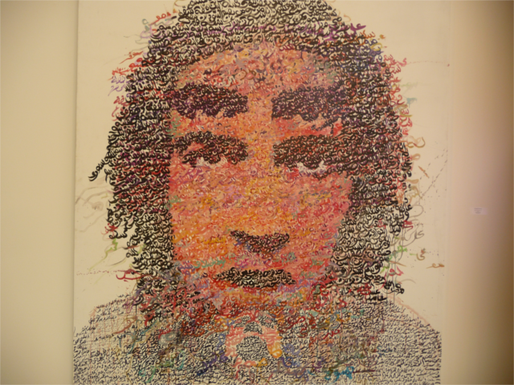

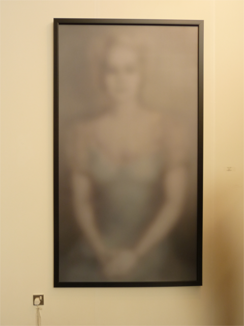

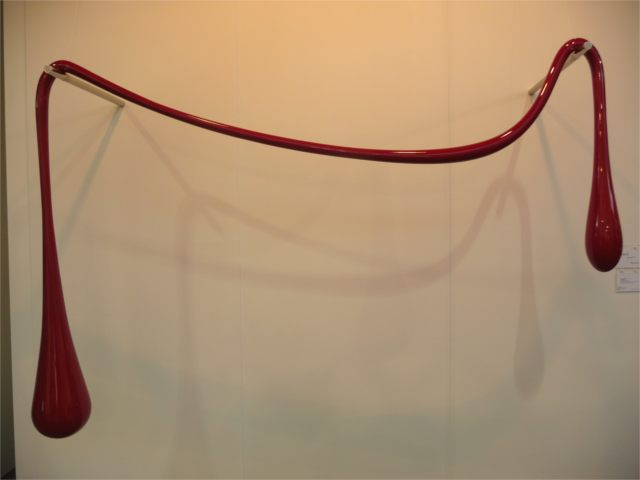

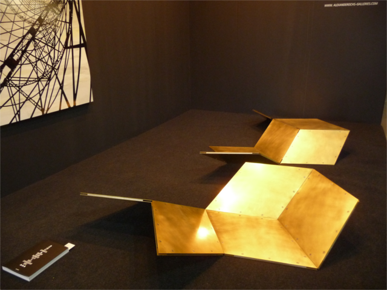

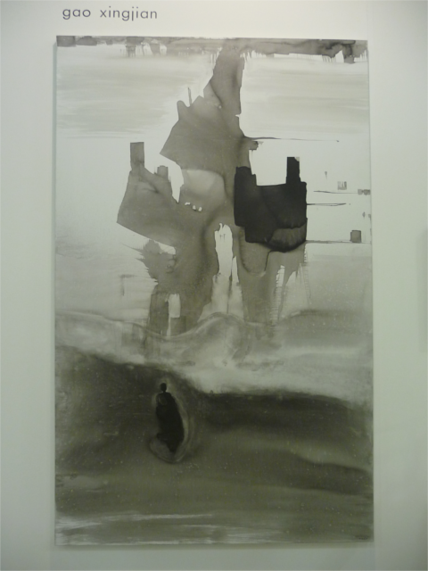

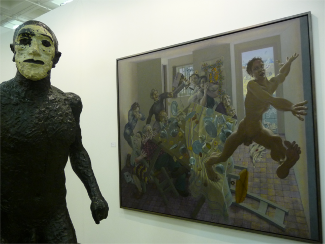

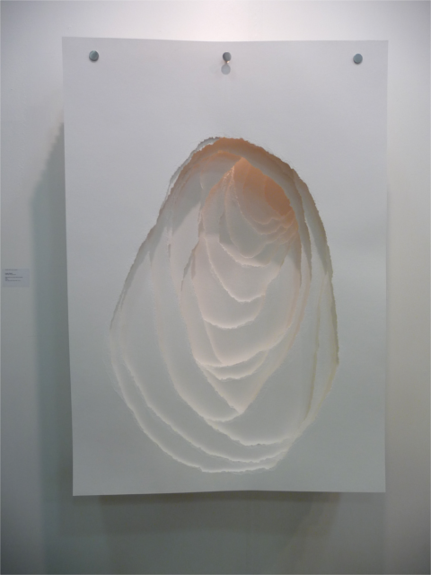

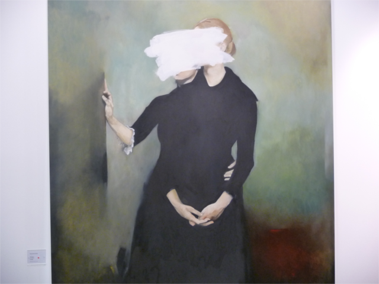

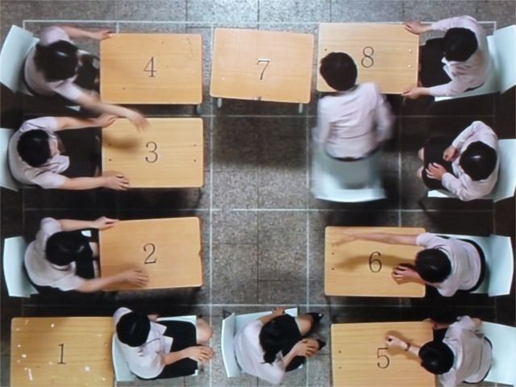

. Let me thinking of you, 2012. Fiber resin figure, painted with acrylic, vinyl sheets and synthetic polyester")

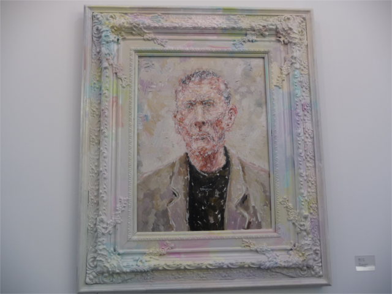

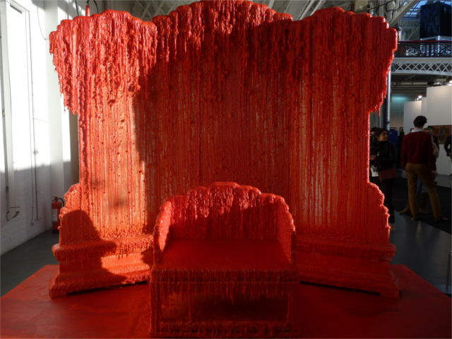

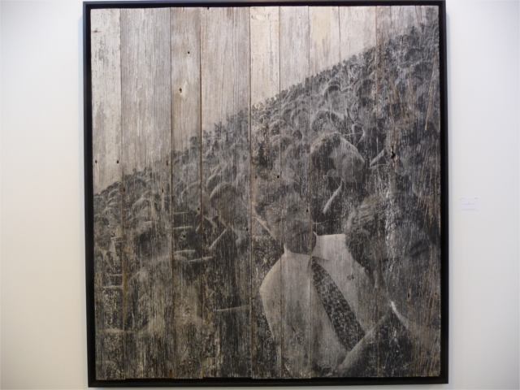
