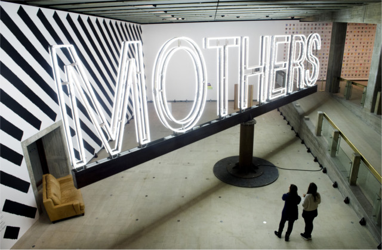
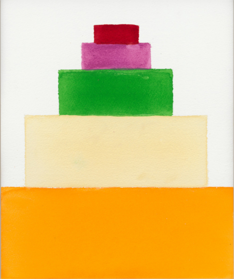
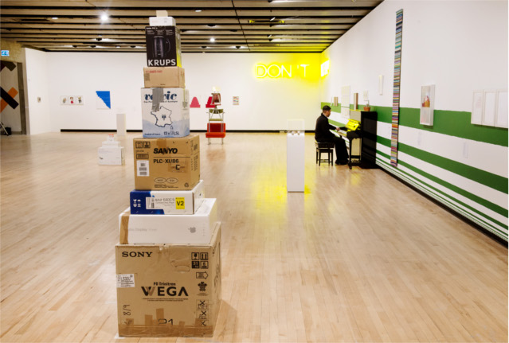
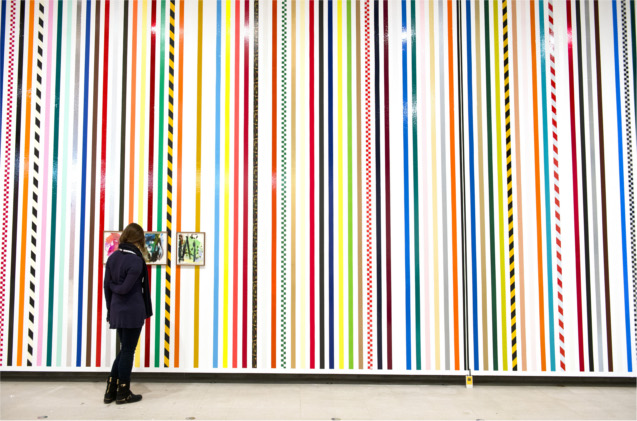
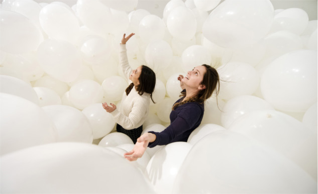
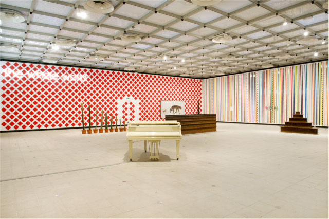
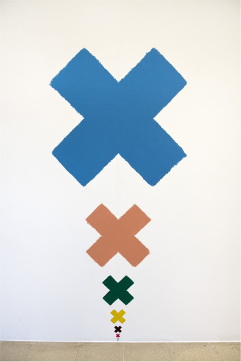

My first indirect interaction with **Martin Creed’s** work was two years ago when I boarded the HMS Belfast with my colleagues to join the Olympic bell-ringing across the UK. It was Martin’s work, entitled **Work No 1197 ‘All the Bells Rung in a Country as Quickly and Loudly as Possible for three minutes’** which made the whole country resound bells of any shape and size to greet the Olympics. There I was at the top of the HMS Belfast, ringing my bell vigorously and proudly at 8.12am, joining the cacophony of sounds all around the city and the whole country. 

Two years on, I still remember that event as one of the **best highlights of London 2012**. So when I came to visit Martin Creed’s new exhibition at the Hayward gallery,  I was expecting another round of bells resounding at the entrance. Instead of bell-ringing, what greeted me was this massive and  towering ‘**Mothers’ sign spinning around the ground floor while 39 metronomes** kept ticking loudly in unison.

**Well, what’s the point of it?** I suspect that I won’t be able to enjoy the exhibition if I try to make any sense of it all. Just like ‘All the Bells, I believe that Martin Creed creates artwork more from his intuition and feeling. If sound is something he connects with, then much of his art will probably have some form of rhythm, pattern or the like. But even that is useless premise when all of these may just be an exercise of futility. One thing is quite certain though, that everything he creates comes with a brand of humour and he invites us all just to go along. ** Just look at the wall full of broccoli paintings of every angle and colour, his famous ziggurat painting, stacked boxes and chairs**. Martin refuses to be called a conceptual artist, but it seems that he loves banal objects and connects with them in a personal level.

An artist tour-guide explains a bit about Martin’s penchant for measurement – evident in the colourful lines across the walls which he says were placed according to their distance or size to each other – a system that Martin would only know – and even his artworks are entitled by numbering system. There are also so many odd occurrences happening around such as a **pianist running the chromatic scale one by one whilst at the corner of the room, a door opens and closes repeatedly.**

On the second floor, he has his smallest pieces of artworks, a few cacti lined up from big to small and adhesive tapes of every shape and colour installed in one wall.  With more than 160 artworks featured in this retrospective, **‘What’s the point of it? is all about about stepping into the maze of Martin’s mind and getting to know the surface of his creative process.**

There’s the crowd-pleaser **‘Half the Air in a Given Space’** – a room full of 7,000 balloons, the highlight of the exhibition and one thing I personally didn’t want to miss.  Inside this claustrophobic room full of balloons, I giggled like a little girl, vigorously pushing the balloons out of my face and up in the air. 

Read more:

- [Martin Creed – What’s the point of it – The Guardian Review](http://www.theguardian.com/artanddesign/2014/feb/02/martin-creed-whats-the-point-hayward-review) 
- [Martin Creed – What’s the point of it – ‘ A deliberate wind up’ – Telegraph Review ](http://www.telegraph.co.uk/culture/art/art-reviews/10599229/Martin-Creed-Whats-the-point-of-it-review-a-deliberate-wind-up.html)
