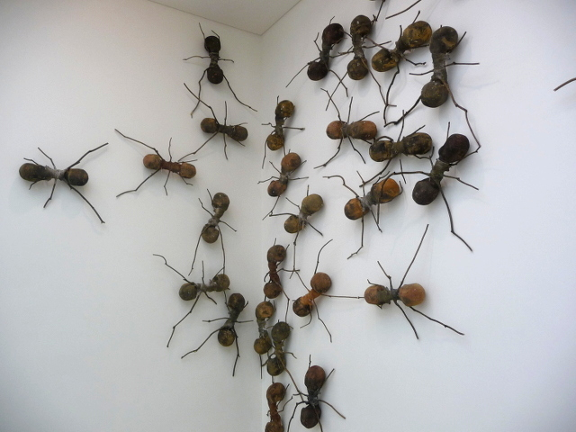
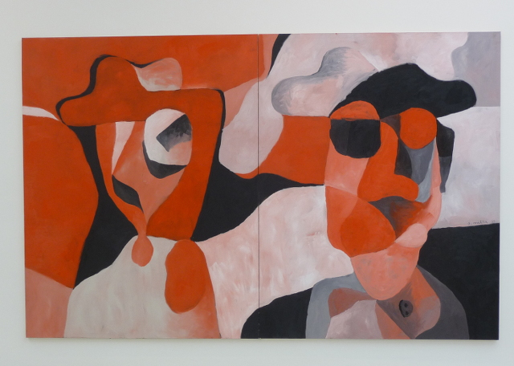
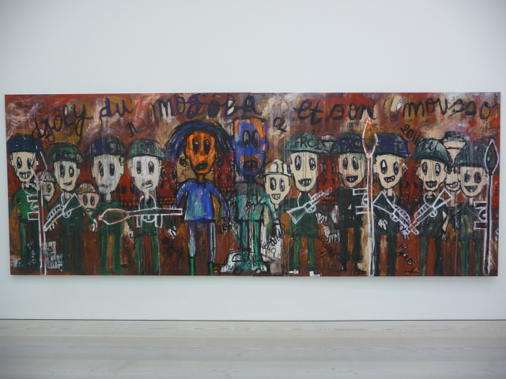
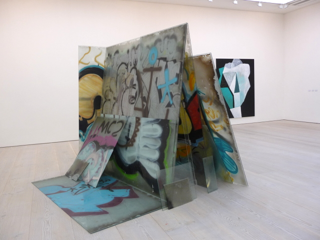
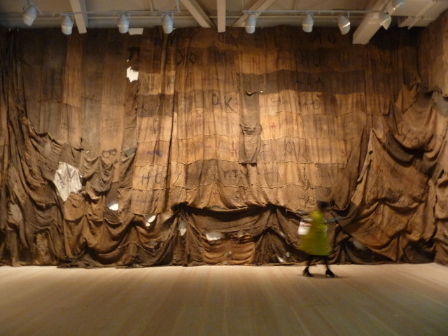

Featuring bonafide and emerging artists from Africa and Latin America, Saatchi’s exhibition **Pangaea**, which opened two months ago is a real attempt to consolidate eclectic art into one package and present it as ONE movement of sorts. The only drawback is that Africa and Latin America are just two super continents by themselves, both marred by different social and historical upheavals too complex and vast to summarise in one solid piece or international trend.

For me, having this kind of mini art-fairs, however, is a step in the right direction especially for those who are interested to see other than the usual fare of retrospectives and one-man exhibitions dominated by major artists. For one, it gives me a **snack-able version of big art fairs with a million things to see to something more manageable**. It might look as if the art pieces are disconnected and lacks a cultural discourse, but I’d like to think that this is a great introduction piece to get the conversation going especially as we might expect more artists from these continents taking a centre stage in the future. The business of art will definitely flourish more on these parts of the world as the economic shift points out to Latin America and with all the business ops that’s happening in Africa.

I am not going to write so much about this exhibit as it had been heavily critiqued already by the press two months past but I’d like to say, the star of the show – and the one I feel stands out from the swarm – is of course Colombian artist **Rafael Gomez Barros’ giant ant-infested wall installation Casa Tomada**. The crazy bit is the ant bodies are composed of cast human skulls, referencing to Argentinian’s disappeared people whilst also conjuring up images of the present-day plight of displaced immigrants. I would have preferred that the ants cross over to other galleries as well, it would have been a real statement about displacement and disruption.

And for the rest, here are some of the pictures I’ve taken:

, 2010. Print on cotton rag paper. 120 x 80 cm")

, 2013. Acrylic on canvas. Triptych, each: 230 x 200 cm")
