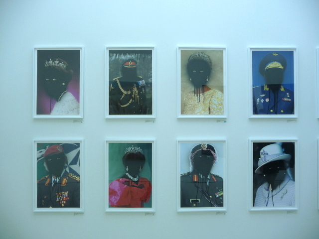
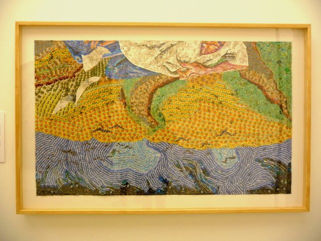
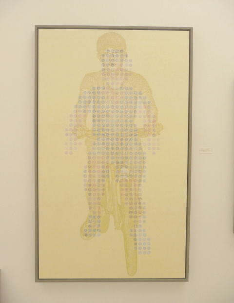
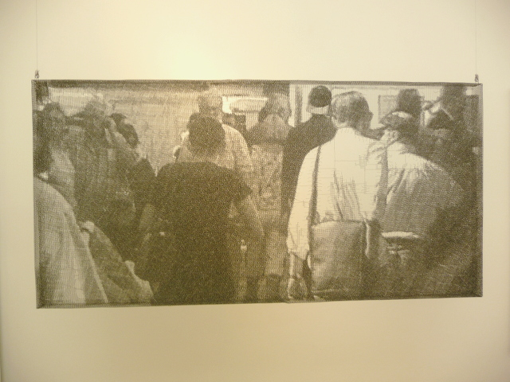
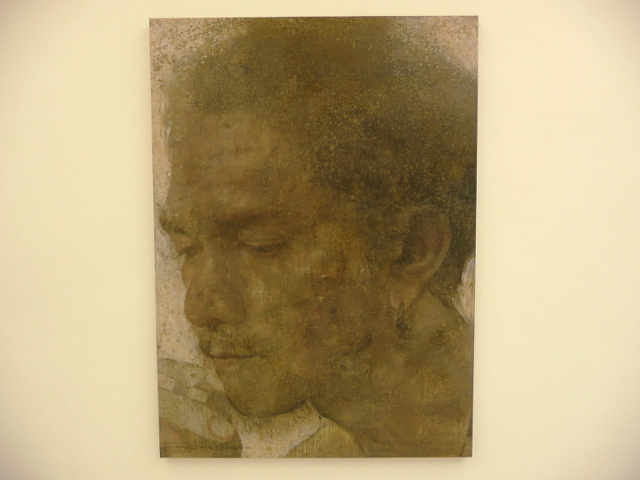
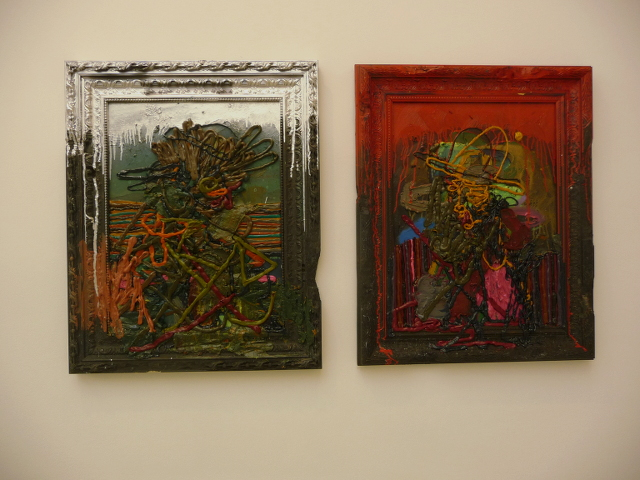
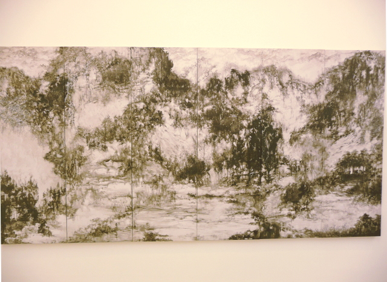
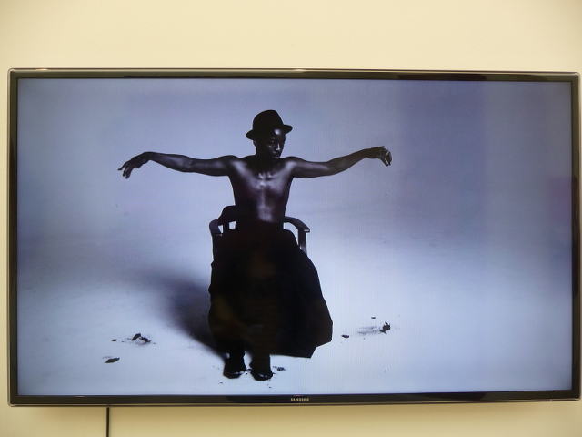
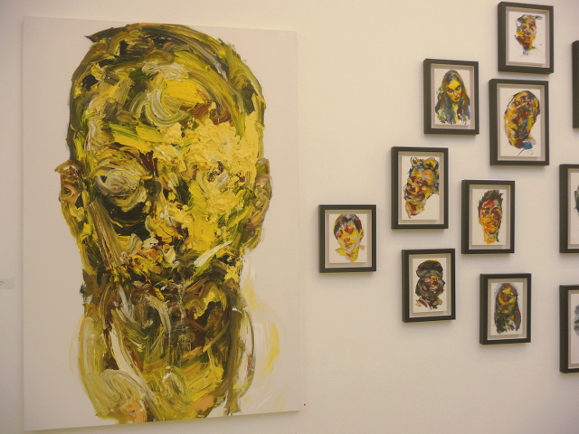
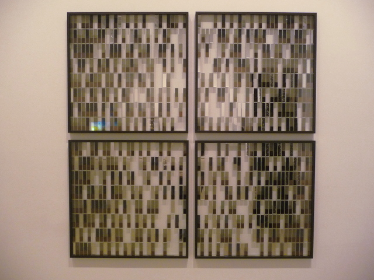

Saatchi gallery scores again with last week’s [START Art Fair](http://startartfair.com). For me, Pangaea was interesting but Start Art Fair was exciting, especially as its a product of the highly successful Global EYE Programme which produced Korean Eye and the Indonesian Art Fair – both of which exhibited at Saatchi. Since 2009, **the Global EYE Programme** has been organising exhibitions about Asian contemporary art so I only expect that Asian artists will be well-represented in this show. I am a big fan of Asian art, and personally I feel that it has reached its zenith as more and more Asian artists are breaking new grounds in international art in the truest sense of the word, without resorting to hype, shock appeal which some of their European counterparts often do.

Judging from the great turnout during the private view at START, there was great energy in the room – with visitors proactively engaging with these international curators to know more about the artists they were representing. Most of the galleries featured in this **art fair are new and emerging galleries from Asia and across the world** – and its worth noting that the curators themselves are quite young themselves even though some of the artists they represent are quite established in their own countries. I don’t find that misleading at all – I get that artists need to have a good portfolio of works to merit being represented internationally.  **The common thread here is that most of the works are paintings, or at least represented in the narrative of a painting composition**. That painting in which way or form is still the choice of creative expression for many of these artists, that provides me some sort of solace to know that the tradition will continue no matter how many times critics declare it to be dead.

These are my favourites from the fair:

**1. [Toni Garifalakis](http://www.tonygarifalakis.com)**
Mob Rule
[Hugo Michell Gallery
](http://www.hugomichellgallery.com)Adelaide, South Australia

I find this series both amusing and ominous. Part graffiti in nature and pop art, Toni takes the likeness of these iconic figures from commercial prints, posters or advertisements and subverts them with black faces – a result of the artist’s exploration about power, authority and systems of belief.

**2. [Chang Yoong Chia](http://www.changyoongchia.com)**
Dear Vincent, 2014
[Richard Koh Fine Art
](http://www.rkfineart.com)Kuala Lumpur, Malaysia and Singapore

This is Chang’s tribute to Van Gogh created with hundreds of stamps, in reference to Van Gogh’s 800 letters to his brother Theo – through which we understand his ideas and practice. I find Chang’s use of stamps as a clever way to create this beautiful and colourful piece of collage work, whilst capturing the essence and brushwork of Van Gogh.

**3. [Gilwoo Lee](http://www.artsperse.com/gil-woo-lee-profile/)**
Moves that breathes 01304
[Absinthe gallery](http://www.galleryabsinthe.com/index.html)
South Korea

I don’t know much about Gilwoo’s body of work but I really find this artwork piece very interesting especially as its technically innovative –  the works are made using burning incense and seared with a hot iron. The curators told me that Gilwoo is quite spiritual and he finds the process of creating as a ritual. Check the You Tube video below to find out more about Gilwoo

<iframe allowfullscreen="" class="youtube-player" frameborder="0" height="505" src="//www.youtube.com/embed/z6dDUqtJfYw?wmode=transparent&fs=1&hl=en&modestbranding=1&iv_load_policy=3&showsearch=0&rel=0&theme=dark" title="YouTube video player" type="text/html" width="640"></iframe>

<figcaption>Gilwoo Lee – Absinthe gallery</figcaption>

**4. [Seung Mo Park](http://www.seungmopark.com)**
Part of the Maya Series
[Gallery: Art Issue Projects](http://www.art-issue.com)
Taipei, Taiwan

New York based multimedia Korean artist is well-known for using wire as his medium of choice for his figurative realist installations. The Maya series on START art fair  are amazing for so many reasons. Not only do they show the great technical skills of the artist but it also shows his investigation between different disciplines – treading the artistic language between street photography, painting and sculpture.

**5. [Kow Leong Kiang](http://kowleongkiang.arts.com.my)**
Ugo
[Gallery Chandan](http://galerichandan.com)
Malaysia

Renowned Malaysian artist Kow Leong Kiang’s combines both portraiture and landscape as an art practice, whilst using Malay men and women as his principal subjects.

<iframe allowfullscreen="" class="youtube-player" frameborder="0" height="505" src="//www.youtube.com/embed/acwSZVf8DRc?wmode=transparent&fs=1&hl=en&modestbranding=1&iv_load_policy=3&showsearch=0&rel=0&theme=dark" title="YouTube video player" type="text/html" width="640"></iframe>

<figcaption>Kow Leong Chiang at Start Art Fair</figcaption>

**6. [Jigger Cruz ](http://www.arndtberlin.com/website/artist_29140)**
Untitled
[Primo Marella Gallery](http://www.primomarellagallery.com)
Milan, Italy

Finally a Filipino artist! Jigger Cruz explores a new figurative language that extends far beyond the formal frame-fixed boundaries, just like Chinese artist Liu Wei which I’ve seen in the Pangaea exhibition at the Saatchi also.

**7. [Nina Pryde](http://www.artinterview.net/nina-pryde.html)**
Pleasure of Nature
[Galerie Ora](http://www.ora-ora.com)

This is an amazing piece of work that uses the techniques of traditional Chinese ink painting whilst exploring the painterly tradition of Western style of painting presented with a contemporary aesthetic.

**8. [Mohau Modisakeng](http://www.saatchigallery.com/artists/mohau_modisakeng.htm?section_name=photography)**
Inzilo
[Brundyn](http://www.brundyn.com/gallery/)
South Africa

There are two sides to Mohau’s work. On one hand, it appears as if his main agenda is to explore notions of masculinity and violence in a South African context, but as you look deeper, he is actually more interested in a ‘movement-centred’ approach in which he attempts to stop time, suspending these violent acts as frozen moments, in order for us to re-examine more closely its real meaning.

**9. [Jaeyeol Han](https://www.facebook.com/media/set/?set=a.611196428894981.1073741828.353138308034129&type=3)**
Passerby, Inherence
[Gallery Sun Contemporary](http://startartfair.com/galleries/gallery-sun-contemporary)
Seoul, Korea

This reminds me so much about Francis Bacon’s work but rather than just distorting faces, Jaeyeol tries to capture the ‘existential energy ‘s individuals. On his artist statement he says, ‘Crowds of people flowing like body of water…Individual energies are negated and their existences dissolved.’

**10. Hong Sulchung**
Perceptual Mirror
Korea

Flipping mirrors using LCD works, this is a great piece of interactive art work from Hong Sulchung.

**11. [A Hidden Order](http://musicalforms.com/projects/a-hidden-order/)**
Prince’s School of Traditional Arts
London

A Hidden Order is a collection of 10 intricate geometric prints all derived from sound – namely a suite of 10 new instrumental chamber works composed by Lee Westwood. Had a chance to speak with Lee in person who explained the creative process behind the composition of the music and the creation of the artwork. He pointed out specifically that the music was composed with a limited frame/shape in mind – the frame being the foundation for the sound. The artwork themselves are very interesting, as I discover some of the colours they’ve used are very reminiscent of the palate used by Impressionist painters. I can’t wait to hear the music. You can download the album via [www.leewestwood.bandcamp.com](http://www.leewestwood.bandcamp.com) or get to listen one track below.

<iframe allowfullscreen="" class="youtube-player" frameborder="0" height="505" src="//www.youtube.com/embed/080aWdyf1tc?wmode=transparent&fs=1&hl=en&modestbranding=1&iv_load_policy=3&showsearch=0&rel=0&theme=dark" title="YouTube video player" type="text/html" width="640"></iframe>

<iframe height="20" seamless="" src="http://bandcamp.com/EmbeddedPlayer/album=150457757/size=small/bgcol=ffffff/linkcol=0687f5/transparent=true/" width="300">[A Hidden Order by Lee Westwood & Sama Mara](http://leewestwood.bandcamp.com/album/a-hidden-order)</iframe>
