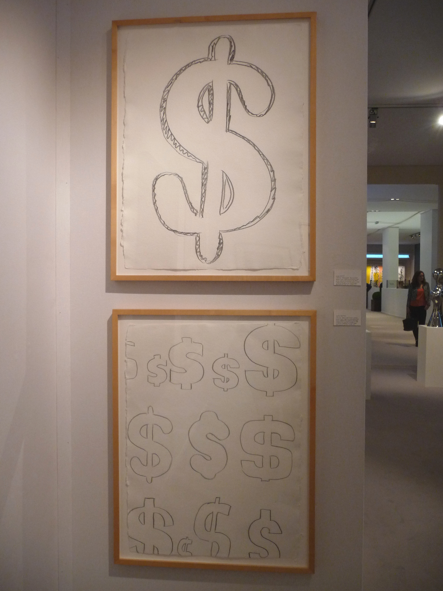
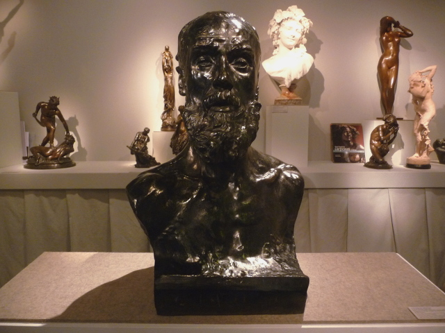
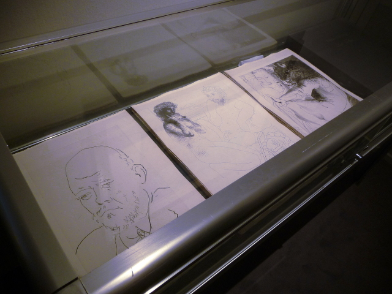

Masterpiece London 2014 was a unique experience for a first-time visitor like me. Happened weeks ago but still very vivid as it featured all kinds of flashy and interesting artefacts and everything you can imagine – **from fine arts, applied arts, decorative arts, jewels, watches even high-end vehicles**! In some way, it was like walking through history but with a bit more of a upscale shopping mall experience. From Greek pottery, Roman mosaics, Renaissance paintings, collector items such as Da Vinci’s signed books up to modern-day jewellery pieces, it’s all breathtaking and all pretty, except that Masterpiece is really for those who have money to spare to add to their collection.

Despite this great shortcoming from my end, that didn’t really stop me from hunting down some art pieces that I haven’t seen before. Here they are: (sorry I didn’t take pictures of the vehicles!)

. A Vanitas: Time Revealing Truth. John Mitchell Fine Paints")

 1936")

<iframe allowfullscreen="" class="youtube-player" frameborder="0" height="505" src="//www.youtube.com/embed/ucJUcrsmA5A?wmode=transparent&fs=1&hl=en&modestbranding=1&iv_load_policy=3&showsearch=0&rel=0&theme=dark" title="YouTube video player" type="text/html" width="640"></iframe>

<figcaption>Jewellery editor: Jewellery and watches at Masterpiece London 2014</figcaption>
