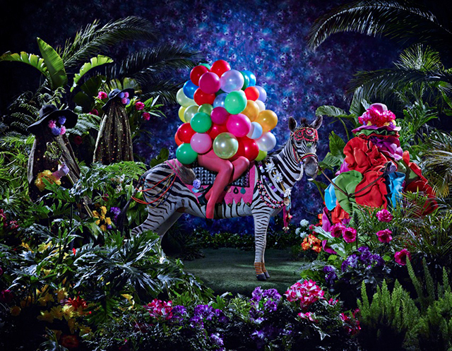
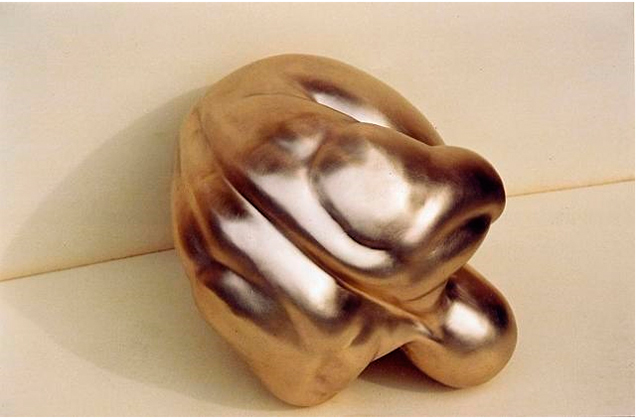
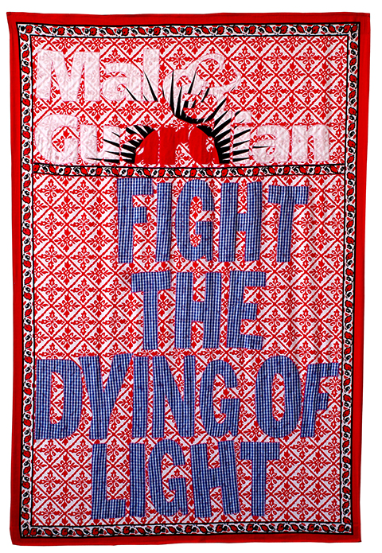
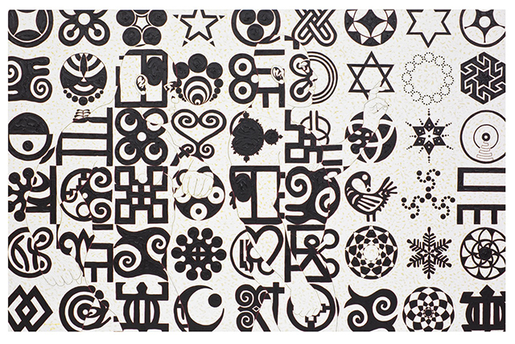
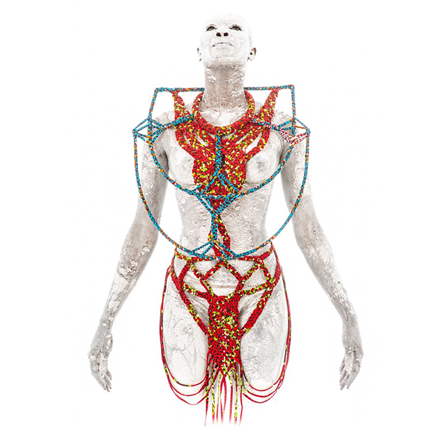
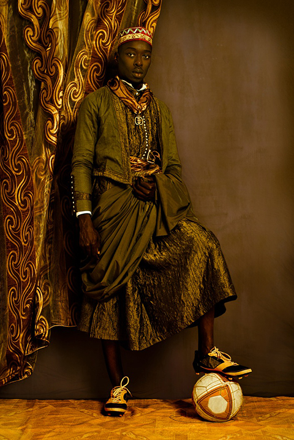

If you want to get a really good insight into the burgeoning contemporary African art scene, I hope you had a chance to see 1:54. With more than 27 galleries participating, Somerset House was a great exhibition space to bring this show together as it provided the perfect and intimate setting to observe and study the diverse but very solid output of these African artists. Compared to the frenetic Frieze Art fair, 1:54 is much more subdued which gave viewers the time to absorb every piece of artwork.

Galleries had also been quite selective as they focussed on a few artists and a few pieces here and there rather than bombard the public with a whole bonanza. Surprisingly theres a lot of mixed media and digital art along side graffiti-like paintings from established artist Aboudia and metal sculptures of Romuald Hazoumee. There’s a lot of sculptures and installation pieces made from everyday materials that are transformed with African references. With all the art fairs this week, I wish I had more time to see 1:54 but I know that I’ll be back next year.  I predict that good things will come to 1:54 and it will just become bigger and better each year.

 

<iframe allowfullscreen="" class="youtube-player" frameborder="0" height="505" src="//www.youtube.com/embed/ebXk5TCW6rE?wmode=transparent&fs=1&hl=en&modestbranding=1&iv_load_policy=3&showsearch=0&rel=0&theme=dark" title="YouTube video player" type="text/html" width="640"></iframe>

<figcaption>Artists from 1:54 Contemporary Art fair</figcaption>
