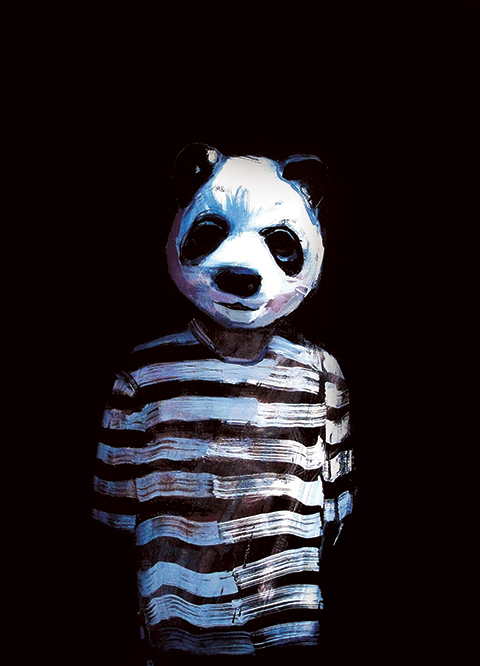
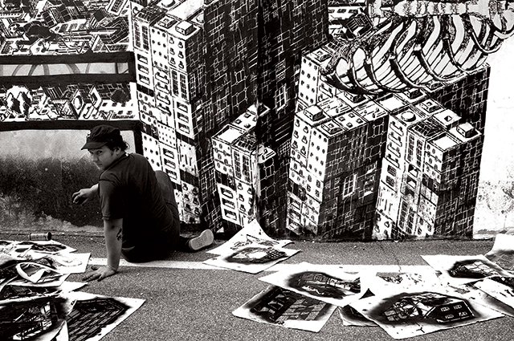
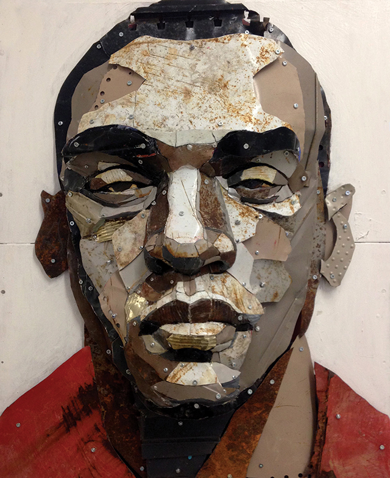
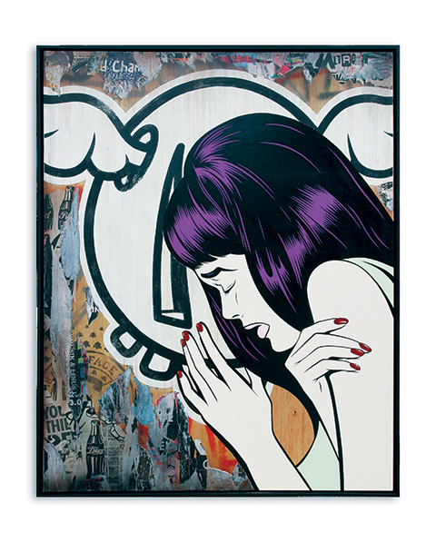

One of the art fairs that coincided with Frieze two weeks ago was the [Moniker Art fair](http://monikerartfair.com) aimed at fans of street art and graffiti. With street artists like Banksy whose works are now being auctioned at top auction houses like Sotheby’s, Moniker art fair is riding high from the success of these artists who’ve penetrated the mainstream. Now on its fifth year, it has become a fixture during Frieze week. According to Fair Coordinator Tina Ziegler in her interview with 55tvc: ‘Every year just seems to get bigger and bigger.’

Looks like having a niche market is also the secret to its success and perhaps will continue to be the trend for many years, when you also consider 1:54 the Contemporary African Fair – another fair that was curated to target a very niche following.

Big star names like Shepard Fairey had one large original artwork and Moniker Projects also presented a large interactive mural by David Shillinglaw – with over 60 artworks integrated with the installation. All in all, 18 galleries participated and showed artworks of more than 50 artworks during the fair. And in the spirit of the street art movement, there were also some live art performance by artists like Keira Rathbone – an artist who created artwork through a typewriter.

<iframe allowfullscreen="" class="youtube-player" frameborder="0" height="505" src="//www.youtube.com/embed/05XB0dNXX1A?wmode=transparent&fs=1&hl=en&modestbranding=1&iv_load_policy=3&showsearch=0&rel=0&theme=dark" title="YouTube video player" type="text/html" width="640"></iframe>

<figcaption>Moniker Art Fair by 55tvc</figcaption>

Read more:
- [Street Art News: Moniker Art Fair
](http://www.streetartnews.net/2014/10/coverage-moniker-art-fair-2014-in.html)
- [Cool Hunting: Moniker Art Fair](http://www.coolhunting.com/culture/moniker-art-fair-2014-london.php)
