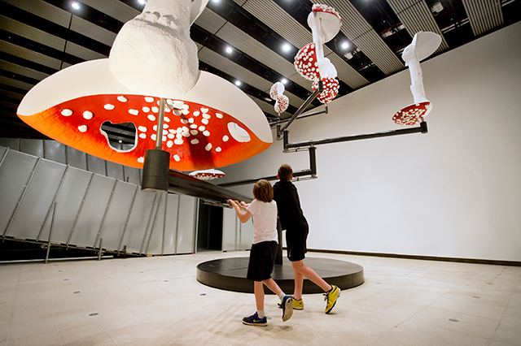
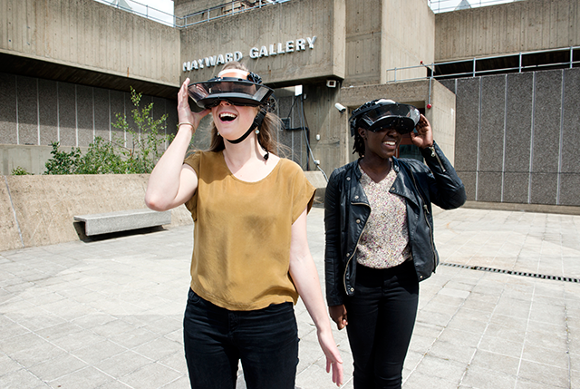
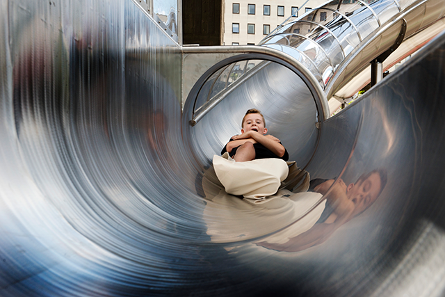
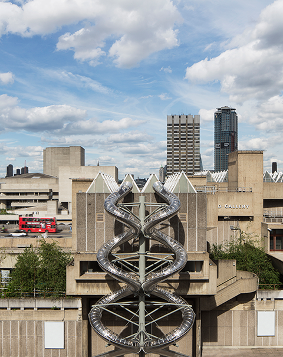
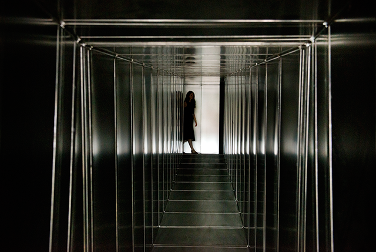
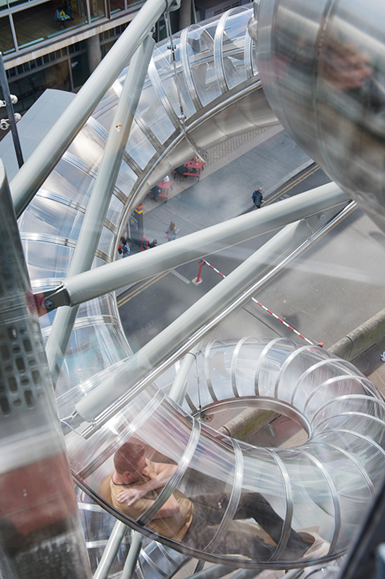
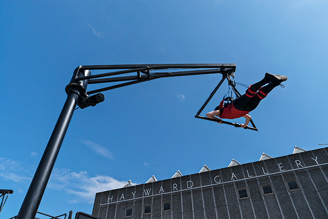

Forget about theme parks - Carsten Höller brings you the playground at the heart of London and into the gallery setting. I never thought this could be done in this scale and not at this capacity. **If you are into interactive installations, it doesn't get as interactive as this.**

It doesn't matter that you have to spend at least 5-10 mins blind as a bat finding your way through a totally dark make-shift hallway where only your hands guide you and small bits of light along the path. It's a bit scary but you plough through because you muster up the courage and make the decision to go all the way.

And as soon as you find the light at the end of the tunnel and finish the first part of the exhibition - **there's no other sensation but relief**, and a bit of pride for making it through the first round.

###Decision

This is **Carsten's largest survey** and it brings together both old and newly commissioned work. The focus of the exhibition is Decision and it summons the visitors to make series of choices/decisions throughout. It already looks like a big hit - which reflects the public's thirst for experiential installations whilst also putting a spotlight on our need to play as a tool to question choices and ultimately make decisions.

The rest of the exhibition present joyrides which is why most people come here in groups. **The exhibition is meant to be experienced in a pack or two**, as the experience calls you to take into consideration not only your perspective but that of another person. And because the experience is immediate, the conversation and questioning happens in real-time.

Except when you finally hit the Isometric slide - you're all by yourself - gleefully exiting the exhibition.

, 2015. © Carsten Höller. Produced with Bonniers Konsthall, Stockholm, and HangarBicocca, Milano. Installation view: Carsten Höller: Decision, Hayward Gallery, London, 2015. Photo  © David Levene copy")

