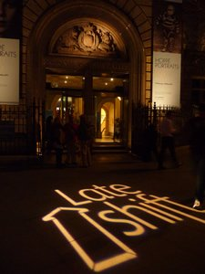
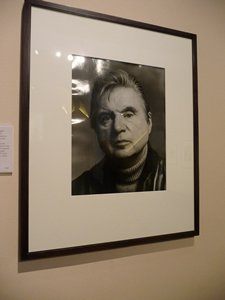
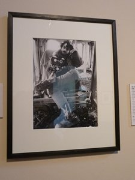
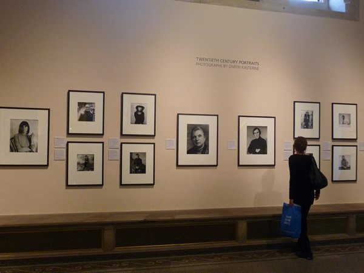

**It took me  a long to decide to be blogging again**. It´s  really scary to write about one´s thoughts and have all the world judge you (well atleast your close friends as your first readers). I have never been confident or comfortable about my writing even though I had been writing here and there for quite some time. It´s probably the reason why I was attracted to visual arts in the first place because words do not hold the same power for me than a visual image.

**Words do not easily rain from heaven for me. I dig graveyards to extract words enough to be able to tell a story.** But here I am trying to blog about art just because it matters to me. 

I guess it´s the same for art. You have to be bold enough to put yourself out there.

You have to believe that what you want to say is important. You have to trust that others can judge you but you still need to carry on.

**“It´s okay to be nervous, because that means you want to do it**,” said the legendary photographer Dmitri Kasterene at the National Portrait Gallery,  a rare visit which I attended two weeks ago in the NPR Late Shift events. Dmitri is known for photographing the most eminent cultural icons in the 20th century like Stanley Kubrick, Francis Bacon and an array of literary figures. What Dmitri had was his special way of convincing these artists to trust him and in a way, to strip for him.

](./images/P1020145_j5akdv.jpg) 
 
*Left: Stanley Kubrick; Right: Francis Bacon*

I loved it when he said, “I had an expensive education but was never educated.” He said his real education began when he met literary figures who influenced him to read. If you see Dmitri´s photographs of these writers and artists, there is an honesty and at the same time boldness in each one of them.  They´ve all been stripped of their clothing, their armour of pretentiousness. Francis Bacon´s gaze in his photograph was as eerie and as intense as his paintings and I looked into his eyes and felt a cold shudder. Stanley Kubrick´s photo was more what you expected him to be – a picture of someone who´s narcissistically sure of himself, beckoning people to oblige to his requests. Strangely, Dmitri said that Stanley has a real way about him to make people do anything he asks them to do.” The photograph said it all.

](./images/P1020150_lkorhq.jpg)Check out Dmitri Kasterine´s photos [here](http://www.kasterine.com/ "Dmitri Kasterine").