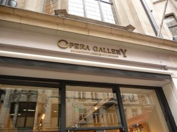
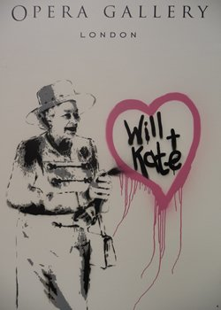
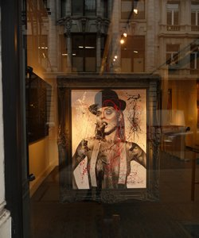

> I had been feeling rather sleepy lately

And I had been doubling my caffeine intake to battle the drowsiness but unfortunately coffee in London is a bit too light for my taste. I prefer strong **Spanish cortado** which gives you a quick punch on the face jabbing to say ***Despiertate!***

Uhm, I miss the food and the sun in Spain but after reading Adriane Searle´s article about [The Drain in Spain: the country´s art crisis](http://www.guardian.co.uk/world/2011/mar/27/new-europe-spain-arts-cuts "Drain in spain") in the Guardian, I can´t help but nod at my decision to leave the sunny shores of Alicante to be here. ***They are all leaving***, I thought. I will learn more about art here. But I am still sleepppy.

Spending time in the art library without anyone to talk to does not help so I thought of changing my routine for the day.

 (I decided to take a break from sending CVs today too and blogging at another site,  and you know what a relief that is!) I need to get the blood circulation moving to wake up so I decided to swing by **New Bond street** to check out [**The Opera Gallery**](http://www.operagallery.com/ "The Opera Gallery").

Apparently, The Opera Gallery is really an important gallery and they have offices in New York, Paris, Seoul, Singapore. Backpack was heavy together with my head but I pranced along. The door of the gallery was open and I noticed workers were coming in and out with a new set of paintings.  ***This must be a new installation and I am feeling lucky today***.

Before I went in, I took a photo of graffitti art of **The Queen** near the gallery door. I love the fact that the symbol of the Royal Highness is still relevant in art and more so because of the up-coming hoopla of a wedding.

Predictably inside, there´s another graffitti art painting of **William and Kate** and then I went inside to take  a look at the paintings and was looking for the name of the artist.  I still have the museum-goer attitude with me and I expected labels on each and every oeuvre.

One of the gallery officers came and asked if I needed any help. And I said, who is the artist? And he asked, do you know **Mr. Brainwash**? He said Brainwash is a really important graffitti artist.  I notice how much graffitti art have creeped into contemporary consciousness.

Two years ago, while I was in Paris, there was a huge exhibit for graffitti artists which included **Jonone**, a famous American artist living now in Paris. I love the fact that street art is now a huge deal. Maybe one day, Banksy wouldn´t need to hide himself….but then again, the danger is the source of adrenaline. I would love to learn graffitti art in the future but first, the drawing classes which I need to sign up for.

Before I left, I asked the gallery officer if I could snap some pictures and he said no. Hmmm, I now need to be more resourceful with the pictures.

*This looks like its from Mr. Brainwash*

**

**

**

Heading home, and checking the internet for Brainwash, I learned that Banksy created a film about him so tonight I would definitely try to see that movie and will let you know what I think. Strangely, browsing Flickr for more photos, I stumbled upon** artisthecure´s photostream** and found pictures of the opening of the graffiti exhibit at the Opera Gallery.

 

*Future ***King by Rich Simmons at the Southbank. Photo by [Garry Knight](http://www.flickr.com/photos/garryknight/5476824152/ "Kate and William")*

Hmmm, I discovered that The Queen graffitti art and William and Kate´s are not by Mr Brainwash but from another  artist named **Rich Simmons **who seems to be also the founder of [**Art is The Cure**](http://www.facebook.com/artisthecureofficial?sk=app_106966931352 "Art is the Cure") which promotes art therapy as a movement to save lives. He just added me on Facebook and I hope to score an interview and see if I can join their art street teams around the city. Check out the video below. Sorry if its in French but his interview is in English….

<object classid="clsid:d27cdb6e-ae6d-11cf-96b8-444553540000" codebase="http://download.macromedia.com/pub/shockwave/cabs/flash/swflash.cab#version=6,0,40,0" height="433" id="kplayer_iLyROoafz0F9" width="648"><param name="name" value="kplayer_iLyROoafz0F9"></param><param name="data" value="http://sll.kewego.com/swf/kp.swf?%cache_buster%"></param><param name="bgcolor" value="0x000000"></param><param name="allowfullscreen" value="true"></param><param name="allowscriptaccess" value="always"></param><param name="flashVars" value="language_code=fr&playerKey=f134f47501c8&configKey=brdwes54vine&suffix=&sig=iLyROoafz0F9&autostart=false"></param><param name="wmode" value="opaque"></param><param name="src" value="http://sll.kewego.com/swf/kp.swf?%cache_buster%"></param><param name="flashvars" value="language_code=fr&playerKey=f134f47501c8&configKey=brdwes54vine&suffix=&sig=iLyROoafz0F9&autostart=false"></param><embed allowfullscreen="true" allowscriptaccess="always" bgcolor="0x000000" data="http://sll.kewego.com/swf/kp.swf?%cache_buster%" flashvars="language_code=fr&playerKey=f134f47501c8&configKey=brdwes54vine&suffix=&sig=iLyROoafz0F9&autostart=false" height="433" id="kplayer_iLyROoafz0F9" name="kplayer_iLyROoafz0F9" src="http://sll.kewego.com/swf/kp.swf?%cache_buster%" type="application/x-shockwave-flash" width="648" wmode="opaque"></embed></object>

