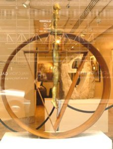
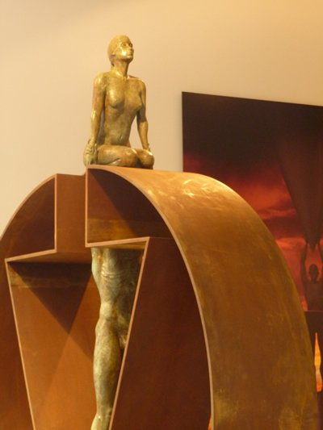
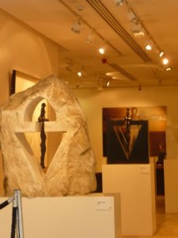
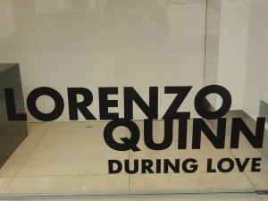
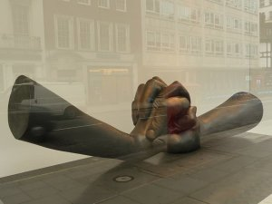

After visiting the **Opera Gallery**,  I headed toward [Halcyon ](http://www.halcyongallery.com/ "Halcyon gallery London") which was on the same street. The door was swung open and I didn´t know if  that  meant  they were welcoming to visitors or because it was a particularly hot day in Central London and  they just needed some breezy respite.  I didn´t go inside.  I saw  two gallery officers seating on their desks, heads bowed down, eyes fixed on their papers.   I peered in the window and the open door and with my camera, **I was ready  to take a papparazzi shot.** I positioned myself  in a spot where the gallery officers couldn´t see me. Click.

I was glad  to know that they were exhibiting works of the famed Italian sculptor **Lorenzo Quinn **who happen to be the son of  the late Hollywood actor Anthony Quinn. **I was  not surprised that his son Lorenzo inherited his father´s creativity and channeled it to sculpture.** Aside from  that, in the world of abstract contemporary art, there is something about figurative  contemporary sculpture that I really find  fascinating. How many different ways can we interpret and give meaning to the body?  I guess it´s like music: you got only seven bars to choose from but you can still create  thousands and thousands of pop bubble gum music.

But Lorenzo Quinn´s sculptures ain´t no bubble-gum Britney Spears. I already  saw one of his public sculptures called the **Vroom Vroom** at the **Park Lane** several times while I was on the bus and I was really impressed.  Again his figurative sculptures stand out in the mish mash of  contemporary art. And while the art world has been showing visible signs of its confused significance in society today,  Quinn´s art still offers a timelessness and a purity that only the greats have managed to achieve.

Michelangelo. Rodin, Quinn. It just rolls on your tongue naturally. And damn, he´s just 44 years old.

**The Metamorphosis series is comprised of  five female Gravity sculptures in marble and glass, materials which Quinn have never used before**.  Each piece depicts a female supported by the male,  but every work is framed by materials that change, from a rough marble to a  polished glass  that suggest the transition cycle from rawness to perfection.  (He already created  gravity sculptures before  with the roles reversed, the man on top carrying the woman below.)

)At some point, I thought why the female always needed to be carried by the man but hmmm do you imagine watching a dance where  the man would be guided by the woman? And this is a dance of  harmony between the two sexes.  **There is a perfect trinity between the man and the woman and the material that envelops them.**

According  to the Halcyon website, Lorenzo wants to demonstrate  the need to have balance between man and woman. I suddenly remembered a quotation from an anonymous writer  who said, “Behind every powerful man is a woman.”

In Metamorphosis, it looked as if it is the woman that emerges complete during this metamorphosis.

In the age of female empowerment, women are encouraged to demonstrate our independent spirit and separate ourselves from the man. But maybe, men and women really do need each other after all.

(Note: The other exhibit of Lorenzo Quinn called During Love was also on-going)

]

<iframe allowfullscreen="" class="youtube-player" frameborder="0" height="505" src="//www.youtube.com/embed/IkrMZqbkPUE?wmode=transparent&fs=1&hl=en&modestbranding=1&iv_load_policy=3&showsearch=0&rel=0&theme=dark" title="YouTube video player" type="text/html" width="640"></iframe>
 
<figcaption>Lorenzo Quinn talks about his art</figcaption>

<iframe allowfullscreen="" class="youtube-player" frameborder="0" height="505" src="//www.youtube.com/embed/UDARMJzD7_U?wmode=transparent&fs=1&hl=en&modestbranding=1&iv_load_policy=3&showsearch=0&rel=0&theme=dark" title="YouTube video player" type="text/html" width="640"></iframe>

<figcaption>Lorenzo Quinn in his studio (Spanish version)  </figcaption>