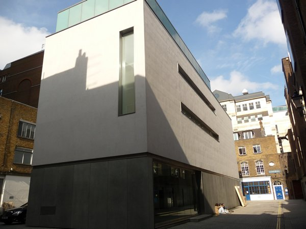
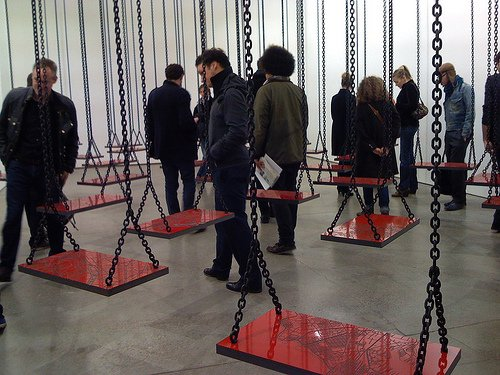
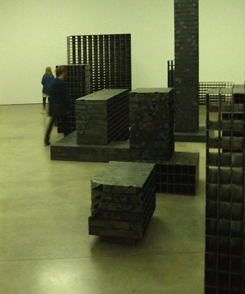
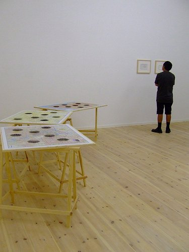

Pach just bought me some new **motorcycle boots** as we are now daily commuting to Central London by motobike. Going by bike in the highway is quite scary and I do catch myself from time to time shutting my eyes whenever we squeeze in-between two trucks.  But its a cheap way to travel compared to taking the tube everyday. So for now, I gotta wear the boots.

They are not just bulky, they are also heavy.  And if stillettos can change a woman´s walk, I can attest to the fact that, these motorcycle boots have transformed my already detestable walk to something more grotesque. Pach calls my walk something akin to that of  **Grandma Fratteli** in the movie **The Goonies**.

And if you do remember her, I can say I am also beginning to develop some scowl  in my face as I drag these heavy, bulky, new boots to [White Cube Mason´s Yard ](http://www.whitecube.com/ "White Cube")to see **Mona Hatoum´s exhibit Bunker.**

*Suspended by Mona Hatoum. Photo by [Michaela Freeman](http://www.flickr.com/photos/7984380@N02/5476190246/ "Mona Hatoum swings")

In the ground floor gallery is the installation **Suspended** where 35 red and black wooden swings are chained from the ceiling all placed in an oblique angle.  **Maps were carved into the seats**, each of them being unique. I hardly noticed which cities these maps represent but the whole structure of the installation, even the constricting spaces between the swings also represent a sensation of movement and the act of passing through. Somehow, it was the same sensation I find whenever I go on a motorcycle and swerve for an open space in between cars.

I went around each swing barely checking the map on the seats and avoided being bumped by the swings in constant motion. That was the experience. Everytime I see artists tackle issues of landscape (connected with identity), I remember a favorite American artist named [**Maya Lin and her Systematic Landscapes**](http://www.arcspace.com/architects/lin/sys_landscapes/sys_landscapes.html "Maya Lin´s Systematic Landscapes").

**Mona Hatoum** was born into a Palestinian family in **Beirut, Lebanon** and it comes as no surpise that the installation Bunker in lower ground floor suggests the aftermath of a war. Again it looked like an **architecture of a city burnt to the ground by war** with structures made of steel tubes. Each gaping hole just doubled the eerie sensation. It was a ghost town and it was Hatoum´s Beirut.

*Bunker by Mona Hatoum*

In the smaller basement, there are three laid out maps of Beirut, Baghdad and Kabul all carefully embellished by cut-out  ections in concentric circles which. Though beautiful,  they all suggest that these were the same locations affected by bomb blasts.

]
*3d-Cities by Mona Hatoum. This photo was taken at another gallery Kunsthall 44 in Germany. Photo by >[Birgitte Svaerke Pederson](http://www.flickr.com/photos/birgittesp/4879787872/ "3d cities")*

<iframe allowfullscreen="" class="youtube-player" frameborder="0" height="505" src="//www.youtube.com/embed/9H_lX1yB0Ho?wmode=transparent&fs=1&hl=en&modestbranding=1&iv_load_policy=3&showsearch=0&rel=0&theme=dark" title="YouTube video player" type="text/html" width="640"></iframe> 
*<figcaption>Mona Hatoum on her  Suspended installation</figcaption>*

Mona Hatoum wins the 2011 Joan Mir0 Prize. Read the news [here](http://www.whitecube.com/news/250/ "Mona Hatoum Joan Miro")