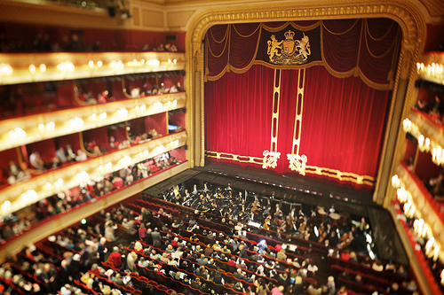

**   Momardi** was officially launched last 8 oApril. Many thanks for the wonderful messages I got from friends and especially from my father who has been urging me to write more about **third-world sentiments**. As a girl who grew up in a developing nation and now making her way here in London. I want to be as honest as I can in this blog and I hope to write more about where I came from and how I got here.

(http://www.roh.org.uk)

So many things happened over the weekend. Pach and I fell off our bike but still happy after watching the **Swan Lake Ice** featuring **the  Imperial Stars** – a group of ice skating champions from Russia. We loved the ride at **Clapham Common** and thinking of eventually moving there. And tonight, as the main dish of our official launch, we will be watching **Beethoven´s Fidelio at [the Royal Opera House](http://www.roh.org.uk "The ROH")** with some friends including a distant distant distant relative of **Diego Velasquez**. Sorry I gotta mention it!

Thanks to [**Picselect**](http://picselect.com "picselect") (press organisation) for accepting my application on your site so I can access publicity photos from the [**Royal Academy of Art**](http://royalacademy.org.uk "royal academy of art") (but I have been postponing my visit and taking advantage of visiting free galleries at the moment).  Thanks to all the Flickr members who allowed me to use their photos for my blog posts! The gallery **Hauser and Wirth** has been so kind to send me publicity photos of Ida Applebroog's exhibit which I will be checking out this week.

*Photo credits: The Royal Opera House by [Aurelien Guichard](http://www.flickr.com/photos/aguichard/5501620235/ "The Royal Opera House").*