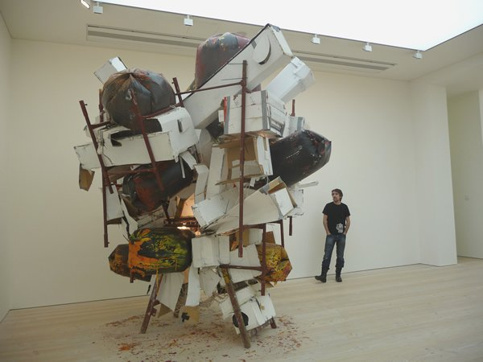

*Photo by Mark Hogan *(http://www.flickr.com/photos/markhogan/5411239699/in/photostream/ "Richard Wilson1")

20:50 is British sculptor Richard Wilson´s most famous installation at the basement of Saatchi Gallery. At first, the room seemed to be mirroring each other and divided by a thin screen of brown sheet. I tried to make out exactly what the material was that separated the ceiling and the room. Pach then pointed out to me that the room wasn´t exactly divided into two but this screen was making a reflection of the architecture above.

Photo by Mark Hogan*](http://www.flickr.com/photos/markhogan/5411240031/in/photostream/ "Richard Wilson")

**Exploring the gallery room, later it became clear that  Richard created  a metal container full of sump oil – (the material that I thought was  brown sheet) – and it glistened and reflected the architecture of the room, much the same way a lake can reflect a sky on a cloudy day. 

The genius of course is the use of the material of oil to create an illusion of space and for visually rendering a thick liquid material from something light as a feather (which I mistook as a thin screen) to something unbelievably heavy and solid inside  a metal container.

<iframe allowfullscreen="" class="youtube-player" frameborder="0" height="505" src="//www.youtube.com/embed/JKXDHuyyd7g?wmode=transparent&fs=1&hl=en&modestbranding=1&iv_load_policy=3&showsearch=0&rel=0&theme=darkd" title="YouTube video player" type="text/html" width="640"></iframe>*Richard Wilson´s 20:50*

<iframe allowfullscreen="" class="youtube-player" frameborder="0" height="505" src="//www.youtube.com/embed/DBXwA0gcBm4?wmode=transparent&fs=1&hl=en&modestbranding=1&iv_load_policy=3&showsearch=0&rel=0&theme=dark&NR=1" title="YouTube video player" type="text/html" width="640"></iframe>*Turning the Place Over by Richard Wilson*

Next one I really liked was **[Ximena Garrido-Lecca](http://www.ximenagarridolecca.com/ "Ximeno Garrido Lecca")´s piece called The Followers**. Ximena is a London-based Peruvian artist who tackles cultural themes such as the extinction of the  indigenous arts in her works.  Covering every piece of the wall, it looked like a large-scale painting but The Followers is a spectacular monument of an installation. In a verticular structure reminiscent of  custom and tradition,  **Ximena fashioned nichos and offerings to still-life installations – with every nicho exuding Baroque and pre-colonial sentiments, joyful celebrations of the dead.**

This was all too familiar for me –  growing up in the Philippines, death could be considered a jjoyful event,  with everybody gathering around  on All  Saints Day  to pay respects to the dead. I understand Ximena´s preoccupation with pre-colonial indigenous arts because  like Peru, the Philippines, had become  a wasted product of colonialism and imperialism.

*Photo by [Matt/Furlined](http://www.flickr.com/photos/furlined/5360494741/ "Ximena 3")*

The celebratory nature of these nichos however, goes to show, that despite the historical and social upheavals of the past, some traditions like the cult of the dead still remain embedded in our consciousness and cannot be fully eradicated.

Other interesting pieces I found at the gallery were the following:

*All my Exes live in Tesco by Graham Hudson*

](./images/tobyziegler1_yvlohg.jpg)*The Liberals by Toby Ziegler*