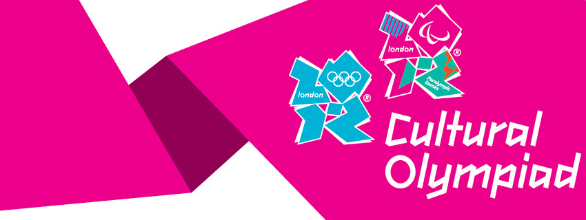

## Digital Marketing Executive (Lead)

I was the digital marketing lead for the London 2012 Festival/Cultural Olympiad, the most ambitious cultural programme of the UK created for the Olympics. With a programme of almost 12,000 events across the UK, the London 2012 Festival puts a spotlight on culture as an huge aspect of UK's identity and a vital part of its own brand of Olympics.

I was running and overseeing all digital platforms and was the only person responsible for all digital activities.

Here are some of the highlights of my role:

- I managed all the digital channels including CMS, CRM and B2B email marketing campaigns, web analytics, **social media and community management**. Attendances of London 2012 Festival events top **19.8 million** with 80% of audiences coming from free events

- I acted as the content manager for the website – sourcing, curating and producing content for the homepage and the main London 2012 Festival website. The final visits to the website were **2 million**

- I managed the events database for the Festival website and the London 2012 Join-in app (Final total: **15 million app downloads**)

- I managed social media for the Festival (**80,000 followers**) and also scheduled content for the London 2012 social networks (**4.7 million followers**). I also liaised with third-party social media monitoring agency and used user feedback for content and social media strategy

- I was  In charge of sourcing and uploading of video content and creation of picture galleries in the gallery section of the Festival website

- I developed the build of Festival newsletters (from brief, writing to broadcast) with the help of the CRM and editorial team and scheduled the inclusion of Festival events in the wider London 2012 newsletters. (Half a million database for Festival; **5 million sign-ups** for the L2012 emails)

- I handled Connect B2B monthly newsletters from brief, writing copy, build to broadcast

- I liaised with cross-multiple teams within London 2012 (editorial, new media, marketing, CRM) and with external press teams and delivery partners to ensure timely delivery of assets

## Relevant videos, screenshots and photos

<iframe width="560" height="315" src="https://www.youtube.com/embed/4As0e4de-rI" frameborder="0" allow="accelerometer; autoplay; encrypted-media; gyroscope; picture-in-picture" allowfullscreen></iframe>

<iframe width="560" height="315" src="https://www.youtube.com/embed/Kd4FgGSY5BY" frameborder="0" allow="accelerometer; autoplay; encrypted-media; gyroscope; picture-in-picture" allowfullscreen></iframe>

<iframe width="560" height="315" src="https://www.youtube.com/embed/A-GQBGk2Xlg" frameborder="0" allow="accelerometer; autoplay; encrypted-media; gyroscope; picture-in-picture" allowfullscreen></iframe>

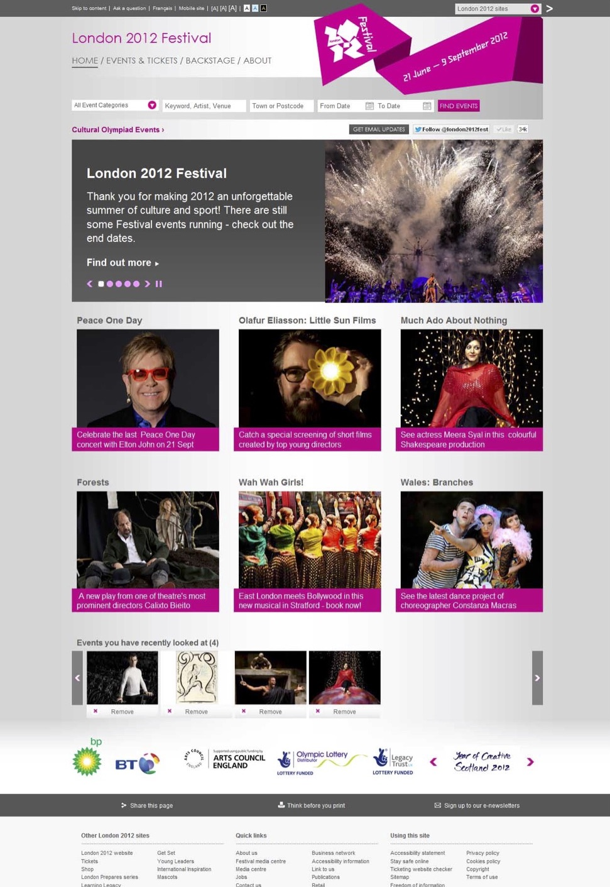

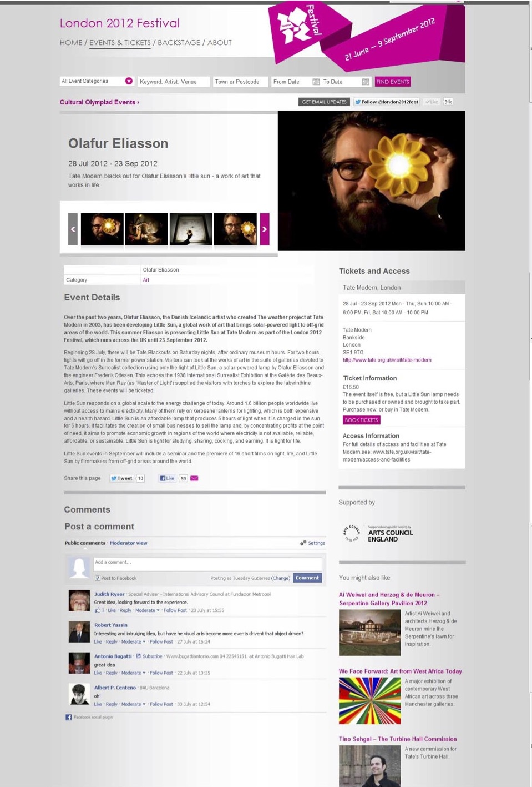

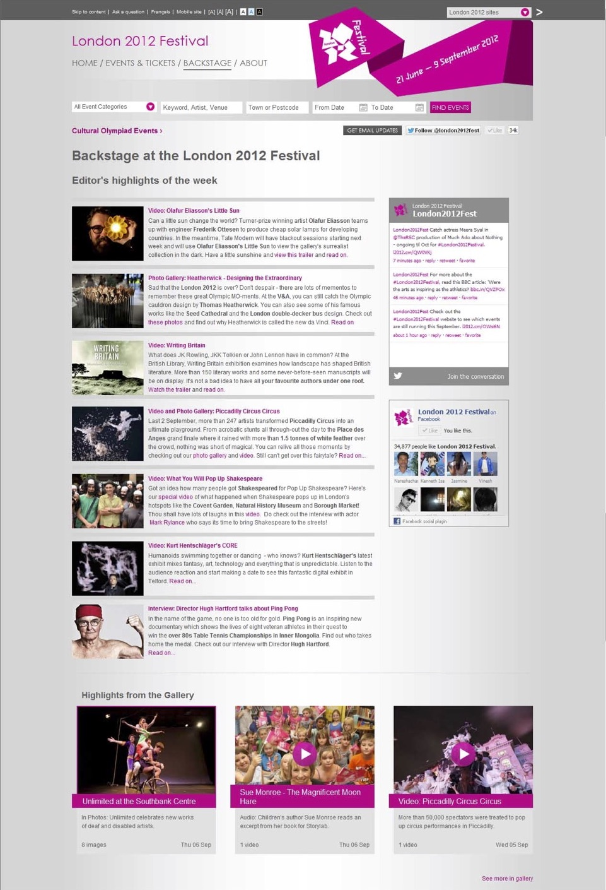

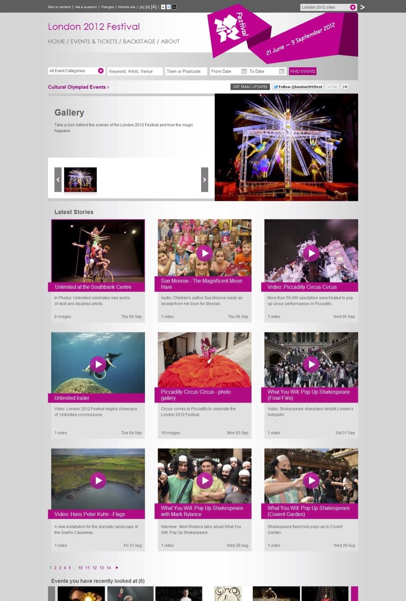

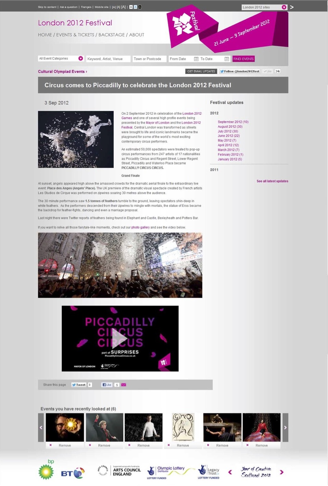

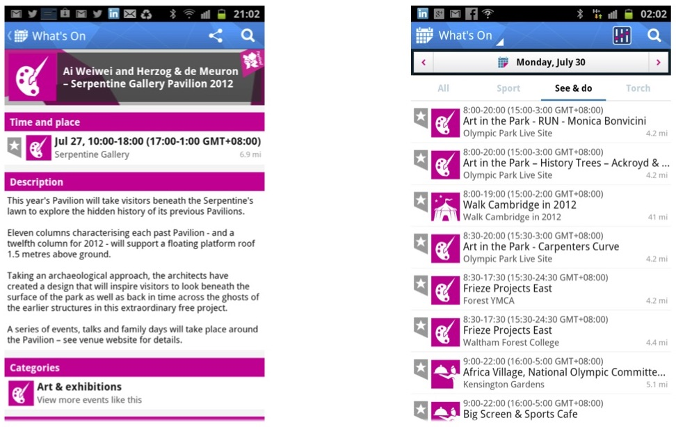

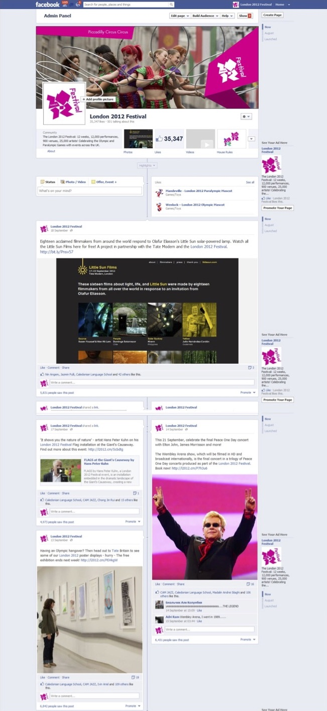

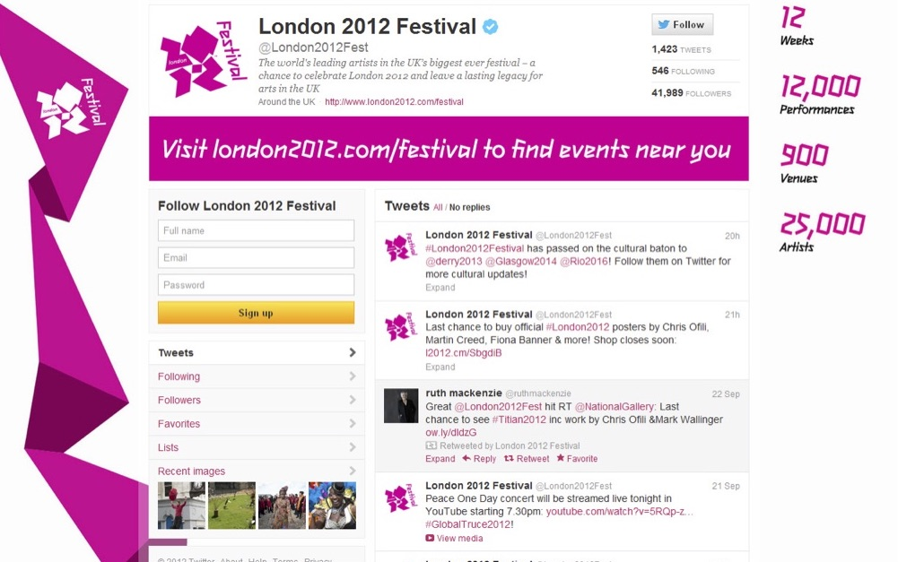

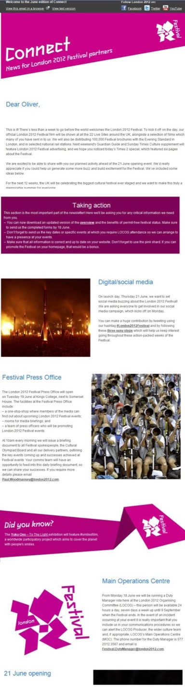

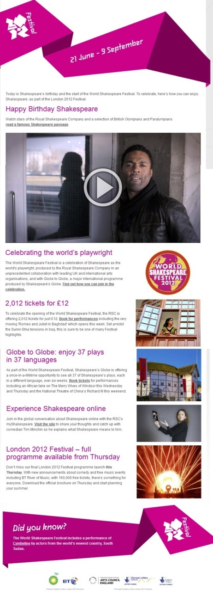

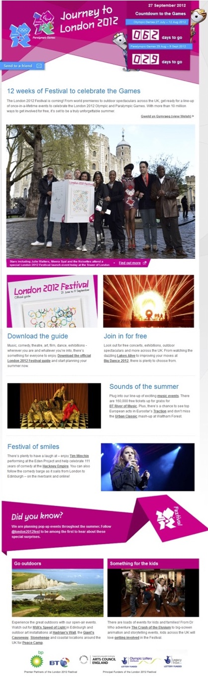
