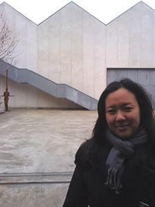
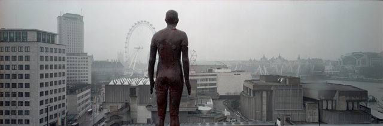

**Because I love art and for the sake of art, I was ready to work in unpaid positions even if the word SACRIFICE was flashing over my head.**

For several months, I had been sending my CV for internship positions even if I was already way way too old to be one. I figure, no one is too old in this field especially because it is probably the only platform where people are allowed to aim for limitless possibilities – and so I thought that yeah it´s still a very open industry.

Well, what do you know? I received multiple slaps of rejection e-mails and it came to a point when it already became monotonously predictable. (Hey Universe, can you surprise me a little bit?)

> Last January, I decided to e-mail **Sir Anthony Caro**, the famed British sculptor, and asked him for a job just the same way he did when he went to Henry Moore´s studio years ago. And here was the response:

**Dear Tuesday**,

Thank you for your email and your C.V. In the last 4 months, we have just taken on a full-time P.A and studio coordinator to Sir Anthony. Before we used to have part-time staff and interns but we have now changed our system and only employ one, full time employer in the office.

I assume you are looking for office work and not fabrication work in the studio? I have heard that Antony Gormley is looking for some office assistants. Perhaps you could contact him?

I will keep your C.V on file, if anything does come up I will let you know. Best of luck, Pat

Well, I was floored!

It was just an email from his studio coordinator but **Mr. Patrick Cunningham** was really gracious enough to answer an email of a fan who´s longing to work with this artist. Imagine having an email mentioning both **Sir Anthony and Antony Gormley**! wooohoo, I was already in the moon.

The next day, Pach, my hubby woke me up and told me to get dressed. He said, **“we are going to Antony Gormley´s studio today** and we are going to hand in your CV.” When we arrived at Antony´s Camden studio, all I could see was a big towering silver gate and glimpse of the roof of his giant studio. My first reaction was, wow, he´s got a lot of space to work on his stuff. **I made 3 deep breaths before I rang the doorbell.** I was waiting for someone to say something on the other end but there was silence.

*  
 Event Horizon part of Antony Gormley´s Blind Light at the Hayward Gallery in 2007.  
 Photo by Gautier Deblonde*

> Then the big giant silver gate creaked open.

I had to step back because it felt cinematic. Then a beautiful girl in studio clothes opened the door to the studio asked me what was going on and I handed her my CV. Damn she was pretty and so lucky to be working in that studio. She quickly hurried up the external stairs to hand it to someone —- I wished it was Antony but I knew on that fine day he would be working. It was such a thrill that it didn´t matter when I received an email from **Laura Mcnamara**, his assistant:

Dear Tuesday

Many thanks for dropping your cv in today. Unfortunately there are currently no positions available at the studio.

Best wishes  
 Laura

<iframe allowfullscreen="" class="youtube-player" frameborder="0" height="505" src="//www.youtube.com/embed/_VBj-gyCcrU?wmode=transparent&fs=1&hl=en&modestbranding=1&iv_load_policy=3&showsearch=0&rel=0&theme=dark" title="YouTube video player" type="text/html" width="640"></iframe>  
*Antony Gormley´s studio in Camden*

<iframe allowfullscreen="" class="youtube-player" frameborder="0" height="505" src="//www.youtube.com/embed/j_U5tScyY7k?wmode=transparent&fs=1&hl=en&modestbranding=1&iv_load_policy=3&showsearch=0&rel=0&theme=dark" title="YouTube video player" type="text/html" width="640"></iframe>  
*Antony Gormley encourages us to go barefoot to change the world*

