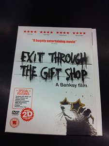
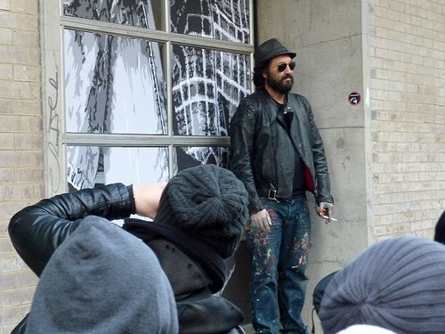
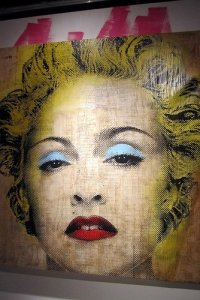
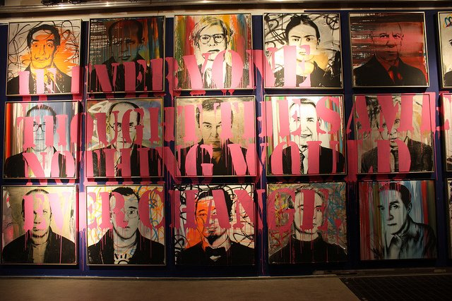

Better late than never. I have just seen **Banksy´s documentary:  [Exit Through the Gift Shop](http://www.imdb.com/title/tt1587707/ "Exit through the Gift Shop")** which was already shown at the Sundance in 2010.  After seeing some works of [**Mr. Brainwash**](http://www.mrbrainwash.com/ "Mr Brainwash") at the Opera Gallery the other day, I just had to see it. It´s supposed to be the story of his evolution from an eccentric French shop keeper to a  world-renowned  street artist.

*Poster. Photo by [Spencer Hickman](ttp://www.flickr.com/photos/donnierobot/4947673391 "Poster of Banksy Film")*

I love underdog stories like these. I do find myself cheering for people who came out of nowhere and then boom, suddenly being tossed in a sort of **X-factor **limelight.  I guess it just gives me some form of catharsis. But you know what´s different about  **Thierry Guetta, a.k.a Mr. Brainwash**?  Well aside from the fact, that he didn´t look young and hip,  he didn´t plan to be an artist. It just came to be.

*Thierry Guetta aka Mr. Brainwash at the Meatpacking District in NYC during his Icons Show in 2010. Photo by [Rich Drogpa](http://www.flickr.com/photos/drogpatravel/4357738541 "Mr. Brainwash at NYC").*

**The documentary showed how Thierry Guetta started as a shop owner (who got obsessed about filming street artists and their creative process) into becoming an artist himself.** He accumulated hundreds of street art footages which he didn´t know what to do with. When he finally produced a documentary which turned out to be unwatchable, **Banksy** told him he should do a small exhibit while he takes on the editing of the documentary. But obsessive by nature, Thierry came out with a big show, exhibiting art works that merge s**treet art and pop art together**, and that´s when Mr. Brainwash, was born. Mr. Brainwash became an overnight sensation. There is something Forrest Gumpish about this whole thing.

*Madonna at the Mr. Brainwash´Icon show. Photo by [Wally Gobetz](http://www.flickr.com/photos/wallyg/4909047741/ "Madonna by Brainwash")*

Frankly, what I liked about this film is Mr. Brainwash himself. **Thierry Guetta was lovable**, actually a comical character, who is devoid of pretensions. I believe if he was otherwise, then it would have been impossible for him to get the trust of these established street artists who allowed him to film them. ****

**Second, unbeknownst to him, by filming the creative process of these artists, he was learning h**imself —which was his alternative to an expensive art education.  By befriending these artists especially Banksy, he was unconsciously positioning himself to be one himself. (You know the saying, tell me who your friends are and I´ll tell you who you are?).  I also loved the fact that he was not ashamed to do self-marketing.

He also didn´t pretend that he knew how to do everything and in fact has admitted to employing a staff who would execute things for him. **I do believe in time, when he has accumulate enough knowledge of technical skills, he would do them himself.**

Or maybe not. Maybe he is just happy to think of concepts and letting other people do the work.  His rise to the top was a bit of a joke but he himself said that only time can prove whether he is an artist or not.  Maybe art already turned out to be a big joke. Maybe Thierry Guetta was not even real. Maybe this movie was just brainwashing us to believe its even a movie.  Or maybe, I´m just running out of things to say. But one thing is very clear: I am inspired.

*The Icons by Mr. Brainwash. Photo by [Betty Tsang](http://www.flickr.com/photos/bettytsang/4836819120/ "Icons of Mr. brainwash ")*

<iframe allowfullscreen="" class="youtube-player" frameborder="0" height="505" src="//www.youtube.com/embed/R3u4bSaByHk?wmode=transparent&fs=1&hl=en&modestbranding=1&iv_load_policy=3&showsearch=0&rel=0&theme=dark" title="YouTube video player" type="text/html" width="640"></iframe>*  
From a Shopkeeper to a Street Artist, Mr Brainwash  
*

