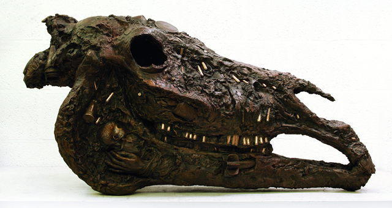
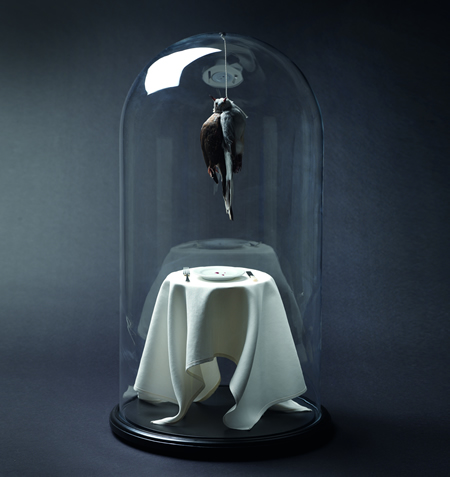
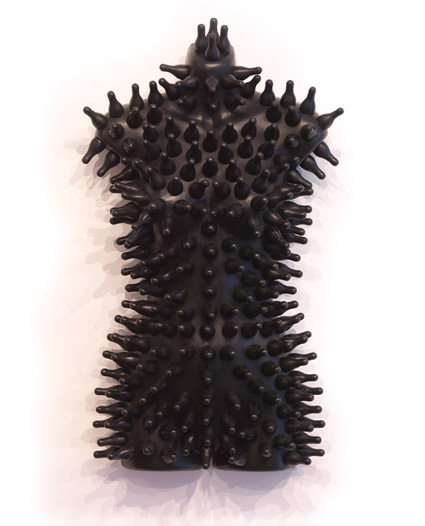
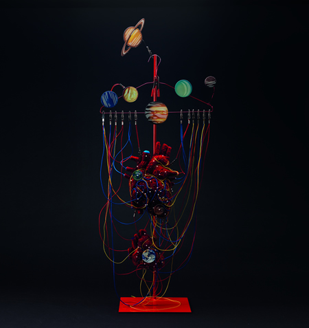
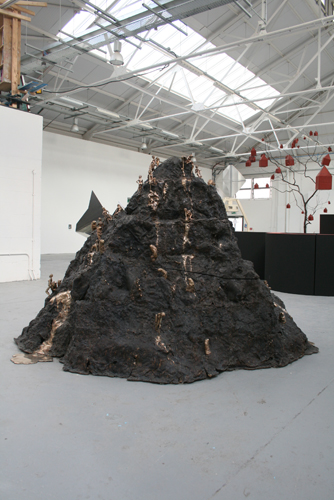

Twenty-four sculptures from an  all-female sculptor ensemble, the Pangolin show might not be as big as the **Modern British Sculpture** exhibit at the [**Royal Academy of Art**](http://www.royalacademy.org.uk/ "Royal Academy of Art") early this year but I was very amazed of the level of creativity.  However, I am still puzzled why gender needs to be such an essential ingredient in the politics of art when for example, the **Saatchi gallery**´s show **“The Shape of Things to Come: New Sculpture” **clearly suggests that we all go back to the most primordial primitive place in art simply because we have come full circle in the space of creativity.

*  
 Collateral by Deborah van der Beek*

**Women Make Sculpture** defies all that. It seeks justice for women sculptors because there is still much more to be said. In fact, women are totally rocking the art scene better than ever. The show tackles themes and issues that concern women: **[Deborah Van der Beek](http://www.deborahvanderbeek.com/ "Deborah van der Beek")´s Collateral**, a dead dinosaur´s head with bullets for teeth, eerily talks about the monstruosity of war. Created in bronze, the piece´s cragginess reminds us of the style of  Giacometti.

[**Polly Morgan**](http://pollymorgan.co.uk/ "Polly Morgan"), explores the theme of death in Communion. A taxidermist who caught the eye of Banksy and has commissioned her before for other works, Communion stages a tiny bird in a bell jar, lifeless over a small table top.  The scene grips you into pieces. The theme of death has never been much more beautifully explored and has rendered **Damien Hirst**´s pitiful Shark in vain.

*Communion by Polly Morgan*

**[Abigail Fallis](http://www.curatedmag.com/news/tag/abigail-fallis/ "Abigail Fallis ")´ Dummy Mummy** and **With Strings Attached**, are both satirical and comical, with a Max Ernst feel. Having studied silversmithing  and metalwork at Camberwell College of Arts, she is fond of using recycled materials like dummies as a response to today´s consumerist tendencies.

*Dummy Mummy by Abigail Fallis*

*  
 With Strings Attached by Abigail Fallis*

The most ambitious piece I would say was from sculptor [Rose Gibbs](http://www.rosegibbs.com/ "Rose Gibbs") who also pokes fun of gender stereotypes. Mountain is monumental in Bronze populated by women in different states of pregnancy and penises.

Over all, Women Make Sculpture shows how varied the themes that women sculptors tackle today. A diversity of forms and materials reflect the statement that they are not fazed by the challenges of creative expression and have much to say as their male counterparts.

Other artists include: Christie Brown, Ann Christopher, Dorothy Cross, Abigail Fallis, Sue Freeborough, Rose Gibbs, Kate Hobby, Sarah Lucas, Briony Marshall, Charlotte Mayer, Polly Morgan, Eilis O Connell, Almuth Tebbenhoff, Deborah van der Beek; Alison Wilding. Download the [catalogue](http://www.gallery-pangolin.com/downloads/gallery-pangolin/catalogues/autumncat.pdf)

PS. Thanks to **Alexandra Darby of Gallery Pangolin** for the photos. (Plus, I´ve seen the section for metalwork and sandmould opportunities for the Gallery Pangolin, hmm, what do you think? 452th CV, perhaps? (wink, wink!)

 

Related Links:  
[Review: Women in Sculpture at the Pangolin by Mouth London](http://www.mouthlondon.com/arts/review-women-make-sculpture-at-pangolin/ "Mouth London") [  
 Polly Morgan, Sarah Lucas, and the rise of the female sculptor by the Guardian](http://www.guardian.co.uk/artanddesign/2011/may/22/sarah-lucas-polly-morgan-female-sculptors?INTCMP=SRCH "The Guardian female sculptors")

<iframe allowfullscreen="" class="youtube-player" frameborder="0" height="505" src="//www.youtube.com/embed/AZGqji53Sbw?wmode=transparent&fs=1&hl=en&modestbranding=1&iv_load_policy=3&showsearch=0&rel=0&theme=dark" title="YouTube video player" type="text/html" width="640"></iframe>  
*Polly Morgan´s Big Influence*

 

<iframe allowfullscreen="" class="youtube-player" frameborder="0" height="505" src="//www.youtube.com/embed/YX_D0qtWM-c?wmode=transparent&fs=1&hl=en&modestbranding=1&iv_load_policy=3&showsearch=0&rel=0&theme=dark&NR=1" title="YouTube video player" type="text/html" width="640"></iframe>*  
Polly Morgan talks about her exhibit Departures, at the Age of the Marvellous*

