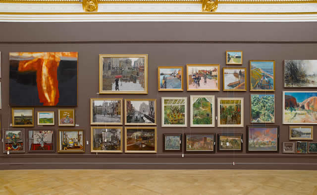

[caption]Installation view of the Lecture Room in progress Courtesy Lisa Milroy and Alan Cristea Gallery[/caption]

Inside the show, the first thing that struck me was the hanging sculpture of **Antony Gormley** and **Tony Cragg**´s sculpture. There were several rooms of paintings from amateur and well-known artists and the fact that they were placed side by side was a visual test for anyone who likes art.  The words “I Like this, I don´t like that” echoed in the room. **I suggest that you see the RA Summer Exhibition twice**. First, go there without carrying the “List of Works Catalogue” and just let your eye take you to the artwork that appeals to you.You´ll be surprised to know it´s still the same people you´ve always liked.

*Jeff Koons Hon RA, Coloring Book 1997-2005 Aluminum*  
*567.7 x 323 x 335cm*  
*Copyright Jeff Koons*  
*Photo: John Bodkin/DawkinsColour*

[Alistair Sooke of the Telegraph](http://www.telegraph.co.uk/culture/art/art-reviews/8562267/Summer-Exhibition-at-the-Royal-Academy-review.html "Alistair Sooke") sums up how the RA show has fared for years:

“Today, suspicion persists that it remains a safe haven for traditional painters who take the “common-sense” view that a picture of a tree must resemble a tree. Yet it strikes me that denigrating the Summer Exhibition is a peculiarly self-flagellating British trait. Nobody could claim that it is cool or cutting-edge. But it is the largest open-submission contemporary art exhibition in the world: this year, the hanging committee vetted more than 12,000 entries from 27 countries.”

-Alistair Sooke

*Installation view of the Lecture Room in progress *  
*Courtesy Lisa Milroy and Alan Cristea Gallery *  
*Photo: John Bodkin*

I didn´t feel that way at all probably because it was my first time to come to the RA show and I have nothing to compare it to. It did not give me the impression that it was pretending to be a major exhibition anyway. It was however, an opportunity to see upcoming artists and be able to buy affordable art if you want to become a future collector.There were prints available for as low as 125 pounds, how great is that?

 *Installation view of Gallery III *  
*Photo: John Bodkin*

Whether the RA show is useless or boring for some, it has served to confirm to myself that I´m still moved by the greats and other newcomers in my life – **Antony Gormley, Anish Kapoor, Tony Cragg, Anselm Kiefer and Edward de Vall** to whom B introduced me to. Most of the things I loved are not being sold according to the catalogue and were only there for display. (Even if they were, I couldn´t afford them anyway.) B says my taste is very expensive. I told her that´s  not true at all because in reality, my taste is priceless.

<iframe allowfullscreen="" class="youtube-player" frameborder="0" height="505" src="//www.youtube.com/embed/Hohytde1axU?wmode=transparent&fs=1&hl=en&modestbranding=1&iv_load_policy=3&showsearch=0&rel=0&theme=dark" title="YouTube video player" type="text/html" width="640"></iframe>  
*Royal Academy Summer Exhibition 2011*

Other artworks to see in the RA Show:

*Bill Woodrow RA *  
*Pillarbox Invigilator *  
*Copyright The Artist *  
*Photo: Prudence Cuming Associates Ltd*

*Cindy Sherman, Untitled # 472 *  
*2008, colour photograph, 169.9 x 127cm, edition 3-6. Courtesy of the artist, Metro Pictures and Spruth Magers Berlin London *

*Gary Hume RA, The Cradle *  
*2011, gloss on aluminium, 196 x 198 x 2.2 cm *  
*Copyright Gary Hume, Photographer Steve White*

Related links:  
[Summer exhibition at the Royal Academy, review by Alistair Sooke](http://www.telegraph.co.uk/culture/art/art-reviews/8562267/Summer-Exhibition-at-the-Royal-Academy-review.html "Alistair Sooke")  
[RA Summer Show Decomposes by Beyond the Frame blog](http://belcheresque.wordpress.com/ "Beyond the Frame")

