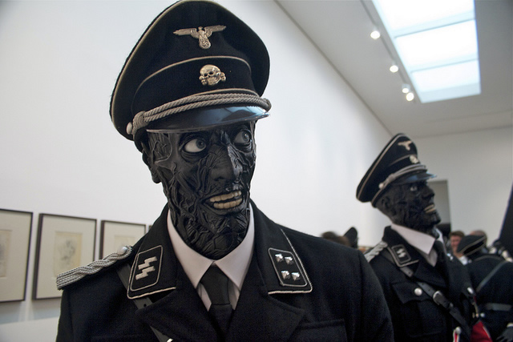
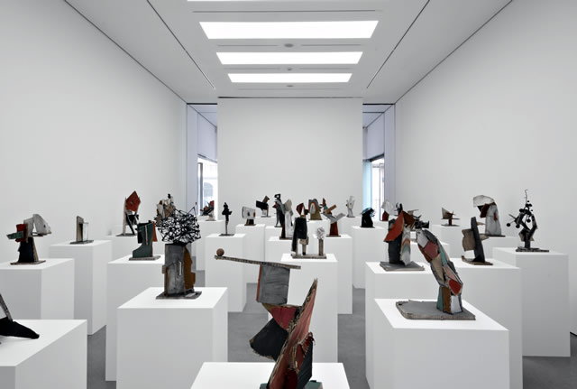
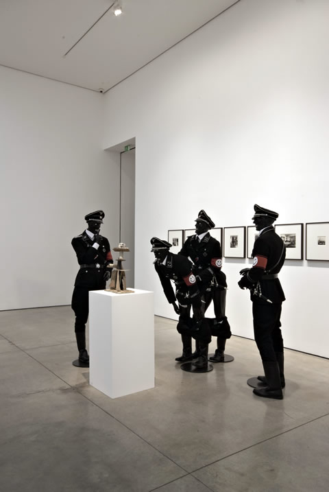
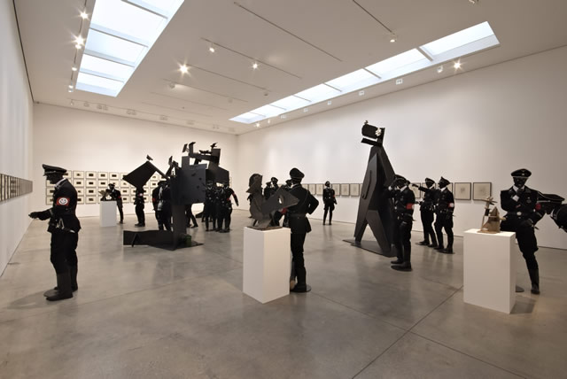
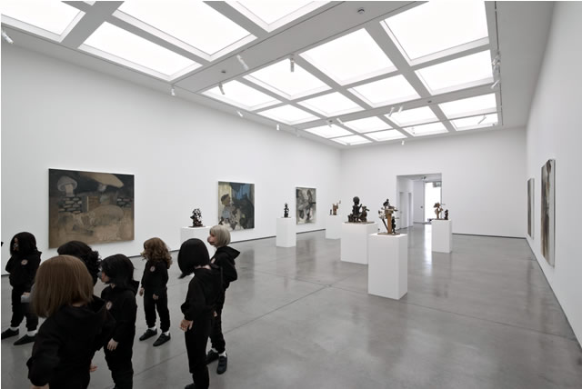
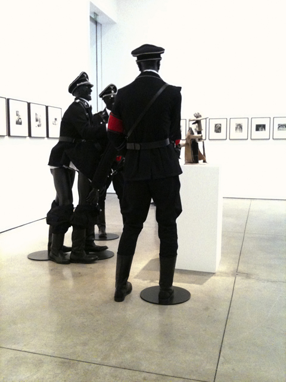

A week has passed since the riots and the lootings in London and I am still scared to walk alone in the streets. Yeah, things have calmed down a bit but I have come to realise that the new country I have come to embrace has far more problems than just financial crisis. It is a case of moral decadence brought about by a crumbling society: kids looting to steal Iphones and a pair of trainers and jeans.  **There was no political agenda except to satisfy the need for instant gratification and status quo – a consumer mentality** that plagues not only these kids, but everyone.  In the future when these kids become adults, they would go down in history as the generation whose morals have all come down to a cellular phone.

The bitter aftertaste of the riots  lingered on when I remembered the exhibit of the **Chapman brothers in [White Cube](http://www.whitecube.com/exhibitions/ "White Cube")Mason´s Yard**. As much as I wanted to comprehend the recent London riots, I simply couldn´t. The same goes out for the Chapman brothers´exhibit where nothing and everything makes sense.  In this exhibit, absurdity becomes a potent force for satire. To understand a Chapman brothers exhibit, you have to let your initial instincts take over reason. To discover the intent and to find an intellectual purpose behind it would just spoil the fun.  Take for example, how Jake or Dinos Chapman created **Nazi skeleton figures donning a smiley swastika rather than the menacing symbol we all have grown to abhor. With fleshless faces, these Nazi figures smile at us and grin at the absurdity of it all.**

*Jake or Dinos Chapman at the White Cube Mason´s Yard. Photo by [Elias Daniel](http://www.flickr.com/photos/elias_daniel/5995061548/ "Elias Daniel")*

<iframe allowfullscreen="" class="youtube-player" frameborder="0" height="505" src="//www.youtube.com/embed/GICpe_HnTjE?wmode=transparent&fs=1&hl=en&modestbranding=1&iv_load_policy=3&showsearch=0&rel=0&theme=dark" title="YouTube video player" type="text/html" width="640"></iframe>  
*Jake and Dinos Chapman interview at the White Cube*

These mannequins are staged in comical scenes: one Nazi had his pants down ready to commit a sexual act on another who was already bending down, while another comrade looks on.  There are others sprawled around the whole ground floor looking at pictures on the wall, contemplating the significance of art.  **It is a paradox that these Nazi are also all black figures, a far cry from the superior white Aryan race that they have stood for and killed the Jews for**. From ideologies and modern art, the Chapman brothers satirize any forms of establishment as only the kings of bad taste would. For instance, at the ground floor, their series of coloured carton sculptures looked as if they were  child´s play. In fact, that what it is: in this exhibit, you shouldn´t take them seriously because the Chapman brothers were simply having fun.

*Jake or Dinos Chapman**, White Cube Mason’s Yard and Hoxton Square**,London*  
*15 July – 17 September 2011*  
*© the artists*  
*Photo: Ben Westoby*  
*Courtesy White Cube*

*Jake or Dinos Chapman**, White Cube Mason’s Yard and Hoxton Square**. London*  
*15 July – 17 September 2011*  
*© the artists*  
*Photo: Ben Westoby*  
*Courtesy White Cube*

  
*Jake or Dinos Chapman, White Cube Mason’s Yard and Hoxton Square, London*  
*15 July – 17 September 2011*  
*© the artists*  
*Photo: Ben Westoby*  
*Courtesy White Cube*

<iframe allowfullscreen="" class="youtube-player" frameborder="0" height="505" src="//www.youtube.com/embed/SRZtcIqQrEc?wmode=transparent&fs=1&hl=en&modestbranding=1&iv_load_policy=3&showsearch=0&rel=0&theme=dark" title="YouTube video player" type="text/html" width="640"></iframe>  
*Scenes from the White Cube Mason´s Yard*

The exhibit is actually divided into two – one at the White Cube Mason´s Yard and the other at the Hoxton Square venue. While the brothers still work in a collaborative effort, the double-header show simply want us to guess who did what. This time, the brothers supposedly worked separately but the visual language is quite the same. **They still shock and entertain before we can make sense of a deeper purpose behind their works. There is also a Marcel Duchampesque confidence that everything they touch and do is art.**  In Mason´s Yard, one of them thought about mocking Nazi sodomy, and in Hoxton Square (which I´m still about to see), another Chapman brother thought about creating sculptures of little girls with pig snouts – perhaps (just like the recent looting and riots in London), a reminder that childhood innocence is really a thing of the past.

*Jake or Dinos Chapman, White Cube Mason’s Yard and Hoxton Square, London*  
*15 July – 17 September 2011*  
*© the artists*  
*Photo: Ben Westoby*  
*Courtesy White Cube*

*Jake and Dinos Chapman exhibition at the White Cube. Photo by [Richard](http://www.flickr.com/photos/myembers/6043133848/ "Richard Myembers")*

<iframe allowfullscreen="" class="youtube-player" frameborder="0" height="505" src="//www.youtube.com/embed/A95-OIop0FM?wmode=transparent&fs=1&hl=en&modestbranding=1&iv_load_policy=3&showsearch=0&rel=0&theme=dark" title="YouTube video player" type="text/html" width="640"></iframe>  
*Meditation on Jake and Dinos Chapman*

Related Links:  
[Jake and Dinos Chapman, White Cube review by Loma Ann-Marks for the Culture Compass](http://www.culturecompass.co.uk/2011/07/15/jake-or-dinos-chapman-white-cube-review/ "Culture Compass: Jake or Dinos Chapman")  
[First Night: Jake or Dinos Chapman at the White Cube by The Independent](http://www.independent.co.uk/arts-entertainment/art/reviews/first-night-jake-or-dinos-chapman-white-cube-masons-yard-amp-hoxton-square-2314019.html "Independent") [  
 Jake or Dinos Chapman by the London Evening Standard](http://www.thisislondon.co.uk/arts/review-23970274-jake-or-dinos-chapman-white-cube-hoxton-square-and-masons-yard---review.do "Chapman Brothers: London Evening Standard")  [Jake or Dinos Chapman: Digital Daze  
](http://www.dazeddigital.com/artsandculture/article/10919/1/jake-or-dinos-chapman-white-cube "Digital Daze") [Jake and Dinos Chapman at the White Cube by Telegraph](http://www.telegraph.co.uk/culture/culturepicturegalleries/8639662/Jake-and-Dinos-Chapman-at-the-White-Cube-in-pictures.html "Telegraph") [  
 Jake and Dinos Chapman: A Kick up the Arts](http://akickupthearts.wordpress.com/2011/07/18/jake-or-dinos-chapman-white-cube/ "A Kick Up the Arts") [  
 Jake or Dinos Chapman by The Guardian´s Adrian Searle](http://www.guardian.co.uk/artanddesign/2011/jul/14/jake-or-dinos-chapman-review "Adrian Searle discusses Jake or Dinos Chapman")

PS. Thank you to Ms.** Sara Macdonald**, Press Officer of the White Cube, for providing me with publicity images =)

