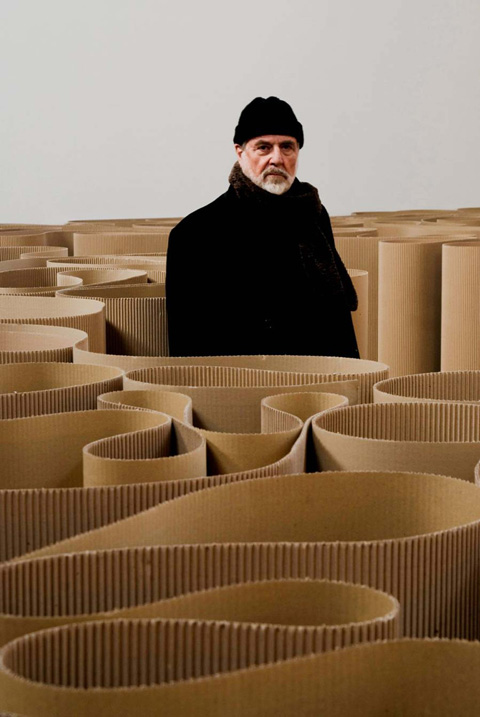
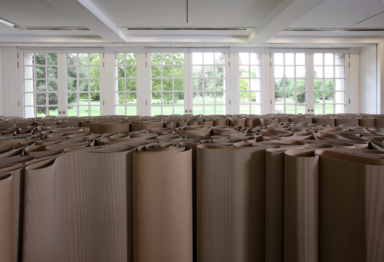
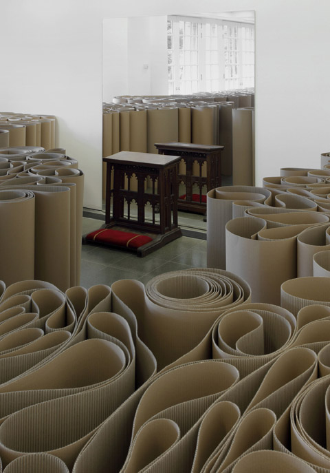
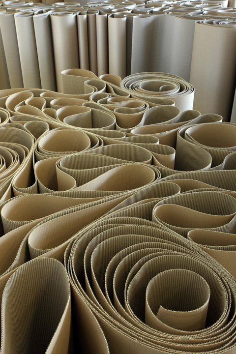

**“How many corrugated cardboards did [Michelangelo Pistoletto](http://www.pistoletto.it/ "Michelangelo Pistoletto") use for this show?”** I asked one of the invigilators at the[ Serpentine Gallery](http://www.serpentinegallery.org "serpentine") when I visited there last week. “I don’t know,” she said, surprised at the incredulity of my question while giving me a look that says “Does it really matter?” She was right – it really didn’t matter **because the effect is a labyrinth and experience of space like nothing else you can imagine.**

Except the space for the **Mirror of Judgement** is made out of rolls and rolls of corrugated cardboard, a cheap material that is accessible and familiar in our consciousness. As one of the early pioneers of **Arte Povera** or “Poor Art”, **Michelangelo Pistoletto** has explored the use of cheap  materials to seek fundamental discussions on contemporary life.

*Michelangelo Pistoletto**: The Labyrinth 1969-2007*  
* Corrugated cardboard*  
* Meters of cardboard*  
* Courtesy Galleria Continua, San Gimignano / Beijing / Le Moulin*  
* Photo by Oak Taylor-Smith*  
* © 2011 Michelangelo Pistoletto*

*Michelangelo Pistoletto**: Installation view, Serpentine Gallery, London*  
* (12 July – 17 September 2011)** © 2011 Sebastiano Pellion*

Here, Michelangelo stretches the normal limitations of cardboard, highlighting it  not only **as the central figure in the show, but also creating it as the architecture within the architecture. **It has transformed the Serpentine gallery as a living, breathing and intimate space. **  
**

Apart from rolls and rolls and winding maze of cardboard, there are large-scale mirrors that welcome the visitor when they arrive at specific corners of sacred space that pay homage to different religions. **There is a prayer mat, a life-size Buddha, a Gothic prayer-kneeler** in front of these mirrors which  invite the viewer to explore their reflection as well contemplate on deeper religious truths, or perhaps the labyrinth of life itself.

<iframe allowfullscreen="" class="youtube-player" frameborder="0" height="505" src="//www.youtube.com/embed/AoxzUuy4QRo?wmode=transparent&fs=1&hl=en&modestbranding=1&iv_load_policy=3&showsearch=0&rel=0&theme=dark" title="YouTube video player" type="text/html" width="640"></iframe>  
*Michelangelo Pistoletto explains the meaning of Mirror of Judgement*

*Michelangelo Pistoletto*:  
* Installation view, Serpentine Gallery, London*  
* (12 July – 17 September 2011)** © 2011 Sebastiano Pellion*

I found myself gazing at my own self several times, contemplating my place not just as a viewer but as a participant of the installation,** discovering that each angle I took reveals a new nook, a new corner, a new perspective.**

And perhaps that is the real success of this show -** it allows the viewer to seek his or her place within the installation and find personal meanings**. Michelangelo cares about what we think and elevates our position to part-creator in the whole experience of seeing, viewing, interacting. In fact, I imagine Michelangelo watching us from a screen, amused with our reactions as we walk thru the winding maze of cardboard labyrinth at the Serpentine.

*Michelangelo Pistoletto**:Installation view, Serpentine Gallery, London*  
* (12 July – 17 September 2011)** © 2011 Sebastiano Pellion*

The beauty of Mirror of Judgment is that is as you go thru the whole gallery, you still wonder what you might discover or imagine.  On a personal note, my experience was very spiritual. **Mirror of Judgment** helped me obtain a new idea of myself – that I could be so much more than just an insignificant viewer of artworks. That I could be a part of an artwork as a co-creator by simply breathing it, living it and being on it.

<iframe allowfullscreen="" class="youtube-player" frameborder="0" height="505" src="//www.youtube.com/embed/aW1Ebxz7hZs?wmode=transparent&fs=1&hl=en&modestbranding=1&iv_load_policy=3&showsearch=0&rel=0&theme=dark&feature=related" title="YouTube video player" type="text/html" width="640"></iframe>  
*The experience*

Related Links:  
[Michelangelo Pistoletto, Serpentine Gallery by Charles Darwent for the Independent](http://www.independent.co.uk/arts-entertainment/art/reviews/michelangelo-pistoletto-serpentine-gallery-london-2319356.html "Charles Darwent, Independent: michelangelo") [  
Michelangelo Pistoletto’s stunning reflections from Jonathan Jones for the Guardian](http://www.guardian.co.uk/artanddesign/jonathanjonesblog/2011/jul/12/michelangelo-pistoletto-stunning-reflections "Jonathan Jones: Michelangelo Pistoletto") [  
Michelangelo Pistoletto: The Mirror of Judgment by Laura Cummings for the Guardian](http://www.guardian.co.uk/artanddesign/2011/jul/24/michelangelo-pistoletto-mirror-judgement-review "Laura Cummings on Michelangelo Pistoletto")

