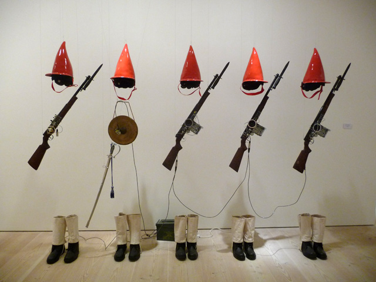
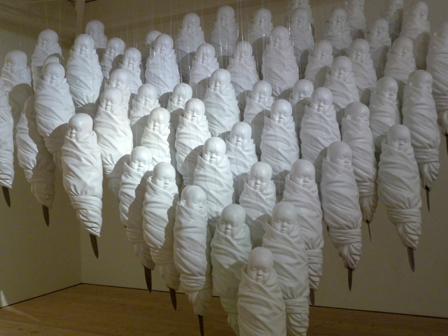
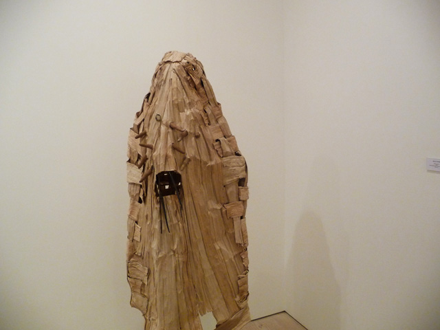
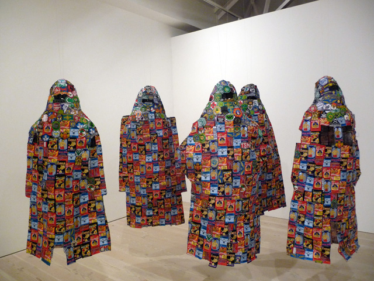
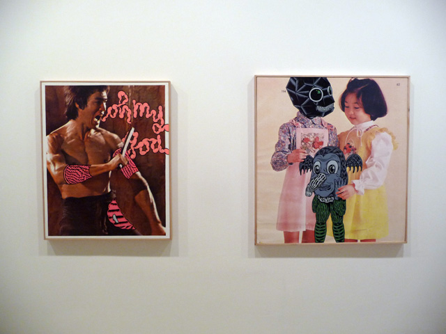
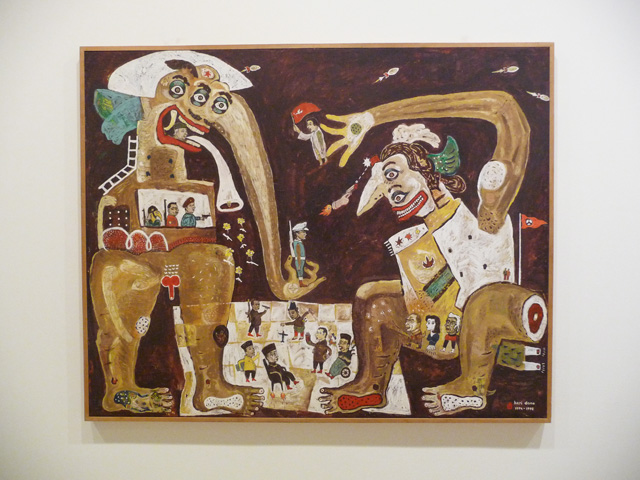
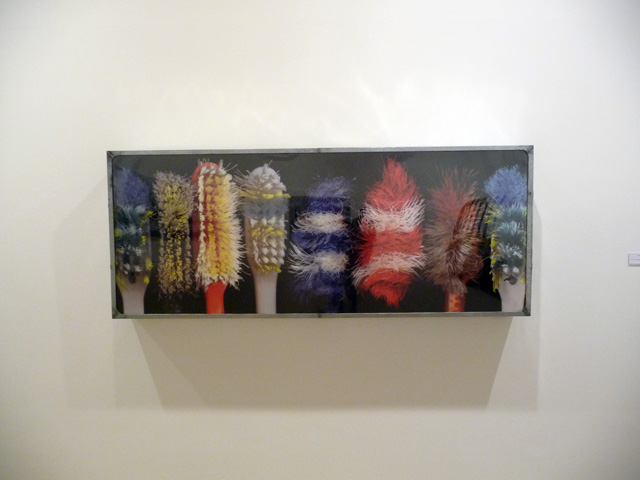
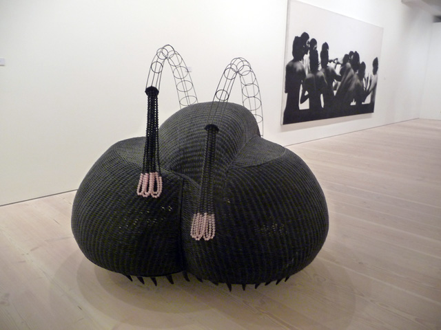

[caption]War of Java, Do you Remember? by Jompet Kuswidananto[/caption]

**It seems that the [Saatchi gallery](http://www.saatchi-gallery.co.uk/current/indonesian_eye.htm "Saatchi Indonesian eye")‘s venture into the world of contemporary South-east Asian art is proving to be very successful**. In 2009, Korean eye: Moon Generation 2009 attracted 250,000 visitors according to one blog and even spawned a sequel last year with the Korean eye: Fantastic Ordinary, which by the way I swooned over as I got a chance to see works from  the best emerging artists in Korea and who as a result of this exhibit, eventually became world-renowned artists.

This year and (also on its last week), artists from Indonesia are featured in Indonesian Eye: Fantasies and Realities at the Saatchi gallery sponsored by Prudential Life. While one Western critic already lambasted it for failing to impress, I beg to disagree.**It might not be as powerful as its Korean counterpart, but Indonesia Eye is a statement that Indonesian art is no longer just about carvings anymore**.

*War of Java, Do you Remember? by Jompet Kuswidananto*. *Photo by Momardi*

**My favourite so far is Jompet Kuswidananto’s “War Of Java, Do you Remember?#1 is an installation of 5 bodiless soldiers with pointy red hats with imaginary hands holding European rifles over a pair of boots**. In each of them, there are cassete transistors broadcasting propaganda speech in Javanese which play and halt from time to time. Jompet’s bodiless figures have been known as his trademark but the beauty of this installation is the fact that it is a homage to the thousands of soldiers who died during the Java war but it is also commentary on cultural disintegration as Indonesia continued then to be a colony of the Dutch wreaking repercussions on their culture. Among all the soldiers in the piece, only one carried a gong which was a symbol of Javanese culture.

<iframe frameborder="0" height="480" src="http://blip.tv/play/gjCB49ArAg.html" width="640"></iframe>*Interview with Jompet Kuswidananto*

**Haris Purnomo** is known for his baby sculptures and has already exhibit some of his works in CoCA Seattle and also in Art Basel in Geneva. H**is “Waiting for a Signal” (2008-2009) is an installation of white baby sculptures hanging from the ceiling like cocoons which look like mythical figures in sleeping form** who seem to be gathering energy for their metamorphosis. It could be a metaphor for Indonesia as a nation, and the only way to give birth to a powerful republic is to look at its past and their beginnings when there was no loss of innocence nor intrusions to their culture.

*Waiting for a Signal by Haris Purnomo. Photo by Momardi*

**Mella Jaarsma** has two powerful contributions in Indonesian Eye **which explores social space with clothing and skin**. In **Sara-Swati II**, a life-like figure is covered in burkha made from  dried banana tree trunks with fingers poking all around it.

Being born in the Netherlands and living in Indonesia for more than twenty years, **it is a natural progression for Mella to be interested in her own concept of identity as seen in the basis of Indonesian ethnicity and religion**. **Post-modernist** is an installation of 5 cloaks using embroidered emblems.  According to Mella, “We are like impermanent buildings with façades in which the inside is changeable. The second skin that we are wearing is like a house in which we can appear from or hide; we can inhabit it or have to be ready to leave.”

*Sara Swati II by Mella Jaarsma. Photo by Momardi*

*Post-modernist by Mella Jaarsma. Photo by Momardi*

There are other noted works in the exhibit which show Indonesia’s foreign influences. **Wiyoga Muhardanto**‘s ironic **“iType”** (2005) combines a typewriter with an Apple logo while **Wedyar Rihad**i combines the image of Bruce Lee with accesories drawn in manga style.

*iType by Wigoya Muhardanto. Photo by Momardi*

*Left: Give me your best flavour and I will bite you from Wedyar Riyadi;   
Right: New Neighbour from Outerspace from Wedyar Riyadi. Photo by Momardi*

Of course there is still an effort to create a unique Indonesian identity. **Heri Dono** uses images from folk traditions as a new platform for social commentary. Using puppets with two or three sets of eyes, soldier figures with animal feet, angels and clowns, **Heri Dono’s “Looking for a Fake President” and “Playing Chess” are colourful depictions of the many problems and issues facing Indonesia today**.

*Flower Diplomacy from Heri Dono. Photo by Momardi*

I am very jealous of the fact that Indonesian artists are getting this kind of exposure and I long for a time when Filipino contemporary artists would have the same kind of attention in the international art scene. **So let me make it clear to you that I’m writing this article not only to support our Asian neighbours but to campaign for Saatchi’s next exhibit to be dedicated to Filipino artists.** =) Knock, knock Mr. Saatchi!

*Brush by Angki Purbandono. Photo by Momardi*

  
*Dzikir by Nindityo Adipurnomo. Photo by Momardi*

<object classid="clsid:d27cdb6e-ae6d-11cf-96b8-444553540000" codebase="http://download.macromedia.com/pub/shockwave/cabs/flash/swflash.cab#version=6,0,40,0" height="240" style="display: none;" width="320"><param name="src" value="http://a.blip.tv/api.swf#gjCB49ArAg"></param><embed height="240" src="http://a.blip.tv/api.swf#gjCB49ArAg" style="display: none;" type="application/x-shockwave-flash" width="320"></embed></object>

 Related Links:[  
Jompet’s Open Structures by Carla Bianpoen for the Jakarta Post](http://www.thejakartapost.com/news/2011/04/14/jompet%E2%80%99s-open-structures-a-response-critical-issues-today.html "Jompet Kuswidananto")  
[The Saatchi Gallery to show Indonesian Eye: Fantasies and Realities by Art Knowledge News](http://www.artknowledgenews.com/28_08_2011_23_50_38_the_saatchi_gallery_to_show_indonesian_eye_fantasies_and_realities.html "Art Knowledge News") [  
Prudential Life’s press release on Indonesian Eye](http://www.prudential.co.uk/prudential-plc/media/newsreleases/archive2011/2011-07-22/2011-07-22b.pdf "Prudential Life")s   
[Catalogue: Indonesian Eye: Fantasies and Realities](http://8.evisua.com/files/Indonesian-Eye-Fantasies-and-Realities-Catalogue.pdf "Catalogue: Indonesian Eye")  
[Indonesian Eye by Blue Mile](http://theblumile.com/2011/09/01/exhibition-indonesian-eye-fantasies-realities/ "Blue Mile")

