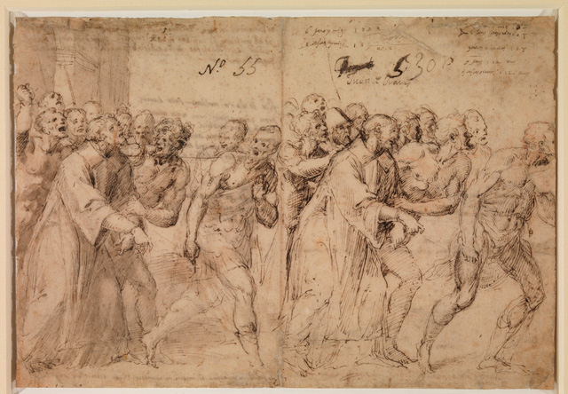
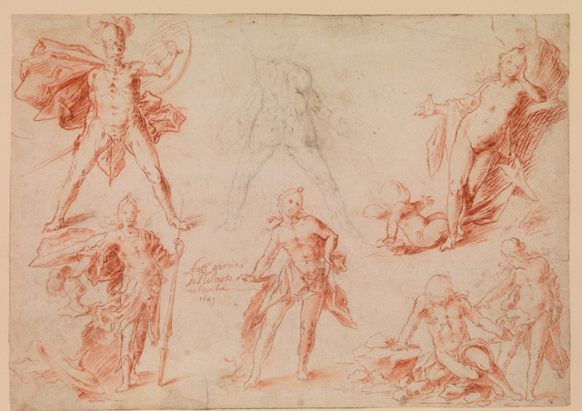
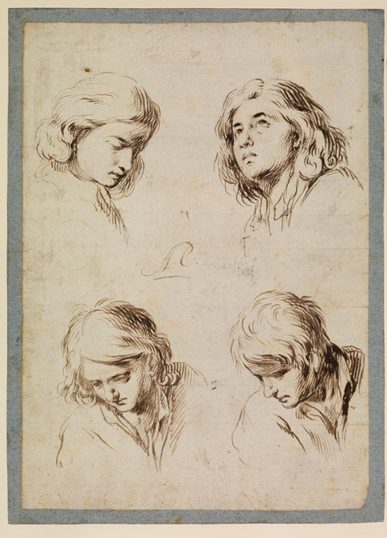
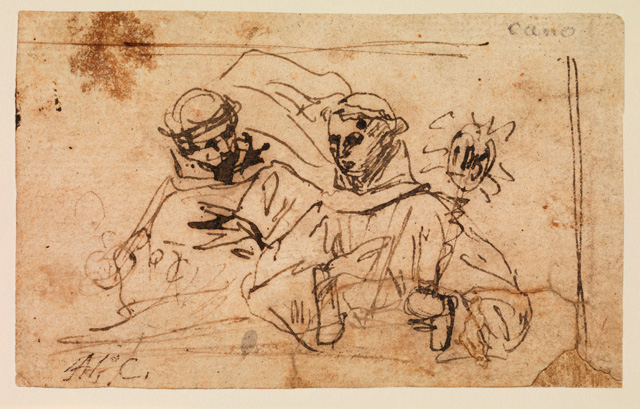
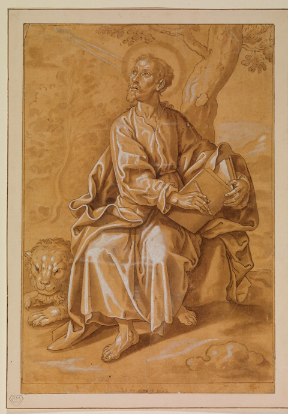
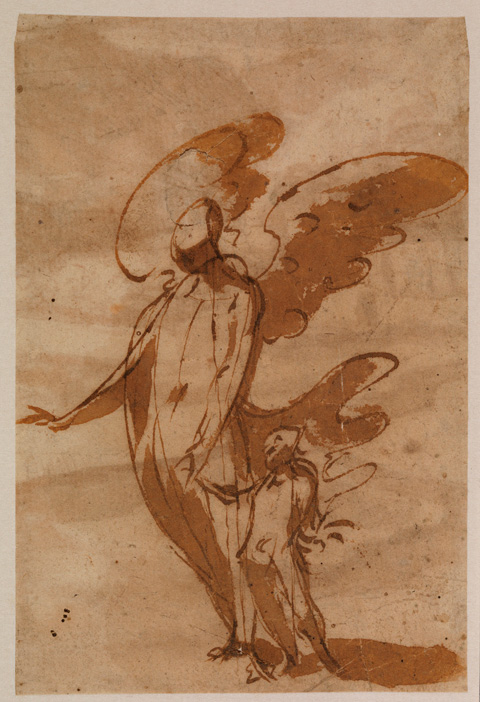
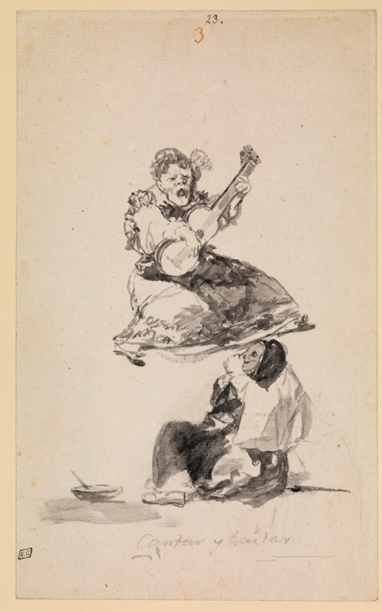
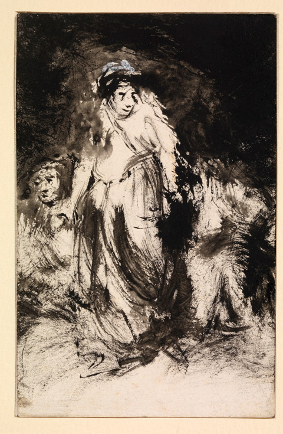
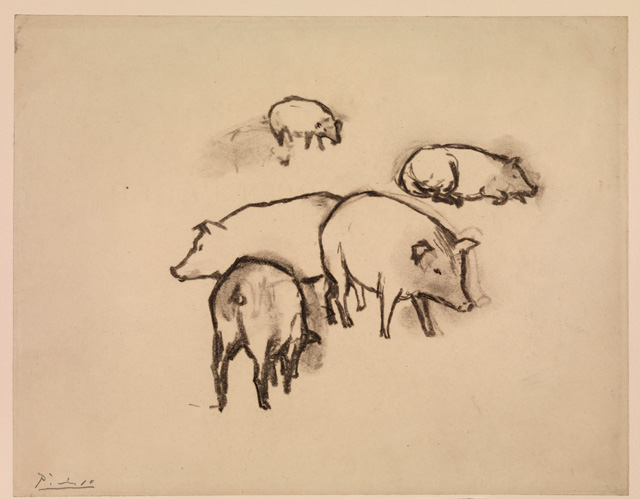

[caption]Pigs by Pablo Picasso. © The Courtauld Gallery[/caption]
We know the Spanish greats like the palm of our hand – **Picasso, Miro, Dali, Velazquez, Goya** –  as if they had been born part of our consciousness. But there’s an area in Spanish art that is relatively unknown, until now. For the first time at the  Courtauld,[ Spanish Line](http://www.courtauld.ac.uk/gallery/exhibitions/2011/spanish-line/index.shtml) explores the unchartered tradition of Spanish draughtsmanship, giving us a new perspective on Spanish art.

All tucked in a room in the 3rd floor, it is a rather small show, showing only 40 representative drawings from more than 100 of the Courtauld’s collection from the 16th century to the 20th century.  Nevertheless if you are a fan of Spanish art like me, this should not be missed. Do not however, expect any bias over works of Picasso and Goya - **the exhibit is a much more a general presentation of Spanish draughtsmanship with an insight into Dutch and Italian Renaissance influence.** While it might not catapult it to the level of stature of its contemporaries, the exhibit clearly states it’s time to take more notice. Here are some of the never-before-seen drawings from the collection:

*Juan de Juanes (Vicente Juan Macip) ** (Valencia c.1510-1579 Bocairente)*  
*Two studies for Saint Stephen taken to his martyrdom*  
*Verso: Sketches of a man standing at a river’s edge and a profile head *  
*Pen and brown ink (recto and verso), grey wash and (later?) traces of red chalk (recto)*  
*217 x 315 mm**  © The Courtauld Gallery, London*

**1.  Saint Stephen taken to his martyrdom by Juan de Juanes (1510-1579)**  
 Heavily influenced by Raphael and Italian Renaissance after a trip to Rome, Juan de Juanes is known for painting Spanish religious icons such as the famous [The Last Supper](http://www.google.co.uk/imgres?imgurl=http://static.artbible.info/large/juanes_avondmaal.jpg&imgrefurl=http://www.artbible.info/art/large/301.html&h=576&w=896&sz=77&tbnid=W5JJKWIuRRQ0gM:&tbnh=90&tbnw=140&prev=/search%3Fq%3Djuan%2Bde%2Bjuanes%26tbm%3Disch%26tbo%3Du&zoom=1&q=juan+de+juanes&docid=GFA1B66D16RVcM&hl=en&sa=X&ei=Ow_qTqXGL6eB4ASyx9nlCA&sqi=2&ved=0CDEQ9QEwAg&dur=1227) and Entombment of St. Stephen. The double-sided sheet studies for Saint Stephen show the first stage preparation for an altarpiece. It is interesting to see the scribblings at the backside because it provides us with a glimpse on the artist’s creative process. It also gives us an idea about Juan de Juanes’ style as an artist giving breadth to his mastery of composition and accuracy of drawing. The characters in this drawing also appear to radiate devotional qualities, typical of most of the personages in his paintings.

*Jusepe de Ribera (lo Spagnoletto) (Játiva 1591-1652 Naples)*  
*Man tied to a tree, and a figure resting*  
*Red chalk, trimmed to later framing line in dark brown ink, inscribed lower left in dark brown ink spagnoletto*  
*241 x 150 mm** © The Courtauld Gallery, London*

<iframe allowfullscreen="" class="youtube-player" frameborder="0" height="505" src="//www.youtube.com/embed/M9AgSYgyAlY?wmode=transparent&fs=1&hl=en&modestbranding=1&iv_load_policy=3&showsearch=0&rel=0&theme=dark" title="YouTube video player" type="text/html" width="640"></iframe>  
*Nicola Spinosa, Director of the Capodimonte Museum Naples, Italy, speaks on Jusepe de Ribera*

**2. Man tied to a tree, and a figure resting by Jusepe de Ribera (lo Spagnoleto) (1591-1652)**  
Another painter influenced by Italian Renaissance Art is Jusepe de Ribera, a leading figure of Spanish Baroque but has often been oveshadowed by Velazquez due to his preference for the uncanny and the odd. He is also a great follower of Caravaggio’s shadow style of painting and later on settled in Italy where he produced most of his mature works. In Man Tied to a Tree, Ribera once again shows his propensity for gloomy and dark subject matters. It is agonizing to see the man tied to a tree trying to reach out one hand to the ground while another person seems resting, or rather lamenting his wrong-doing in one corner.

*Antonio García Reinoso (Granada 1623-1677 Córdoba)**  
Sheet of figure studies, 1649*  
*Red and black chalk; blending with damp brush or stump *  
*Artist’s signature and date left of centre, in red chalk*  
* AnttO garcia / De Reinoso / nobien-bre / 1647*  
*214 x 303 mm** © The Courtauld Gallery, London*****

**3. Sheet of figure studies, 1649 by Antonio Garcia Reinoso (1623-1677)**  
Aside from Italian Renaissance art, developments in Dutch and Flemish art also influenced Spanish artists like the lesser-known Baroque Painter Antonio Garcia who produced  religious works in churches and convents during his lifetime. And yet this drawing of figure studies show  diversity, creativity and imagination.

*Antonio del Castillo y Saavedra (Córdoba 1616-1668)*  
*Four studies of the head of a young man*  
*Pen and brown ink *  
*Autograph monogram in centre A.C.*  
*219 x 156 mm © The Courtauld Gallery, London*****

**4. Four Studies of the head of a young man by Antonio del Castillo y Saavedra (1616-1668)**  
Saavedra is one of the few distinctive painters who stayed in his native city, Cordoba to practice his art. This study of four heads show Saavedra’s use of vigorous strokes and also muted tones, a style which he carried out on his frescoes and oil paintings.

*Alonso Cano (Granada 1601-1667 Granada)*  
*Saint Bernardino and Saint Juan of Capistrano*  
*Pen and brown ink*  
*76 x 123 mm © The Courtauld Gallery, London*

**5. Saint Bernardo and Saint Juan of Capistrano by Alonso Cano (1601-1667)**  
Nicknamed the Spanish Michelangelo, Alonso Cano was a painter, sculptor and architect of religious works and was responsible for the famous facade of the cathedral of Granada in Spain. The study drawing of Saint Bernardo and Saint Juan of Capistrano looks more like a rapidly sketched doodle than a drawing. One can see other forms of markings within the paper, showing the composition of the scene.

*Francisco Pacheco (Seville 1564-1644)*  
*Saint Mark*  
*Pen and brown ink and darker ink, brown wash, heightened with white body colour, on medium-brown toned paper,  inscribed lower edge centre**, 23 de octubre 1632*  
*362 x 221 mm © The Courtauld Gallery, London*

**6. Saint Mark, 23 October 1632 by Francisco Pacheco (1564-1644)**  
A teacher of Cano and father in law of Diego Velazquez, Pachecho was known for his didactic approach to painting evident in the [Lo Judici Final](http://en.wikipedia.org/wiki/File:Francisco_Pacheco-Lo_Judici_Final.jpg) at the Museo Goya.  This highly-detailed drawing of St Mark  is a typical representation of religious icons during Pachecho’s time, where subjects often exude devotional qualities. The drawing is executed well and shows the technical skill of the artist, but a little bit unimaginative compared to a drawing of Ribera above.

*Francisco de Herrera the Younger  (Seville 1627-1685) attributed*  
*Guardian angel walking with a child  *  
*Verso: Fragment of a landscape *  
*Pen and brush, brown ink, brown wash, *  
*Verso: pen and brown ink wash*  
*130 x 88 mm © The Courtauld Gallery, London*

**7. Guardian Angel walking with a child  by Francesco de Herrera, the Younger (1627-1685)**  
Another artist who painted religious icons is Francesco de Herrera, the Younger. The drawing of Guardian Angel walking with a child looks like a sketch of a modern artist as only the basic figurative forms are retained.

*Francisco de Goya y Lucientes (Fuendetodos 1746-1828 Bordeaux)*  
*Cantar y Bailar [Singing and Dancing], c, 1819-20*  
*Point of brush and black ink, with scraping in mouth of upper figure*  
*Inscribed in black chalk**, Cantar y bailar. *  
*145 x 235 mm © The Courtauld Gallery, London*

** 8. Cantar y Bailar, 1819-1829 from Franciso de Goya y Lucientes (1746-1828)**  
Regarded as the last of the Old Masters, Goya was also known to be a very skilled and imaginative draughtsman evident in this drawing Cantar y Bailar where an Old woman sings as if levitating while a spectator looks on. This is part of the Witches and Old Women Album, Goya’s private drawing book, coinciding at a period when he started doing his haunting black paintings. I would say that out of all the drawings at the exhibition, this is my favourite as it clearly captures the essence of Spanish gitano freedom of spirit. I would have liked to have more Goya drawings in the collection, but that might just inspire a Part II of Spanish Line!

*Eugenio Lucas y Padilla  **(Alcalá de Henares 1824 -1870 Madrid)*  
*A Woman walking, and other figures*  
*Brush drawing with black watercolour or ink, white heightening, executed on the verso of a business card for the Compañía de Carbones Ingleses (an English coal merchant)*  
*115 x 73 mm** © The Courtauld Gallery, London*

**9. A woman walking and other figures 1850-1860 by Eugenio Lucas y Padilla (1824-1870)**  
A woman walking and other figures drawing also evoke traces of influence from Goya’s art –  the dark and haunting. Here Padilla smudged the ink all through out the paper leaving different textures and a very dark background.

*Pablo Picasso (1881-1973): **Pigs, c.1906*  
*Charcoal on paper, 213 x 273 mm*  
*© The Courtauld Gallery, London*  
*Succession PicassoDACS 2003*

**10. Pigs 1906 by Pablo Picasso (1881-1973)**  
Pigs is a drawing made by Picasso for the writer Gertrude Stein, evidently a realistic representation of pigs, and here there are still no signs of the impending Cubist genius.

Related Links:  
[Spanish Line at the Courtauld More Siesta than Fiesta](http://www.artlyst.com/articles/spanish-line-at-courtauld-more-siesta-than-fiesta)

