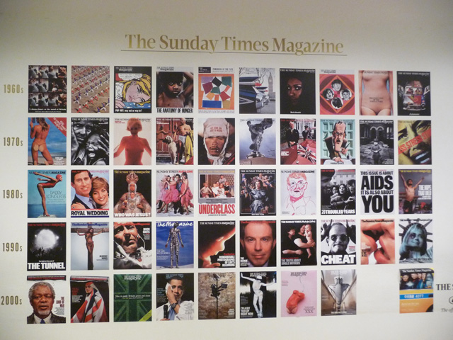
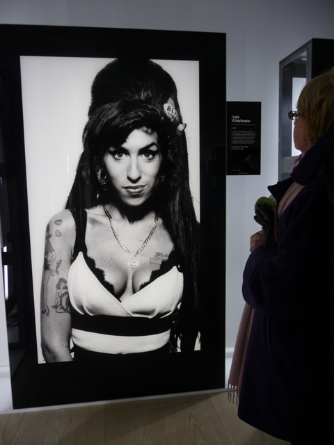
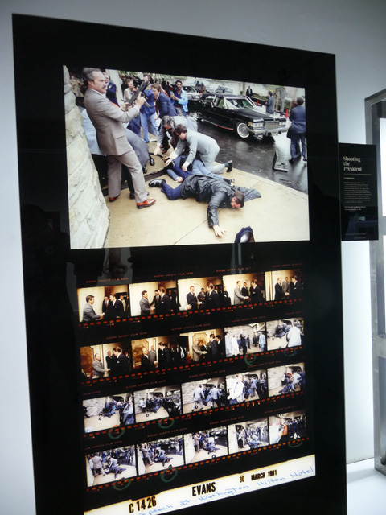
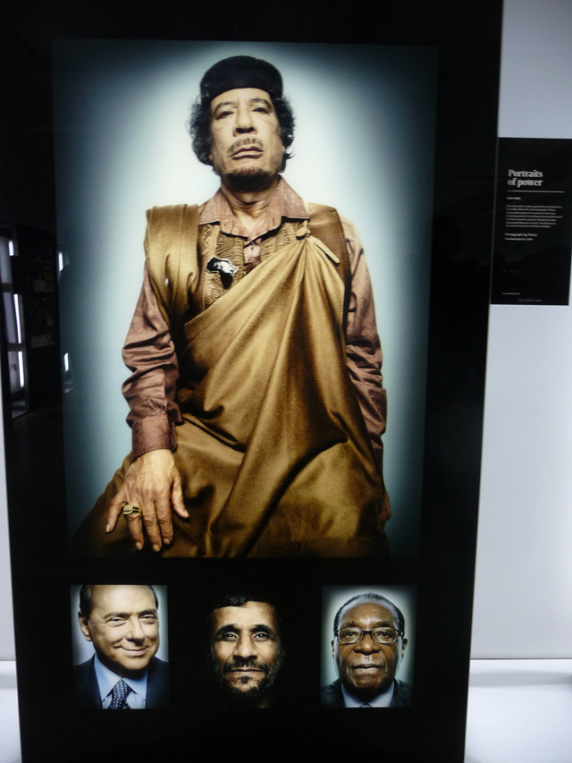
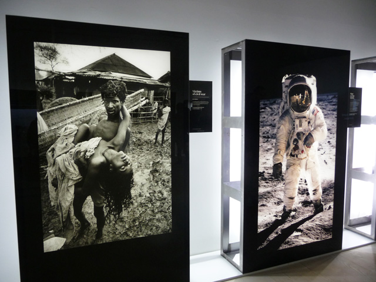
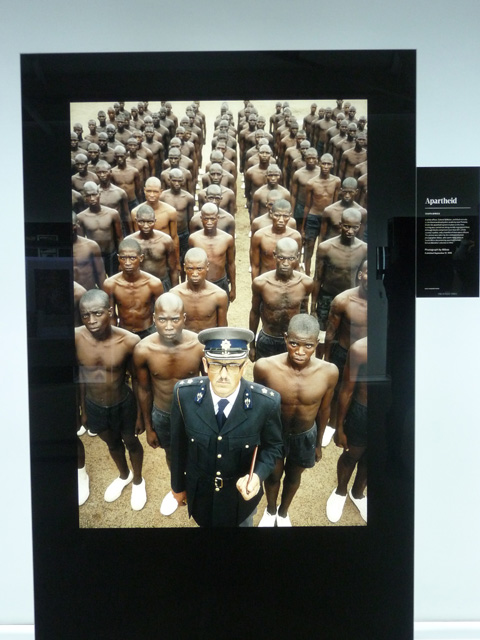

[caption]Left: Victim of War by Don McCullin; Right: Man in the Moon by Neil Armstrong[/caption]

After almost a year of blogging, I can honestly say how much** I’ve enjoyed writing and owning this blog**. It’s my own little kingdom where I can write about anything without having to follow protocols and restrictive editorial guidelines. And in my book, that is priceless.

One of the other priceless and most touchings things I’ve seen during two weekends ago was** the Sunday Times Magazine exhibition** at the Saatchi Gallery. The exhibition celebrates photojournalism at its best while also looking back at the **importance of print journalism in the 20th century**. And although, I love all things digital, nothing can replace the act of  flipping pages off a magazine or a book and seeing  amazing covers of people and **unforgettable moments in history.**

 Have you ever seen photos so arresting in your life? The Sunday Times Magazine at the Saatchi Gallery is probably the rarest of times when you get that kick one photo after another – enough to give you a roller-coaster ride of emotions. I’m glad that Saatchi decided to extend the exhibit until the first of March because it is truly a must-see.

Celebrity photos were indeed a delight. **Boy George as red-hot drag-queen-slash-devil by Uli Weber** was indeed humorous and a very 50s looking **Kylie Minogue** with only her head seen bobbing from the bathtub was enough to tickle anyone’s fancy. Terry O’ Neill’s portrait of **Amy Winehouse**‘s portrait smiling sheepishly was very uncanny and made me feel as if she were alive.

*Amy Winehouse by Terry O’ Neill*

*  
Shooting the President by Michael Evans*

My other favourites were very political in nature. **Shooting the President by Michael Evans**, showed a blow-by-blow assassination attempt to President Ronald Reagan. A**partheid by photographer Abbas shot in 1978** with a white guard contrasting to an army of black South African police reminded me that not so long ago this was then a reality.

I was touched by **Victim of War by Don McCullen** which was probably the most graphic portrayal of the horrors of war – a man carries a woman in his arms, whose eyes just appeared very translucent. If death was so apparent in the eyes of this woman, ironically, in one corner there was a** portrait by Platon of Muammar Qaddaffi** portrayed very much alive and in power together with other portraits of other heads of state during a UN convention by Platon.

*Muammar Qaddaffi by Platon*

*Left: Victim of War by Don McCullin; Right: Man in the Moon by Neil Armstrong*

**The Sacred Lake Mali by Alain Buu** documented the catfish catchers in Mali of how they yearly strip the lake of fish in over a quarter of an hour as  part of an on-going tradition. **Man in the Moon by Neil Armstrong** was probably the most unique and the most out of this world and I don’t really need to explain why.

Even if the photos were mounted in lightboxes, **I sort of appreciated because it gave me the sense that I was peering into them before publication and I as a spectator was part of the creative process of putting a magazine cover**. However, I would have liked to see more of the behind-the-scenes info on how these photographers have taken the shot and why the editors decided to use it as the cover of that issue.  **Behind every beautiful picture is a thousand stories.**

*Apartheid by Abbas*

 *Disclaimer: Copyright of photos owned by the photographers and their respective agencies.*

Related Links:  
[50 years of the Sunday Times Magazine by Spectator](http://www.spectator.co.uk/arts-and-culture/night-and-day/7620018/50-years-of-the-sunday-times-magazine.thtml)  
[50 Years of Sunday Times Magazine celebrated in new exhibition by the Huffington Post ](http://www.huffingtonpost.co.uk/2012/02/01/50-years-sunday-times-magazine_n_1247000.html)  
[The Sunday Times Magazine: 50 years by Francis Hodgson](http://francishodgson.com/the-sunday-times-magazine-50-years)

