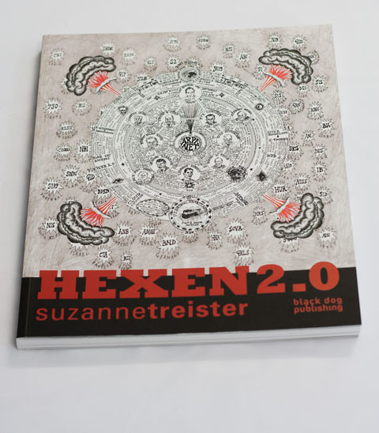
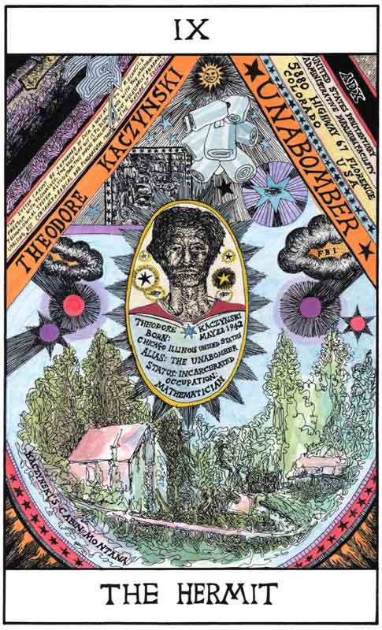
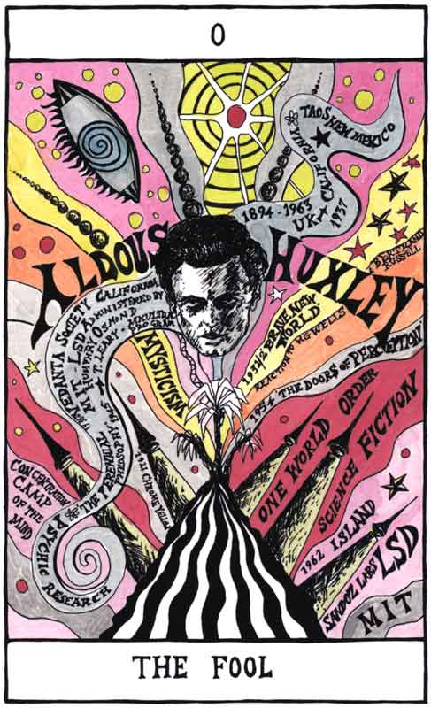
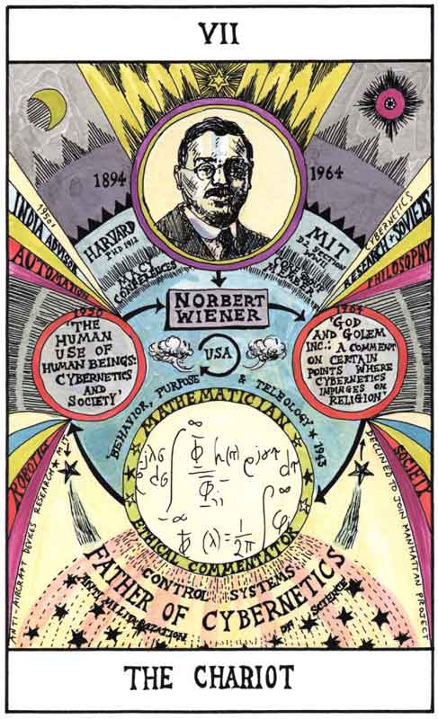
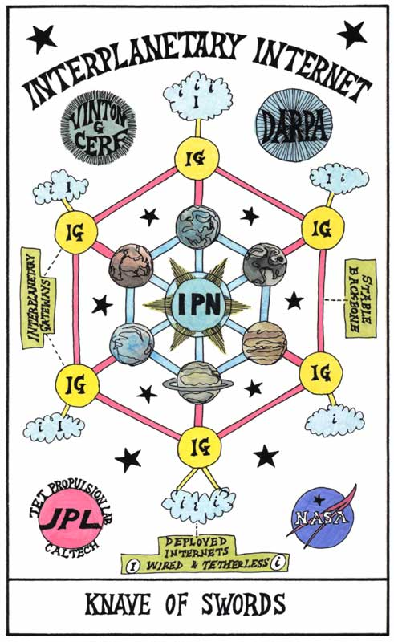
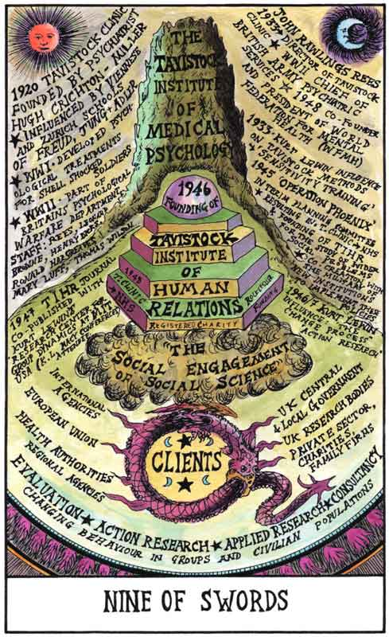
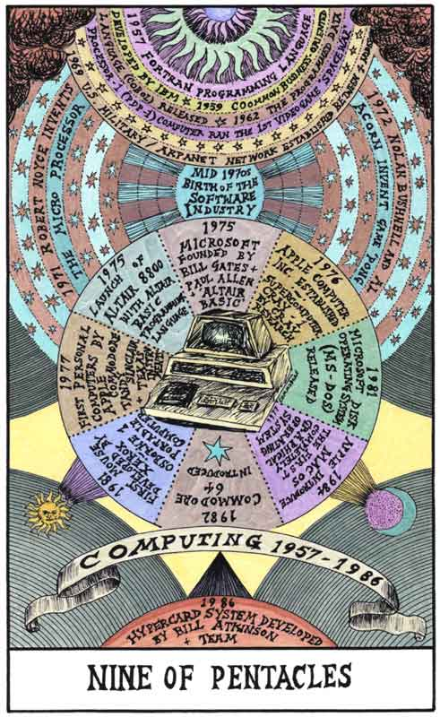
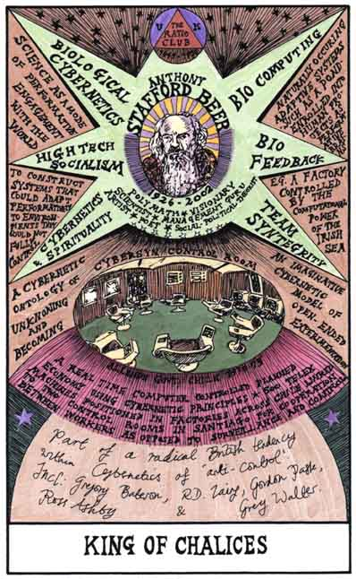

It’s not everyday that you see an artist like  [**Suzanne Treister**](http://www.suzannetreister.net/) who delves into an exploration of  human history woven into the paradigms of science, occult, technology and mass intelligence. Most contemporary artists nowadays have made artworks extracted from personal experience but **Suzanne has definitely tackled on a mammoth undertaking to give us a view of our own distorted history.    
**

I’ve been away because of my work at the [Festival](http://www.london2012.com/festival) but these are the type of exhibitions that I am excited to see.  **I am interested to see how Suzanne will tell our history through these tarot card illustrations**. I’ve scheduled my visit at the [Science Museum](http://www.sciencemuseum.org.uk/HEXEN2) on 27 April – unfortunately the exhibition will end on 30 April so don’t miss this one. I just got the Suzanne Treister Hexen 2.0 book from Blackdog Publishing and it’s just one of those exhibitions were you want to see a preview of the book first. Because **Suzanne Treister’s creative process is a combination of research**, there are minutae details that you just want to take in first before seeing the actual work. I’m going to post the press release here so you can have a read but this will be updated as soon as I visit the exhibit. So watch this space.

Here are some of the greatest illustrations I have ever seen in my life!

 

**PRESS RELEASE**

The Science Museum premieres HEXEN 2.0, a major new exhibition by British artist Suzanne Treister, as part of its contemporary art programme.  

Opening in March 2012, *HEXEN 2.0* follows Treister’s fine-tuned research and powerful imagination into the histories of scientific research behind government programmes of mass control, and investigates parallel histories of countercultural and grass roots movements.

 Through a complex body of gloriously detailed work, the exhibition charts the coming together of diverse scientific and social sciences, within a framework of post-WWII U.S. governmental and military imperatives, through the development of cybernetics, the history of the internet, the rise of Web 2.0 and mass intelligence gathering, and the implications for the future of new systems of societal manipulation towards a control society.

*HEXEN 2.0* is the sequel to Treister’s acclaimed *HEXEN 2039, *and**brings together an array of large-scale drawings, carefully plotted ‘alchemical diagrams’, and photo-text as well as a hand-coloured set of 78 re-imagined Tarot cards, along with a compelling film presenting a cybernetic séance. Opening on 7th March 2012, HEXEN 2.0 is a free exhibition, running until 1 May 2012.

Artist, Susanne Treister, said, “(to check) *Based on past history, people, histories and scientific projections of the future, the exhibition delves into hypothetical futures to an hypnotic, mesmerising space of early technological fantasy to hallucinate feedback from the past from where one may imagine and construct a myriad of possible and alternative futures.”* Head of Arts Projects, Hannah Redler, at the Science Museum said, “*The Science Museum’s new funded arts** programme** provides a great opportunity to showcase Treister’s latest work. *

Looking at real life events, the exhibition specifically investigates the participants of the Macy Conferences (1946-1953), whose primary goal was to set the foundations for a general science of the workings of the human mind. As well as looking at the critics of the technological society such as Theodore Kaczynski/The Unabomber; the claims of Anarcho-Primitivism and Post Leftism, Technogaianism and Transhumanism, and traces precursory ideas of Thoreau, Heidegger, Adorno in relation to visions of utopic/dystopic futures from science-fiction literature and film.

* *The exhibition will occupy the Bridge gallery of the Science Museum for eight weeks only. The project also includes a dedicated website (link) and a book, published by Black Dog Publishing.* HEXEN 2.0 Literature* is being exhibited simultaneously at WORK from 16th March 2012.

 Suzanne Treister studied at St Martin’s School of Art, London (1978-1981) and Chelsea College of Art and Design, London (1981-1982) and is based in London. Primarily a painter through the 1980s, Treister was a pioneer in the digital/new media/web based field from the beginning of the 1990s. Her practice engages with eccentric narratives and unconventional bodies of research which she relies on to reveal the structures that bind power, identity and knowledge.

 

