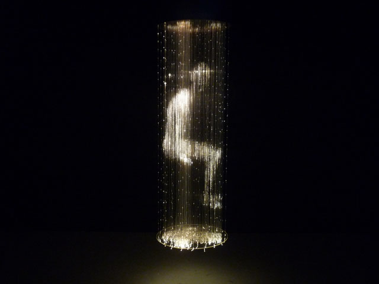
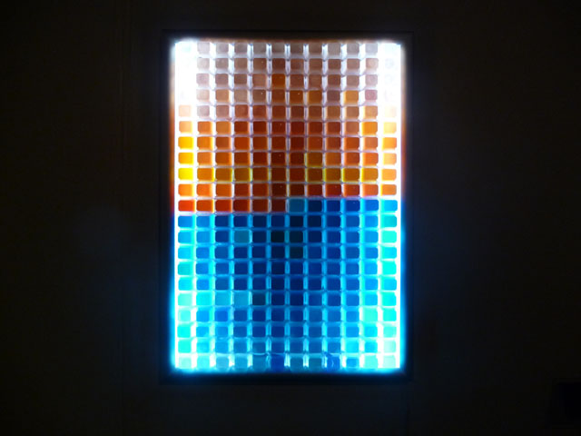
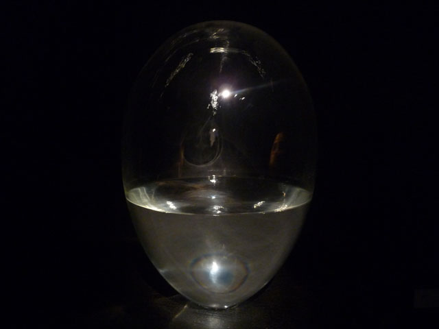
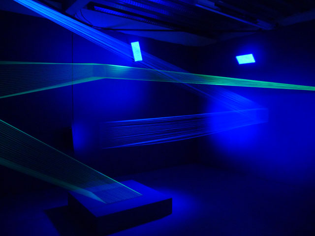
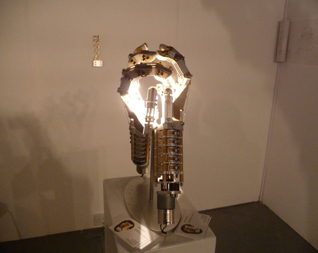

The more our lives become intertwined with technology, the more the [Kinetica Art Fair](http://www.kinetica-artfair.com/) becomes a relevant platform for ambitious tech-related type of art. Now on its fifth year, **Kinetica Art Fair is bustling with energy and possibilities.** The great thing about the Kinetic Art Fair is that it looks to the future and yes, it’s future is oh so bright.  I predict that in a few years to come, it will become a much more important exhibition and would garner more funding from not just new media outfits but also by top art ponchos.

A convergence of kinetic, electronic, robotic, sound, light, time-based and multi-disciplinary new media art, Kinetica Art Fair brings artworks from more than **35 galleries and some of the artists featured are with international pedigree**. It’s not surprising that this is not a curated art fair.  Art is for all and so is technology although I am sure that if it is curated better, it can be a formidable force in the arts world. But for now, here in the Kinetica Art Fair, there is a sense of **collaborative spirit all happening between artists, designers, architects and new media students** so much so that it seems like they are breeding this into their own playground.

Interactivity is in the heart of the Kinetica Art Fair: from a typewriter that beats drum sounds into bottles to a large-scale sculptural zoetrope, there are unexpected things in this exhibition that can take your breath away.

**1. A sculptural dream-world**

 

<iframe allowfullscreen="" class="youtube-player" frameborder="0" height="505" src="//www.youtube.com/embed/OIHxjqZ7pTU?wmode=transparent&fs=1&hl=en&modestbranding=1&iv_load_policy=3&showsearch=0&rel=0&theme=dark" title="YouTube video player" type="text/html" width="640"></iframe>  
*Gregory Barsamian at Kinetica Art Fair 2013  
A modernisation of the Zoetrope, inspired by Carl Jung  
*

 

**2. 3d but 2d**

<iframe allowfullscreen="" class="youtube-player" frameborder="0" height="505" src="//www.youtube.com/embed/GPOtykKvTFI?wmode=transparent&fs=1&hl=en&modestbranding=1&iv_load_policy=3&showsearch=0&rel=0&theme=dark" title="YouTube video player" type="text/html" width="640"></iframe>  
*The Trulife™ Hologram reproduces the same light wave which reflected off the original object *created by [*Colour Holographic*](http://www.colourholographic.com/)

**3. Tech Ocean**

 <iframe allowfullscreen="" class="youtube-player" frameborder="0" height="505" src="//www.youtube.com/embed/vAlrnRrrVpw?wmode=transparent&fs=1&hl=en&modestbranding=1&iv_load_policy=3&showsearch=0&rel=0&theme=dark" title="YouTube video player" type="text/html" width="640"></iframe>  
*The Mechanical Ocean Wave Simulator, Ciboure 2013 by [Matthieu Schönholzer](http://www.kinetica-artfair.com/?exhibitors/2013?cat=5)*  
*One of the pioneers of 3d-FX computer graphics industry, this is Matthieu’s foray into the world of interactive sculpture*

 

** 4. Fibre optic figure**

 

*Seated Child (Columba) by Roseline de Thelin*  
*Roselin used fibre optics to create light points to create an illusion of a seated figure*

 

** 5. Type some sounds**

 

*A typewriter that drums bottles by Xiaofei Dyson – an interactive installation that invites young and adults to play *

 

** 6. Flipping books**

 

*Mechanical Flipbook – created by Wendy Marvel and Mark Rosen. Made from Hand Machined parts from Bronze, Aluminum, Steel and 50’s era Aircraft Chassis Boxes*

 

**7. Keyboard beauty**

 

 *Alexander Berchert creates this artwork combining his fascination for mass-produced objects and physics*

 

**8. Breathing H20**

 

*Breathe by Ben Tyers. A water container that emulates the act of breathing.*

 

**9. Fishing line but not for fish**

 

*08015 by David Ogle – made from fluorescent fishing line and ultraviolet light*. *David explores the notions of materiality, of permanence and the visual perceptions of object in space.*

 

**10. Tech fingers**

 

*Bailey Bots by Marko Kryut – two moving robotic hands exploring the origins of matter*

 

Read more:  
[Wunderkammeras and techno-animalism: Kinetica Art Fair returns to Ambika P3 –  Culture 24](http://www.culture24.org.uk/art/sculpture%20%26%20installation/art422490)  
[Kinetica comes into its own illusory adventures – New Scientist blog](http://www.newscientist.com/blogs/culturelab/2013/03/kinetica-artfair.html)  
[When Art and Science Collide (Pictures) – Huffington Post](http://www.huffingtonpost.co.uk/2013/03/01/kinetica-2013-art-fair_n_2789402.html?utm_hp_ref=uk)  
[Kinetica Art Fair – Half Matrix – Half Diagon Alley – Artlyst](http://www.artlyst.com/articles/kinetica-art-fair-2013-half-matrix-half-diagon-alley)

<iframe allowfullscreen="" class="youtube-player" frameborder="0" height="505" src="//www.youtube.com/embed/eqNRrUDSI8Y?wmode=transparent&fs=1&hl=en&modestbranding=1&iv_load_policy=3&showsearch=0&rel=0&theme=dark" title="YouTube video player" type="text/html" width="640"></iframe>  
*More on Kinetic Art Fair 2013*

