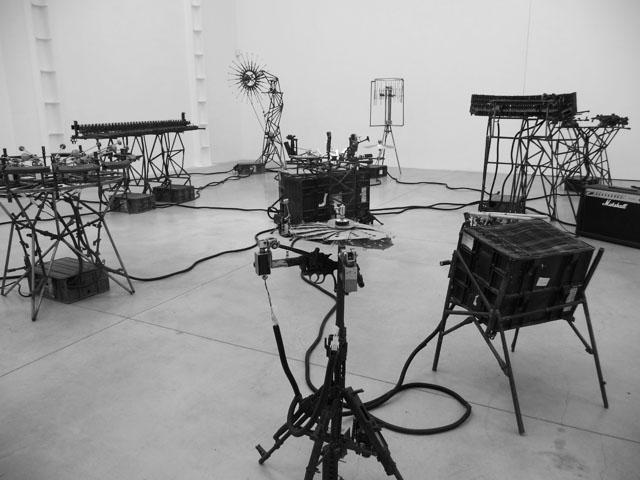
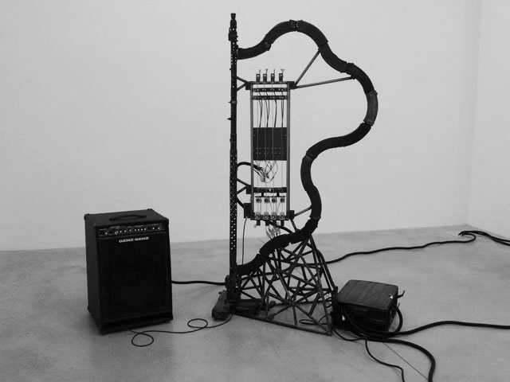
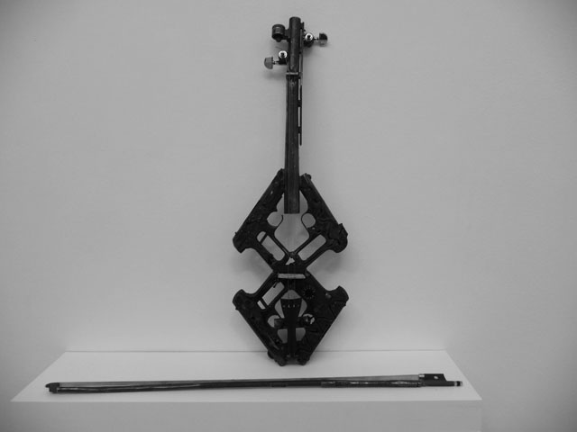
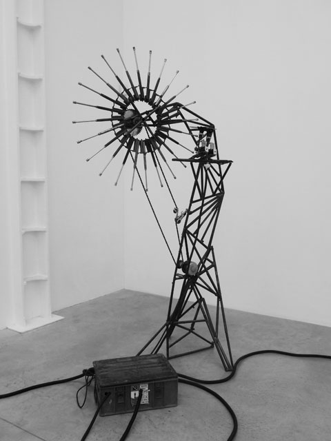
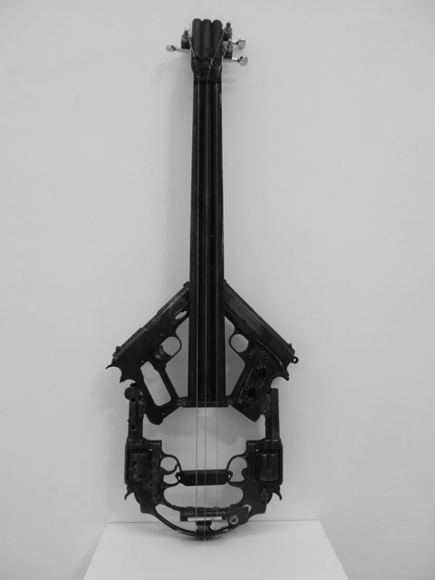
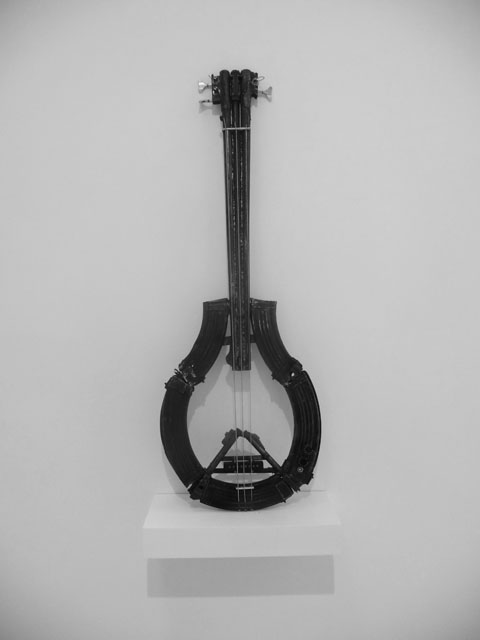
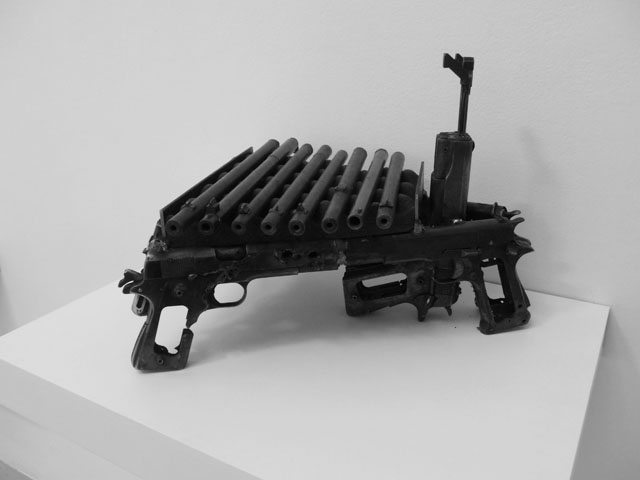
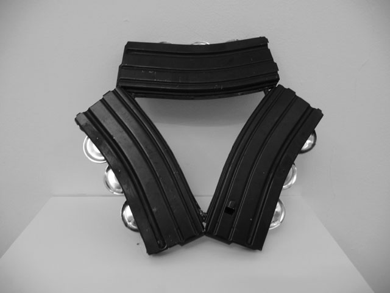
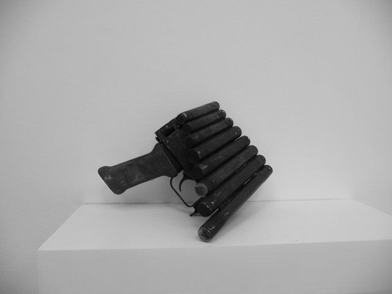

If John Lennon’s song Imagine can be transformed into a visual language, it would be something like this Disarm exhibition at the Lisson gallery. I think Pedro Reyes’ weapons-cum-musical instruments really tune into what is probably the closest thing I’ve ever seen visual arts do to call for peace. In Disarm, **Pedro fashions destroyed weapons into mechanical musical instruments** and transforms them into objects with a positive message. And it’s not bad too that these instruments are also functional and can be played live or automated by a computer. 

There’s probably too much to take in here – in fact, I had to deal with a spectrum of emotions when I saw Disarm – as if I was listening to some affecting music. First, as sculptural pieces, they all look beautiful – **they are a re-imagining of how musical instruments should be in the 21st century** and even without the music, they would have probably been able to stand alone as fine-tuned beautifully-crafted pieces of sculpture.

 

*Pedro Reyes *  
*Disarm (Mechanized) 2012*  
*Recycled Metal*  
*Installation comprising of 8 mechanized instruments*

*Pedro Reyes*  
*Disarm (Harpanet) 2013*  
*Metal*

Second – and this is where it really gets bloody – the material used to craft these pieces all came from firearms, revolvers, shot guns, machine guns – all killer weapons – and** just thinking what’s behind its bloodstained journey is enough to make you feel some jolt in the senses**. These are weapons offered to Pedro by the Mexican government who’ve confiscated these items. Crushed and steamrolled by military tanks, these weapons find their tragic end to their tragic journey.

Then they get resurrected into these musical instruments enough to rid it of its dark past. **How Pedro was able to transform these deadly machines into playable and functional instruments is a true feat**. It bodes well that Pedro was trained in architecture so he has this vision of creating art that has utility. In a video featured also at Lisson gallery, I was able to see how he and his team hammers away these weapons of war into a flute, a drum, a harp creating beautiful music from something that used to deadly.

For Pedro “[It] was more than physical. It’s important to consider that many lies were taken with these weapons; as if a sort of exorcism was taking place, the music expelled the demons they held as well as being a requiem for lives lost.”

*Pedro Reyes*  
*Disarm (Canonofono) 2013*  
*Metal*

*Pedro Reyes*  
*Disarm (Violin) 2013*  
*Metal*

*Pedro Reyes*  
*Disarm (Sentinel) 2013*  
*Metal*

*Pedro Reyes*  
*Disarm (Guitar) 2013*  
*Metal*

*Pedro Reyes*  
*Disarm (Bass) 2013*  
*Metal*

*Pedro Reyes*  
*Disarm (Xylophone) 2013*  
*Metal *

*Pedro Reyes*  
*Disarm (Tambourine) 2013*  
*Metal*

*Pedro Reyes*  
*Disarm (Pan Pipes) 2013*  
Metal

Related articles:

[ Londonist: Weapons as musical instruments – Disarm at Lisson gallery](http://londonist.com/2013/03/weapons-as-musical-instruments-disarm-at-lisson-gallery.php)  
[London Evening Standard: Weapon for Change – Interview with Pedro Reyes by Ben Luke](http://www.standard.co.uk/goingout/exhibitions/weapon-for-change-interview-with-mexican-artist-pedro-reyes-8549414.html)  
[Digital Journal: Artist Pedro Reyes turns guns into musical instruments](http://digitaljournal.com/article/343438)  
[Design Boom: Weapon Instruments by Pedro Reyes at Lisson gallery](http://www.designboom.com/design/weapon-instruments-by-pedro-reyes-at-lisson-gallery/)

 <iframe allowfullscreen="" class="youtube-player" frameborder="0" height="505" src="//www.youtube.com/embed/6LIrcMioP_I?wmode=transparent&fs=1&hl=en&modestbranding=1&iv_load_policy=3&showsearch=0&rel=0&theme=dark" title="YouTube video player" type="text/html" width="640"></iframe>  
*Pedro Reyes live performance – Disarm at the Lisson gallery*

<iframe allowfullscreen="" class="youtube-player" frameborder="0" height="505" src="//www.youtube.com/embed/oNb9x_e-3SQ?wmode=transparent&fs=1&hl=en&modestbranding=1&iv_load_policy=3&showsearch=0&rel=0&theme=dark&list=PL6uqON-thyrZcRFF8qVugHPFTytlJe1wV" title="YouTube video player" type="text/html" width="640"></iframe>  
Turning Weapons into Instruments. Bonus – Live at the Lisson gallery

 

