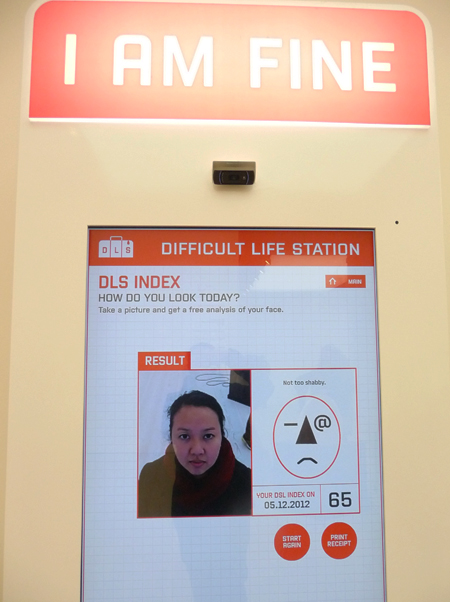

Hi, I am Tuesday. Welcome to my art blog!

Two years ago, I had the privilege to work with the best art practitioners in the country for the **London 2012 Festival – the largest UK-wide  festival ever staged**. As the digital manager for the culture team, we were able to deliver more than 12,000 events attended by more than **20 million people around the UK** in celebration of the [Olympic and Paralympic Games](http://www.london2012.com). Watch the highlights of the Festival at [TheSpace](http://thespace.org/items/p0001f60)

*[Streb dancers](http://www.streb.org/) performing one of their circus acts last year as part of the London 2012 Festival. Watch [Surprises: STREB Turn](https://www.youtube.com/watch?v=W9vY116Wt4g)*

**About the blog**

I’ve created Momardi as a way of educating myself about the arts and creative sector. Through this blog, **I want to promote artists I like and also feature the latest art exhibitions around London and occasionally some international exhibits.**

*Self-portrait done at Wong Chiu Tat’s Kiosk Version Installation at Saatchi Gallery  2012*

**More on the digital me et.al**

I am an all-around digital professional with years of experience in content creation, content strategy and social media. [View my curriculum at LinkedIn](http://uk.linkedin.com/in/tuesdaygutz)

**Contact me**

If you are an art institution or a creative artist and would like to be featured, email me at [tuesdaygutz@gmail.com](mailto:tuesdaygutz@gmail.com). I am also doing consultancy work and if you want to me to take a look at the digital and content strategy of your institution, feel free to drop me a line.

**Disclaimer**

All views expressed are my own and not those of the companies I work for.
